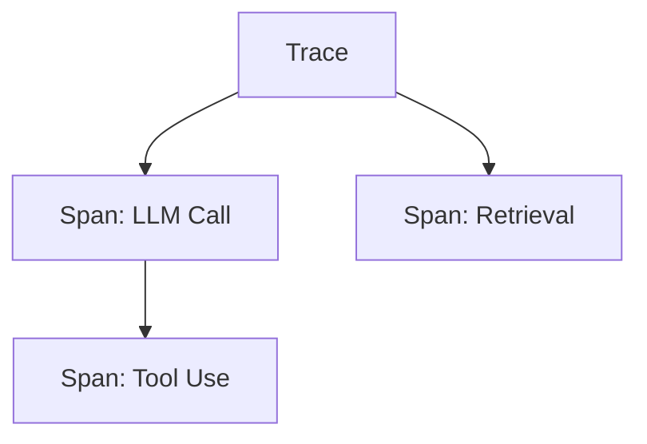

# Brokle Public Documentation Strategy

**Version**: 1.0
**Date**: December 27, 2025
**Status**: Ready for Implementation

---

## Executive Summary

This document presents a comprehensive documentation strategy for Brokle based on deep competitive analysis of five leading AI observability platforms: HoneyHive, Braintrust, Langfuse, Comet Opik, and Arize Phoenix. The strategy provides a complete blueprint for transforming Brokle's documentation from placeholder content to a production-ready, developer-focused knowledge base.

---

## 1. Competitor Documentation Benchmark Report

### 1.1 HoneyHive

| Category | Analysis |
|----------|----------|
| **Strengths** | ADLC (Agent Development Lifecycle) workflow organization; Multi-tier tabbed navigation; AI-assisted search (Cmd+K); Visual workflow steps with screenshots; Color-coded theme system |
| **Weaknesses** | Some broken links (404 on quickstart pages); Versioning complexity (v0.1.x stable); Dense navigation hierarchy |
| **Adopt** | Lifecycle-based content organization; Visual step-by-step tutorials; AI search integration |
| **Avoid** | Over-versioned navigation; Complex tab hierarchies |
| **Unique Features** | "Evaluation-Driven Development" methodology; Deployment option cards (SaaS/Dedicated/Self-Hosted) |

### 1.2 Braintrust

| Category | Analysis |
|----------|----------|
| **Strengths** | Cookbook section with 40+ recipes; Multi-language SDK support (7 languages); Progressive disclosure navigation; "Copy to Claude/ChatGPT" feature; Wide page mode |
| **Weaknesses** | Dense sidebar categories; Context vs Core organization unclear |
| **Adopt** | Cookbook/recipes section; Multi-language code tabs; AI assistant copy buttons; Guides vs Reference distinction |
| **Avoid** | Unclear category naming (Context vs Core) |
| **Unique Features** | BTQL query language docs; MCP integration; Remote evals documentation |

### 1.3 Langfuse

| Category | Analysis |
|----------|----------|
| **Strengths** | Clean pillar organization (Observability/Prompts/Evaluation); Multi-quickstart options (7 paths); Interactive demo; Video walkthroughs; Multi-language support (JP/KR/CN); SOC2/ISO/GDPR badges |
| **Weaknesses** | Essential vs Advanced categorization can be confusing; Dense sidebar |
| **Adopt** | Three-pillar product structure; Multiple quickstart paths; Video tutorials; Security/compliance badges; GitHub integration showcase |
| **Avoid** | Overloaded Essential/Advanced split |
| **Unique Features** | Auto-install agent; Feature carousel; Lifecycle visualization; 20K+ GitHub stars display |

### 1.4 Comet Opik

| Category | Analysis |
|----------|----------|
| **Strengths** | 50+ integrations; University learning section; Colab/Codespace notebooks; 20+ evaluation metrics; Agent Optimization algorithms; Progressive complexity |
| **Weaknesses** | No visible API playground; Limited search visibility; Sparse screenshots |
| **Adopt** | Notebook-first onboarding; Metrics as first-class docs; University/learning paths; Integration breadth showcase |
| **Avoid** | Lack of interactive API explorer |
| **Unique Features** | Agent optimization algorithms (MetaPrompt, Evolutionary, Bayesian); Video-augmented learning |

### 1.5 Arize Phoenix

| Category | Analysis |
|----------|----------|
| **Strengths** | Mintlify-powered clean design; Tutorial/How-to/Concept separation; FAQ section; Migration guides; Banner persistence; Dark/light mode |
| **Weaknesses** | Some 404 pages in navigation; Redirect complexity |
| **Adopt** | Tutorial/How-to/Concept structure; FAQ integration; Migration guides; Clean visual design |
| **Avoid** | Complex redirect systems |
| **Unique Features** | Card-based feature grid; Multi-deployment documentation (Cloud/Self-host) |

### 1.6 Competitive Feature Matrix

| Feature | HoneyHive | Braintrust | Langfuse | Opik | Phoenix | **Brokle (Target)** |
|---------|-----------|------------|----------|------|---------|---------------------|
| AI Search | Yes | Yes | Yes | No | Yes | **Yes** |
| Multi-language SDKs | 2 | 7 | 3 | 2 | 3 | **3 (Python/JS/Go)** |
| Code Tabs | Yes | Yes | Yes | Yes | Yes | **Yes** |
| Video Tutorials | Yes | No | Yes | Yes | Yes | **Yes** |
| Cookbook/Recipes | No | Yes | No | No | Yes | **Yes** |
| Interactive Demo | No | No | Yes | No | No | **Yes** |
| Self-host Docs | Yes | Yes | Yes | Yes | Yes | **Yes** |
| API Playground | No | No | No | No | No | **Yes** |
| Dark Mode | Yes | Yes | Yes | Yes | Yes | **Yes** |
| Quickstart Paths | 1 | 2 | 7 | 1 | 4 | **5** |

---

## 2. Brokle Documentation Gap Analysis

### 2.1 Current State Assessment

**Existing Content Structure:**
```
content/docs/
├── index.mdx (7 lines - placeholder)
├── quickstart.mdx (50 lines - basic)
├── first-trace.mdx (7 lines - placeholder)
├── tracing/
│   ├── traces.mdx (7 lines - placeholder)
│   └── spans.mdx (exists)
├── evaluation/
│   ├── scores.mdx (7 lines - placeholder)
│   └── feedback.mdx (exists)
├── integrations/
│   ├── index.mdx (7 lines - placeholder)
│   ├── openai.mdx (exists)
│   └── anthropic.mdx (exists)
├── sdk/
│   ├── index.mdx (7 lines - placeholder)
│   ├── python.mdx (exists)
│   └── javascript.mdx (exists)
└── self-hosting/
    ├── index.mdx (exists)
    └── docker.mdx (exists)
```

### 2.2 Critical Gaps

| Gap Category | Current State | Competitor Standard | Priority |
|--------------|---------------|---------------------|----------|
| **Introduction/Overview** | 7-line placeholder | 500+ words with philosophy, architecture | P0 |
| **Quickstart Depth** | 50 lines basic | Multiple paths, video, Colab links | P0 |
| **Concepts Documentation** | None | Traces, spans, sessions explained | P0 |
| **API Reference** | None | Full endpoint documentation | P0 |
| **Tutorials** | None | Step-by-step workflows | P1 |
| **Integration Guides** | 2 basic pages | 20-50 integrations | P1 |
| **Evaluation Deep Dive** | Placeholder | Metrics, evaluators, custom scorers | P1 |
| **Cookbook/Recipes** | None | 40+ practical examples | P2 |
| **FAQ** | None | Common questions answered | P2 |
| **Changelog** | Exists (marketing) | Technical changelog in docs | P2 |
| **Troubleshooting** | None | Debug guides, common errors | P2 |
| **Migration Guides** | None | From competitors | P3 |

### 2.3 Quick Wins (Immediate Impact)

1. **Expand index.mdx** - Add comprehensive introduction with value proposition
2. **Add "What is Brokle?"** page - Philosophy, architecture, use cases
3. **Create Concepts section** - Traces, spans, sessions, evaluations explained
4. **Complete SDK pages** - Full API documentation for Python/JS
5. **Add code tabs** - Python/JavaScript/curl for all examples

### 2.4 Must-Have Future Content

1. Complete API reference with interactive examples
2. At least 10 integration guides (major LLM providers + frameworks)
3. 5+ tutorials covering end-to-end workflows
4. Cookbook with 10+ practical recipes
5. Self-hosting guides for Docker, Kubernetes
6. Production best practices guide

---

## 3. Documentation Structure & Navigation

### 3.1 Information Architecture

```
/docs/
│
├── 📘 Introduction
│   ├── what-is-brokle.mdx          # Platform overview
│   ├── philosophy.mdx               # Design principles
│   ├── architecture.mdx             # Technical architecture
│   └── comparison.mdx               # vs other tools
│
├── 🚀 Getting Started
│   ├── quickstart.mdx               # 5-minute setup
│   ├── first-trace.mdx              # Create first trace
│   ├── first-evaluation.mdx         # Run first eval
│   └── dashboard-tour.mdx           # UI walkthrough
│
├── 📚 Concepts
│   ├── overview.mdx                 # Core concepts intro
│   ├── traces.mdx                   # Traces explained
│   ├── spans.mdx                    # Spans explained
│   ├── sessions.mdx                 # Sessions explained
│   ├── evaluations.mdx              # Evaluations explained
│   ├── scores.mdx                   # Scoring system
│   └── cost-analytics.mdx           # Cost tracking
│
├── 🔧 Tracing
│   ├── overview.mdx                 # Tracing intro
│   ├── manual-tracing.mdx           # Manual instrumentation
│   ├── automatic-tracing.mdx        # Auto-instrumentation
│   ├── distributed-tracing.mdx      # Multi-service traces
│   ├── metadata.mdx                 # Adding metadata
│   └── annotations.mdx              # Trace annotations
│
├── 📊 Evaluation
│   ├── overview.mdx                 # Evaluation intro
│   ├── built-in-evaluators.mdx      # Pre-built metrics
│   ├── custom-evaluators.mdx        # Custom scoring
│   ├── llm-as-judge.mdx             # LLM evaluation
│   ├── datasets.mdx                 # Test datasets
│   ├── experiments.mdx              # A/B testing
│   └── human-feedback.mdx           # Human annotation
│
├── 💡 Prompt Management
│   ├── overview.mdx                 # Prompt management intro
│   ├── playground.mdx               # Prompt playground
│   ├── versioning.mdx               # Version control
│   └── templates.mdx                # Prompt templates
│
├── 📈 Analytics
│   ├── overview.mdx                 # Analytics intro
│   ├── dashboards.mdx               # Custom dashboards
│   ├── cost-tracking.mdx            # Cost analytics
│   └── performance.mdx              # Performance metrics
│
├── 🔌 Integrations
│   ├── overview.mdx                 # Integration guide
│   ├── llm-providers/
│   │   ├── openai.mdx
│   │   ├── anthropic.mdx
│   │   ├── google-gemini.mdx
│   │   ├── aws-bedrock.mdx
│   │   └── azure-openai.mdx
│   ├── frameworks/
│   │   ├── langchain.mdx
│   │   ├── llamaindex.mdx
│   │   ├── vercel-ai-sdk.mdx
│   │   └── dspy.mdx
│   └── observability/
│       ├── opentelemetry.mdx
│       └── custom.mdx
│
├── 📦 SDKs
│   ├── overview.mdx                 # SDK overview
│   ├── python/
│   │   ├── installation.mdx
│   │   ├── quickstart.mdx
│   │   ├── tracing.mdx
│   │   ├── evaluation.mdx
│   │   └── reference.mdx
│   ├── javascript/
│   │   ├── installation.mdx
│   │   ├── quickstart.mdx
│   │   ├── tracing.mdx
│   │   ├── evaluation.mdx
│   │   └── reference.mdx
│   └── go/
│       └── overview.mdx
│
├── 🔑 API Reference
│   ├── overview.mdx                 # API intro
│   ├── authentication.mdx           # API keys, auth
│   ├── endpoints/
│   │   ├── traces.mdx
│   │   ├── spans.mdx
│   │   ├── evaluations.mdx
│   │   ├── projects.mdx
│   │   └── prompts.mdx
│   └── errors.mdx                   # Error codes
│
├── 📖 Tutorials
│   ├── overview.mdx                 # Tutorial index
│   ├── rag-tracing.mdx              # Trace RAG app
│   ├── agent-evaluation.mdx         # Evaluate agents
│   ├── cost-optimization.mdx        # Reduce AI costs
│   └── production-monitoring.mdx    # Monitor in prod
│
├── 🍳 Cookbook
│   ├── overview.mdx                 # Recipes index
│   ├── tracing-recipes/
│   │   ├── async-tracing.mdx
│   │   ├── batch-processing.mdx
│   │   └── streaming.mdx
│   ├── evaluation-recipes/
│   │   ├── hallucination-detection.mdx
│   │   ├── response-quality.mdx
│   │   └── latency-scoring.mdx
│   └── integration-recipes/
│       ├── nextjs-app.mdx
│       ├── fastapi-service.mdx
│       └── langchain-agent.mdx
│
├── 🏠 Self-Hosting
│   ├── overview.mdx                 # Self-host intro
│   ├── docker.mdx                   # Docker setup
│   ├── docker-compose.mdx           # Compose setup
│   ├── kubernetes.mdx               # K8s deployment
│   ├── configuration.mdx            # Config options
│   └── upgrading.mdx                # Upgrade guide
│
├── 🔐 Security
│   ├── overview.mdx                 # Security intro
│   ├── authentication.mdx           # Auth methods
│   ├── data-privacy.mdx             # Privacy controls
│   └── compliance.mdx               # SOC2, GDPR
│
├── ❓ FAQ
│   └── index.mdx                    # Common questions
│
├── 🐛 Troubleshooting
│   ├── common-issues.mdx            # Common problems
│   ├── debugging.mdx                # Debug guide
│   └── support.mdx                  # Getting help
│
├── 📝 Changelog
│   └── index.mdx                    # Release notes
│
└── 🤝 Contributing
    ├── overview.mdx                 # Contribute guide
    └── docs.mdx                     # Doc contributions
```

### 3.2 Navigation Menu Structure

**Primary Navigation (Header Tabs):**
```
Docs | API Reference | Tutorials | Cookbook | Changelog
```

**Sidebar Groups:**
```yaml
Getting Started:
  - Introduction
  - Quickstart
  - First Trace
  - Dashboard Tour

Core Concepts:
  - Traces & Spans
  - Sessions
  - Evaluations
  - Analytics

Features:
  - Tracing (expandable)
  - Evaluation (expandable)
  - Prompt Management (expandable)
  - Analytics (expandable)

Integrations:
  - Overview
  - LLM Providers (expandable)
  - Frameworks (expandable)

SDKs & API:
  - Python SDK (expandable)
  - JavaScript SDK (expandable)
  - REST API (expandable)

Resources:
  - Tutorials
  - Cookbook
  - Self-Hosting
  - FAQ
  - Troubleshooting
```

### 3.3 Cross-Linking Strategy

1. **Concept → Implementation**: Every concept page links to related SDK/API docs
2. **SDK → Examples**: Every SDK method links to cookbook recipes
3. **Tutorial → Reference**: Tutorials link to detailed reference pages
4. **FAQ → Deep Dive**: FAQ answers link to comprehensive explanations
5. **Breadcrumbs**: Every page shows navigation path

---

## 4. Content Templates

### 4.1 Concept Page Template

```mdx
---
title: "[Concept Name]"
description: "Clear one-line description for SEO"
---

## What is [Concept]?

[2-3 sentence explanation of the concept in plain language]

## Why [Concept] Matters

[Brief explanation of business value and use cases]

## How [Concept] Works

[Technical explanation with diagram if applicable]

```mermaid
[Optional architecture/flow diagram]
```

## Key Properties

| Property | Description | Type |
|----------|-------------|------|
| prop_1   | Description | string |
| prop_2   | Description | number |

## Example

<Tabs>
  <Tab title="Python">
    ```python
    # Code example
    ```
  </Tab>
  <Tab title="JavaScript">
    ```javascript
    // Code example
    ```
  </Tab>
</Tabs>

## Related Concepts

- [Link to related concept 1](/docs/concepts/related-1)
- [Link to related concept 2](/docs/concepts/related-2)

## Next Steps

- [Follow tutorial: [Tutorial Name]](/docs/tutorials/example)
- [Read SDK reference](/docs/sdk/python/reference)
```

### 4.2 SDK Reference Template

```mdx
---
title: "[Method/Class Name]"
description: "SDK reference for [method/class]"
---

## Overview

[Brief description of what this method/class does]

## Installation

```bash
pip install brokle
```

## Basic Usage

<Tabs>
  <Tab title="Python">
    ```python
    from brokle import Brokle

    client = Brokle(api_key="your-api-key")
    # Basic usage example
    ```
  </Tab>
  <Tab title="JavaScript">
    ```javascript
    import { Brokle } from '@brokle/sdk';

    const client = new Brokle({ apiKey: 'your-api-key' });
    // Basic usage example
    ```
  </Tab>
</Tabs>

## Parameters

| Parameter | Type | Required | Default | Description |
|-----------|------|----------|---------|-------------|
| param_1   | string | Yes | - | Description |
| param_2   | object | No | {} | Description |

## Returns

| Field | Type | Description |
|-------|------|-------------|
| field_1 | string | Description |
| field_2 | array | Description |

## Examples

### Example 1: [Use Case]

```python
# Detailed example with comments
```

### Example 2: [Use Case]

```python
# Another example
```

## Error Handling

```python
try:
    result = client.method()
except BrokleError as e:
    print(f"Error: {e.message}")
```

## Related

- [Related Method 1](/docs/sdk/python/method-1)
- [Related Concept](/docs/concepts/related)
```

### 4.3 Tutorial Template

```mdx
---
title: "[Tutorial Title]"
description: "Learn how to [outcome] with Brokle"
---

## Overview

**What you'll learn:**
- Bullet point 1
- Bullet point 2
- Bullet point 3

**Prerequisites:**
- Brokle account ([sign up](https://app.brokle.com))
- Python 3.8+ or Node.js 18+
- Basic familiarity with [technology]

**Time to complete:** ~15 minutes

## Step 1: Set Up Your Environment

[Detailed instructions]

```bash
pip install brokle
```

## Step 2: [Next Step]

[Detailed instructions with explanations]

```python
# Code with inline comments explaining each step
from brokle import Brokle

client = Brokle(api_key="your-api-key")
```

<Callout type="tip">
  Pro tip or helpful note here
</Callout>

## Step 3: [Next Step]

[Continue pattern...]

## Step 4: Verify Results

[How to confirm success]


## Summary

You've learned how to:
- Achievement 1
- Achievement 2
- Achievement 3

## Next Steps

- [Try advanced tutorial](/docs/tutorials/advanced)
- [Explore the cookbook](/docs/cookbook)
- [Read the API reference](/docs/api)
```

### 4.4 Integration Guide Template

```mdx
---
title: "[Integration Name] Integration"
description: "Integrate Brokle with [Integration Name]"
---

## Overview

Brokle integrates with [Integration Name] to provide [value proposition].

## Compatibility

| Version | Status |
|---------|--------|
| v4.x | Fully Supported |
| v3.x | Supported |
| v2.x | Deprecated |

## Installation

<Tabs>
  <Tab title="pip">
    ```bash
    pip install brokle brokle-[integration]
    ```
  </Tab>
  <Tab title="npm">
    ```bash
    npm install @brokle/sdk @brokle/[integration]
    ```
  </Tab>
</Tabs>

## Quick Setup

```python
from brokle import Brokle
from brokle.integrations import [IntegrationName]

# Initialize
client = Brokle(api_key="your-api-key")
[integration] = [IntegrationName](client)

# Use as normal - tracing is automatic
response = [integration].chat(...)
```

## Configuration Options

| Option | Default | Description |
|--------|---------|-------------|
| option_1 | true | Description |
| option_2 | "auto" | Description |

## Advanced Usage

### [Advanced Topic 1]

```python
# Advanced example
```

### [Advanced Topic 2]

```python
# Another advanced example
```

## Troubleshooting

### Common Issue 1

**Problem:** Description of issue
**Solution:** How to fix it

### Common Issue 2

**Problem:** Description of issue
**Solution:** How to fix it

## Related

- [Similar Integration](/docs/integrations/similar)
- [Tracing Concepts](/docs/concepts/tracing)
```

### 4.5 API Endpoint Template

```mdx
---
title: "[Endpoint Name]"
description: "API reference for [endpoint]"
---

## [METHOD] /v1/[endpoint]

[Brief description of what this endpoint does]

## Authentication

<Tabs>
  <Tab title="API Key">
    ```bash
    curl -H "X-API-Key: bk_your_api_key" ...
    ```
  </Tab>
  <Tab title="Bearer Token">
    ```bash
    curl -H "Authorization: Bearer your_jwt_token" ...
    ```
  </Tab>
</Tabs>

## Request

### Headers

| Header | Required | Description |
|--------|----------|-------------|
| X-API-Key | Yes* | Your Brokle API key |
| Content-Type | Yes | application/json |

### Body Parameters

| Parameter | Type | Required | Description |
|-----------|------|----------|-------------|
| param_1 | string | Yes | Description |
| param_2 | object | No | Description |

### Example Request

<Tabs>
  <Tab title="curl">
    ```bash
    curl -X POST https://api.brokle.com/v1/endpoint \
      -H "X-API-Key: bk_your_api_key" \
      -H "Content-Type: application/json" \
      -d '{
        "param_1": "value",
        "param_2": {}
      }'
    ```
  </Tab>
  <Tab title="Python">
    ```python
    import requests

    response = requests.post(
        "https://api.brokle.com/v1/endpoint",
        headers={"X-API-Key": "bk_your_api_key"},
        json={"param_1": "value"}
    )
    ```
  </Tab>
  <Tab title="JavaScript">
    ```javascript
    const response = await fetch('https://api.brokle.com/v1/endpoint', {
      method: 'POST',
      headers: {
        'X-API-Key': 'bk_your_api_key',
        'Content-Type': 'application/json'
      },
      body: JSON.stringify({ param_1: 'value' })
    });
    ```
  </Tab>
</Tabs>

## Response

### Success Response (200)

```json
{
  "id": "trace_abc123",
  "created_at": "2025-01-15T12:00:00Z",
  "status": "success"
}
```

### Response Fields

| Field | Type | Description |
|-------|------|-------------|
| id | string | Unique identifier |
| created_at | string | ISO 8601 timestamp |
| status | string | Status of the request |

## Errors

| Code | Description |
|------|-------------|
| 400 | Bad Request - Invalid parameters |
| 401 | Unauthorized - Invalid API key |
| 404 | Not Found - Resource doesn't exist |
| 429 | Rate Limited - Too many requests |
| 500 | Server Error - Internal error |

## Rate Limits

- 1000 requests per minute per API key
- Burst: 100 requests per second

## Related Endpoints

- [POST /v1/related](/docs/api/endpoints/related)
- [GET /v1/resource](/docs/api/endpoints/resource)
```

---

## 5. SEO & Style Guidelines

### 5.1 SEO Requirements

#### Title Tags
```
Format: [Page Title] | Brokle Docs
Length: 50-60 characters
Example: "Tracing Overview | Brokle Docs"
```

#### Meta Descriptions
```
Format: [Action-oriented description of page content]
Length: 150-160 characters
Example: "Learn how to trace your AI applications with Brokle. Set up tracing in 5 minutes with our Python or JavaScript SDK."
```

#### URL Slugs
```
Format: lowercase-kebab-case
Structure: /docs/[category]/[page-name]
Examples:
  /docs/concepts/traces
  /docs/sdk/python/installation
  /docs/integrations/openai
```

#### Keyword Strategy

| Page Type | Primary Keywords | Secondary Keywords |
|-----------|------------------|-------------------|
| Concepts | AI observability, LLM tracing, [concept] | monitoring, debugging, evaluation |
| SDK | Brokle SDK, Python/JS SDK, AI tracing SDK | instrumentation, telemetry |
| Integrations | [Provider] integration, [Provider] observability | LLM monitoring, AI analytics |
| Tutorials | how to [action], [action] tutorial | step-by-step, guide, example |

### 5.2 Writing Style Guide

#### Voice & Tone
- **Professional but approachable**: Technical accuracy without jargon overload
- **Action-oriented**: Use imperative verbs ("Create", "Configure", "Deploy")
- **Second person**: Address reader as "you" directly
- **Present tense**: Describe current functionality

#### Language Conventions
```
✅ DO:
- "You can trace your application by..."
- "Brokle captures the following data..."
- "Create a new project with..."

❌ DON'T:
- "We will show you how to..."
- "The user should..."
- "One might consider..."
```

#### Code Style
- Always include copy buttons
- Use syntax highlighting
- Add inline comments for complex logic
- Show output/result when relevant
- Use realistic, working examples

#### Formatting Rules
- **Headers**: Sentence case (not Title Case)
- **Lists**: Use for 3+ items; parallel structure
- **Tables**: Use for structured data; keep under 6 columns
- **Callouts**: Use sparingly for important notes/warnings
- **Links**: Use descriptive text, not "click here"

### 5.3 Visual Guidelines

#### Images
- Format: PNG or WebP
- Max width: 800px
- Include alt text for accessibility
- Use consistent styling/branding
- Dark mode compatible

#### Diagrams
- Use Mermaid for architecture diagrams
- Keep diagrams simple and focused
- Include legend if complex
- Match brand colors

#### Screenshots
- Capture at 2x resolution
- Highlight relevant UI elements
- Keep focused on specific feature
- Update with each major UI change

---

## 6. Implementation Roadmap

### Phase 1: Foundation (Weeks 1-2)

**Goal:** Establish core content structure and essential pages

| Task | Priority | Est. Time |
|------|----------|-----------|
| Update index.mdx with comprehensive introduction | P0 | 1 day |
| Create "What is Brokle?" page | P0 | 1 day |
| Expand quickstart.mdx with multiple paths | P0 | 2 days |
| Create complete Concepts section (5 pages) | P0 | 3 days |
| Complete tracing section (4 pages) | P0 | 2 days |
| Set up Fumadocs sidebar configuration | P0 | 0.5 days |

**Deliverables:**
- Complete introduction section
- Functional quickstart for Python/JS
- Core concepts documented
- Basic tracing documentation

### Phase 2: SDK & API Documentation (Weeks 3-4)

**Goal:** Complete reference documentation for developers

| Task | Priority | Est. Time |
|------|----------|-----------|
| Python SDK complete documentation | P0 | 3 days |
| JavaScript SDK complete documentation | P0 | 3 days |
| API Reference - Authentication | P0 | 1 day |
| API Reference - All endpoints | P0 | 3 days |
| Add code tabs to all examples | P0 | 1 day |

**Deliverables:**
- Complete Python SDK reference
- Complete JavaScript SDK reference
- Full API documentation
- Multi-language code examples throughout

### Phase 3: Integrations & Features (Weeks 5-6)

**Goal:** Expand integration coverage and feature documentation

| Task | Priority | Est. Time |
|------|----------|-----------|
| OpenAI integration (expand) | P1 | 0.5 days |
| Anthropic integration (expand) | P1 | 0.5 days |
| LangChain integration | P1 | 1 day |
| LlamaIndex integration | P1 | 1 day |
| Additional LLM providers (5) | P1 | 2 days |
| Evaluation section (5 pages) | P1 | 2 days |
| Prompt Management section | P1 | 1 day |
| Analytics section | P1 | 1 day |

**Deliverables:**
- 10+ integration guides
- Complete evaluation documentation
- Prompt management documentation
- Analytics documentation

### Phase 4: Tutorials & Cookbook (Weeks 7-8)

**Goal:** Practical learning content for developers

| Task | Priority | Est. Time |
|------|----------|-----------|
| Tutorial: RAG Tracing | P2 | 1 day |
| Tutorial: Agent Evaluation | P2 | 1 day |
| Tutorial: Production Monitoring | P2 | 1 day |
| Cookbook: 10 recipes | P2 | 3 days |
| FAQ section | P2 | 0.5 days |
| Troubleshooting guide | P2 | 0.5 days |

**Deliverables:**
- 4 complete tutorials
- 10+ cookbook recipes
- FAQ with 20+ questions
- Troubleshooting documentation

### Phase 5: Polish & SEO (Weeks 9-10)

**Goal:** Optimize for discoverability and user experience

| Task | Priority | Est. Time |
|------|----------|-----------|
| SEO audit and optimization | P2 | 2 days |
| Cross-link all related content | P2 | 1 day |
| Add images/diagrams | P2 | 2 days |
| Review and edit all content | P2 | 2 days |
| Add video tutorials (3) | P3 | 3 days |
| Migration guides | P3 | 1 day |

**Deliverables:**
- SEO-optimized metadata
- Complete cross-linking
- Visual content
- Video tutorials

---

## 7. Folder Structure

### 7.1 Content Directory Structure

```
public/brokle-site/
├── content/
│   └── docs/
│       ├── meta.json                    # Sidebar configuration
│       │
│       ├── introduction/
│       │   ├── meta.json
│       │   ├── index.mdx                # What is Brokle?
│       │   ├── philosophy.mdx
│       │   ├── architecture.mdx
│       │   └── comparison.mdx
│       │
│       ├── getting-started/
│       │   ├── meta.json
│       │   ├── index.mdx                # Quickstart overview
│       │   ├── quickstart-python.mdx
│       │   ├── quickstart-javascript.mdx
│       │   ├── first-trace.mdx
│       │   └── dashboard-tour.mdx
│       │
│       ├── concepts/
│       │   ├── meta.json
│       │   ├── index.mdx
│       │   ├── traces.mdx
│       │   ├── spans.mdx
│       │   ├── sessions.mdx
│       │   ├── evaluations.mdx
│       │   └── cost-analytics.mdx
│       │
│       ├── tracing/
│       │   ├── meta.json
│       │   ├── index.mdx
│       │   ├── manual-tracing.mdx
│       │   ├── automatic-tracing.mdx
│       │   ├── distributed-tracing.mdx
│       │   ├── metadata.mdx
│       │   └── annotations.mdx
│       │
│       ├── evaluation/
│       │   ├── meta.json
│       │   ├── index.mdx
│       │   ├── built-in-evaluators.mdx
│       │   ├── custom-evaluators.mdx
│       │   ├── llm-as-judge.mdx
│       │   ├── datasets.mdx
│       │   ├── experiments.mdx
│       │   └── human-feedback.mdx
│       │
│       ├── prompt-management/
│       │   ├── meta.json
│       │   ├── index.mdx
│       │   ├── playground.mdx
│       │   ├── versioning.mdx
│       │   └── templates.mdx
│       │
│       ├── analytics/
│       │   ├── meta.json
│       │   ├── index.mdx
│       │   ├── dashboards.mdx
│       │   ├── cost-tracking.mdx
│       │   └── performance.mdx
│       │
│       ├── integrations/
│       │   ├── meta.json
│       │   ├── index.mdx
│       │   ├── llm-providers/
│       │   │   ├── meta.json
│       │   │   ├── openai.mdx
│       │   │   ├── anthropic.mdx
│       │   │   ├── google-gemini.mdx
│       │   │   ├── aws-bedrock.mdx
│       │   │   └── azure-openai.mdx
│       │   ├── frameworks/
│       │   │   ├── meta.json
│       │   │   ├── langchain.mdx
│       │   │   ├── llamaindex.mdx
│       │   │   ├── vercel-ai-sdk.mdx
│       │   │   └── dspy.mdx
│       │   └── observability/
│       │       ├── meta.json
│       │       ├── opentelemetry.mdx
│       │       └── custom.mdx
│       │
│       ├── sdk/
│       │   ├── meta.json
│       │   ├── index.mdx
│       │   ├── python/
│       │   │   ├── meta.json
│       │   │   ├── index.mdx
│       │   │   ├── installation.mdx
│       │   │   ├── tracing.mdx
│       │   │   ├── evaluation.mdx
│       │   │   └── reference.mdx
│       │   ├── javascript/
│       │   │   ├── meta.json
│       │   │   ├── index.mdx
│       │   │   ├── installation.mdx
│       │   │   ├── tracing.mdx
│       │   │   ├── evaluation.mdx
│       │   │   └── reference.mdx
│       │   └── go/
│       │       ├── meta.json
│       │       └── index.mdx
│       │
│       ├── api/
│       │   ├── meta.json
│       │   ├── index.mdx
│       │   ├── authentication.mdx
│       │   ├── endpoints/
│       │   │   ├── meta.json
│       │   │   ├── traces.mdx
│       │   │   ├── spans.mdx
│       │   │   ├── evaluations.mdx
│       │   │   ├── projects.mdx
│       │   │   └── prompts.mdx
│       │   └── errors.mdx
│       │
│       ├── tutorials/
│       │   ├── meta.json
│       │   ├── index.mdx
│       │   ├── rag-tracing.mdx
│       │   ├── agent-evaluation.mdx
│       │   ├── cost-optimization.mdx
│       │   └── production-monitoring.mdx
│       │
│       ├── cookbook/
│       │   ├── meta.json
│       │   ├── index.mdx
│       │   ├── tracing-recipes/
│       │   │   ├── meta.json
│       │   │   ├── async-tracing.mdx
│       │   │   ├── batch-processing.mdx
│       │   │   └── streaming.mdx
│       │   ├── evaluation-recipes/
│       │   │   ├── meta.json
│       │   │   ├── hallucination-detection.mdx
│       │   │   ├── response-quality.mdx
│       │   │   └── latency-scoring.mdx
│       │   └── integration-recipes/
│       │       ├── meta.json
│       │       ├── nextjs-app.mdx
│       │       ├── fastapi-service.mdx
│       │       └── langchain-agent.mdx
│       │
│       ├── self-hosting/
│       │   ├── meta.json
│       │   ├── index.mdx
│       │   ├── docker.mdx
│       │   ├── docker-compose.mdx
│       │   ├── kubernetes.mdx
│       │   ├── configuration.mdx
│       │   └── upgrading.mdx
│       │
│       ├── security/
│       │   ├── meta.json
│       │   ├── index.mdx
│       │   ├── authentication.mdx
│       │   ├── data-privacy.mdx
│       │   └── compliance.mdx
│       │
│       ├── faq/
│       │   └── index.mdx
│       │
│       ├── troubleshooting/
│       │   ├── meta.json
│       │   ├── common-issues.mdx
│       │   ├── debugging.mdx
│       │   └── support.mdx
│       │
│       ├── changelog/
│       │   └── index.mdx
│       │
│       └── contributing/
│           ├── meta.json
│           ├── index.mdx
│           └── docs.mdx
│
├── public/
│   └── images/
│       ├── docs/
│       │   ├── concepts/
│       │   ├── tutorials/
│       │   ├── screenshots/
│       │   └── diagrams/
│       └── og/
│           └── docs/
│
└── src/
    └── lib/
        └── source.ts                    # Fumadocs configuration
```

### 7.2 Root meta.json Configuration

```json
{
  "title": "Brokle Documentation",
  "root": true,
  "pages": [
    "introduction",
    "getting-started",
    "---",
    "concepts",
    "tracing",
    "evaluation",
    "prompt-management",
    "analytics",
    "---",
    "integrations",
    "---",
    "sdk",
    "api",
    "---",
    "tutorials",
    "cookbook",
    "---",
    "self-hosting",
    "security",
    "---",
    "faq",
    "troubleshooting",
    "changelog",
    "contributing"
  ]
}
```

---

## 8. Page Outline Templates

### 8.1 Introduction/What is Brokle (index.mdx)

```mdx
---
title: What is Brokle?
description: Brokle is an open-source AI observability platform for tracing, evaluation, and analytics
---

## Welcome to Brokle

[Hero paragraph: 2-3 sentences describing Brokle's core value proposition]

## Why Brokle?

### Trace Every AI Call
[Description of tracing capabilities]

### Evaluate Quality at Scale
[Description of evaluation features]

### Understand Costs
[Description of cost analytics]

### Self-Host or Cloud
[Description of deployment flexibility]

## Core Capabilities

<Cards>
  <Card title="Tracing" href="/docs/concepts/traces" />
  <Card title="Evaluation" href="/docs/concepts/evaluations" />
  <Card title="Prompt Management" href="/docs/prompt-management" />
  <Card title="Analytics" href="/docs/analytics" />
</Cards>

## Quick Links

- [5-Minute Quickstart](/docs/getting-started/quickstart)
- [Core Concepts](/docs/concepts)
- [API Reference](/docs/api)
- [Self-Hosting Guide](/docs/self-hosting)

## Open Source

Brokle is open source at heart. Star us on [GitHub](https://github.com/brokle-ai/brokle).
```

### 8.2 Quickstart Page Outline

```mdx
---
title: Quickstart
description: Get started with Brokle in 5 minutes
---

## Choose Your Path

<Tabs>
  <Tab title="Python">
    [Python quickstart content]
  </Tab>
  <Tab title="JavaScript">
    [JavaScript quickstart content]
  </Tab>
  <Tab title="OpenAI Integration">
    [OpenAI-specific quickstart]
  </Tab>
  <Tab title="LangChain">
    [LangChain quickstart]
  </Tab>
</Tabs>

### Step 1: Install the SDK

[Installation instructions per language]

### Step 2: Get Your API Key

[Instructions for getting API key from dashboard]

### Step 3: Initialize the Client

[Code examples for initialization]

### Step 4: Create Your First Trace

[Simple tracing example]

### Step 5: View in Dashboard

[Screenshot of trace in dashboard]

## Next Steps

[Links to deeper content]
```

### 8.3 Concept Page Outline (Traces)

```mdx
---
title: Traces
description: Understanding traces in Brokle - the foundation of AI observability
---

## What is a Trace?

[2-3 paragraphs explaining traces conceptually]

## Trace Anatomy



## Key Attributes

| Attribute | Description | Example |
|-----------|-------------|---------|
| trace_id | Unique identifier | trace_abc123 |
| name | Human-readable name | "chat_completion" |
| start_time | When trace began | 2025-01-15T12:00:00Z |
| duration_ms | Total duration | 1523 |
| status | Success/error status | "success" |

## Creating Traces

<Tabs>
  <Tab title="Python">
    [Python trace creation examples]
  </Tab>
  <Tab title="JavaScript">
    [JavaScript trace creation examples]
  </Tab>
</Tabs>

## Trace Hierarchy

[Explanation of parent-child relationships]

## Viewing Traces

[Screenshot and explanation of UI]

## Related

- [Spans](/docs/concepts/spans)
- [Sessions](/docs/concepts/sessions)
- [Tracing Guide](/docs/tracing)
```

### 8.4 Integration Page Outline (OpenAI)

```mdx
---
title: OpenAI Integration
description: Trace OpenAI API calls with Brokle
---

## Overview

Automatically trace all OpenAI API calls including:
- Chat completions
- Embeddings
- Function calling
- Assistants API

## Installation

```bash
pip install brokle
```

## Quick Setup

<Tabs>
  <Tab title="Wrapper (Recommended)">
    [Wrapper approach - easiest]
  </Tab>
  <Tab title="Decorator">
    [Decorator approach]
  </Tab>
  <Tab title="Context Manager">
    [Context manager approach]
  </Tab>
</Tabs>

## Configuration Options

| Option | Default | Description |
|--------|---------|-------------|
| capture_input | true | Log prompt content |
| capture_output | true | Log completion content |
| capture_tokens | true | Track token usage |

## What Gets Traced

[Table or list of automatically captured data]

## Advanced Usage

### Streaming
[Streaming example]

### Function Calling
[Function calling example]

### Assistants API
[Assistants example]

## Troubleshooting

### Common Issues

[FAQ-style troubleshooting]

## Related

- [Anthropic Integration](/docs/integrations/anthropic)
- [Manual Tracing](/docs/tracing/manual-tracing)
```

### 8.5 Cookbook Recipe Outline

```mdx
---
title: Tracing a RAG Pipeline
description: Recipe for adding observability to retrieval-augmented generation
---

## Overview

This recipe shows how to trace a complete RAG pipeline with:
- Document retrieval
- Context assembly
- LLM generation
- Response quality scoring

**Time:** 10 minutes
**Difficulty:** Intermediate

## Prerequisites

- Brokle SDK installed
- OpenAI API key
- Vector database (Pinecone, Weaviate, etc.)

## The Recipe

### 1. Set Up Tracing

```python
from brokle import Brokle

client = Brokle()
```

### 2. Trace Document Retrieval

```python
@client.trace()
def retrieve_documents(query: str):
    # Your retrieval logic
    pass
```

### 3. Trace LLM Generation

```python
@client.trace()
def generate_response(context: str, query: str):
    # Your generation logic
    pass
```

### 4. Complete Pipeline

```python
# Full pipeline example
```

### 5. Add Quality Scores

```python
# Adding evaluation
```

## View Results

[Screenshot of trace in dashboard]

## Variations

- [With streaming](/docs/cookbook/streaming)
- [With reranking](/docs/cookbook/reranking)

## Related

- [RAG Tutorial](/docs/tutorials/rag-tracing)
- [Evaluation Guide](/docs/evaluation)
```

---

## 9. Appendix

### 9.1 Technology Stack

| Component | Technology |
|-----------|------------|
| Framework | Next.js 16 |
| Documentation | Fumadocs MDX |
| Styling | Tailwind CSS 4 |
| Components | shadcn/ui |
| Search | Fumadocs built-in |
| Hosting | Vercel (recommended) |

### 9.2 Component Requirements

**Custom Components to Build:**
- `<CodeTabs>` - Multi-language code examples
- `<APIEndpoint>` - Formatted API documentation
- `<Callout>` - Info/warning/tip boxes
- `<VideoEmbed>` - YouTube/Loom integration
- `<Card>` / `<Cards>` - Navigation cards

### 9.3 Success Metrics

| Metric | Target | How to Measure |
|--------|--------|----------------|
| Time to first trace | < 5 min | User testing |
| Doc search success | > 80% | Analytics |
| Page bounce rate | < 40% | Analytics |
| Docs page views/month | 10K+ | Analytics |
| GitHub doc contributions | 5+/month | GitHub stats |

---

## Conclusion

This documentation strategy provides a comprehensive blueprint for transforming Brokle's documentation into a world-class developer resource. The phased implementation approach ensures quick wins while building toward a complete knowledge base.

**Key priorities:**
1. Establish strong foundations with comprehensive concepts
2. Provide multiple quickstart paths for different user types
3. Match competitor depth for SDK and API reference
4. Differentiate with excellent tutorials and cookbook
5. Optimize for SEO and discoverability

The documentation should be treated as a product itself, with continuous iteration based on user feedback and analytics.
