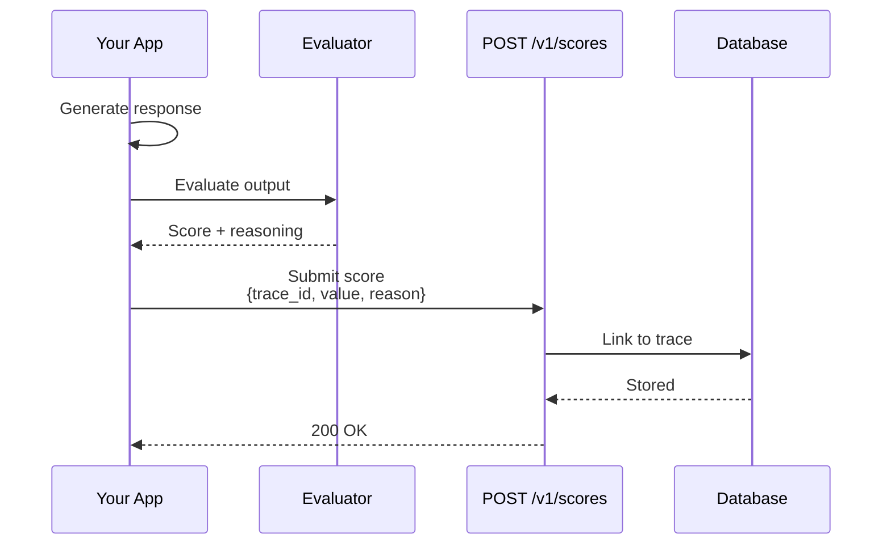

import { Callout } from "fumadocs-ui/components/callout";
import { Tabs, Tab } from "fumadocs-ui/components/tabs";

# Evaluations API

The Evaluations API provides endpoints for submitting quality scores and feedback, and querying evaluation results.

## Endpoints Overview

| Method | Endpoint | Description | Auth |
|--------|----------|-------------|------|
| POST | `/v1/scores` | Submit evaluation scores | API Key |
| GET | `/api/v1/scores` | List scores | JWT |
| GET | `/api/v1/scores/{id}` | Get score details | JWT |
| POST | `/v1/scores/batch` | Batch submit scores | API Key |
| DELETE | `/api/v1/scores/{id}` | Delete score | JWT |
| GET | `/api/v1/projects/{projectId}/scores/analytics` | Score analytics | JWT |



## Submit Score

```
POST /v1/scores
```

Submit a single evaluation score for a trace or span.

### Authentication

- **Header**: `X-API-Key: bk_your_api_key`

### Request Body

```json
{
  "trace_id": "0af7651916cd43dd8448eb211c80319c",
  "span_id": "b7ad6b7169203331",
  "name": "relevance",
  "value": 0.95,
  "type": "NUMERIC",
  "reason": "Response directly addresses the question",
  "metadata": {
    "dataset": "test_set_v1",
    "run_id": "run_abc123"
  }
}
```

### Request Fields

| Field | Type | Required | Description |
|-------|------|----------|-------------|
| `trace_id` | string | No | Trace ID to attach score to (required for trace-linked scores) |
| `span_id` | string | No | Span ID to attach score to |
| `name` | string | Yes | Score name (e.g., `relevance`, `hallucination`) |
| `value` | float | No | Numeric score value |
| `string_value` | string | No | Categorical score value |
| `type` | string | Yes | `NUMERIC`, `BOOLEAN`, or `CATEGORICAL` |
| `reason` | string | No | Explanation for the score |
| `metadata` | object | No | Arbitrary metadata |
| `experiment_id` | string | No | Link to an experiment |
| `experiment_item_id` | string | No | Link to an experiment item |

### Score Types

| Type | Value Field | Description |
|------|-------------|-------------|
| `NUMERIC` | `value` (float) | Continuous score (e.g., 0.0 - 1.0) |
| `BOOLEAN` | `value` (0 or 1) | Binary pass/fail |
| `CATEGORICAL` | `string_value` | One of predefined categories |

### Response

```json
{
  "data": {
    "id": "score_abc123",
    "project_id": "proj_xyz789",
    "trace_id": "0af7651916cd43dd8448eb211c80319c",
    "span_id": "b7ad6b7169203331",
    "name": "relevance",
    "value": 0.95,
    "type": "NUMERIC",
    "source": "sdk",
    "reason": "Response directly addresses the question",
    "timestamp": "2024-01-15T10:31:00Z"
  }
}
```

### Examples

<Tabs>
  <Tab value="curl" label="cURL">
    ```bash
    curl -X POST https://api.brokle.com/v1/scores \
      -H "Content-Type: application/json" \
      -H "X-API-Key: bk_your_api_key" \
      -d '{
        "trace_id": "0af7651916cd43dd8448eb211c80319c",
        "name": "relevance",
        "value": 0.95,
        "type": "NUMERIC",
        "reason": "Highly relevant response"
      }'
    ```
  </Tab>
  <Tab value="python" label="Python">
    ```python
    import requests

    response = requests.post(
        "https://api.brokle.com/v1/scores",
        headers={
            "Content-Type": "application/json",
            "X-API-Key": "bk_your_api_key"
        },
        json={
            "trace_id": "0af7651916cd43dd8448eb211c80319c",
            "name": "relevance",
            "value": 0.95,
            "type": "NUMERIC",
            "reason": "Highly relevant response"
        }
    )

    print(response.json())
    ```
  </Tab>
  <Tab value="javascript" label="JavaScript">
    ```javascript
    const response = await fetch('https://api.brokle.com/v1/scores', {
      method: 'POST',
      headers: {
        'Content-Type': 'application/json',
        'X-API-Key': 'bk_your_api_key'
      },
      body: JSON.stringify({
        trace_id: '0af7651916cd43dd8448eb211c80319c',
        name: 'relevance',
        value: 0.95,
        type: 'NUMERIC',
        reason: 'Highly relevant response'
      })
    });

    const data = await response.json();
    console.log(data);
    ```
  </Tab>
</Tabs>

## List Scores

```
GET /api/v1/scores
```

Retrieve scores with filtering and pagination.

### Authentication

- **Header**: `Authorization: Bearer {jwt_token}`

### Query Parameters

| Parameter | Type | Required | Description |
|-----------|------|----------|-------------|
| `project_id` | string | Yes | Filter by project |
| `trace_id` | string | No | Filter by trace |
| `span_id` | string | No | Filter by span |
| `name` | string | No | Filter by score name |
| `source` | string | No | Filter by source (e.g., `API`, `sdk`) |
| `type` | string | No | Filter by type (`NUMERIC`, `BOOLEAN`, `CATEGORICAL`) |
| `page` | integer | No | Page number |
| `limit` | integer | No | Items per page (default: 50, max: 100) |
| `sort_by` | string | No | Field to sort by |
| `sort_dir` | string | No | Sort direction (`asc` or `desc`) |

### Response

```json
{
  "data": [
    {
      "id": "score_abc123",
      "project_id": "proj_xyz789",
      "trace_id": "0af7651916cd43dd8448eb211c80319c",
      "span_id": "b7ad6b7169203331",
      "name": "relevance",
      "value": 0.95,
      "type": "NUMERIC",
      "source": "API",
      "reason": "Highly relevant response",
      "metadata": {},
      "timestamp": "2024-01-15T10:31:00Z"
    }
  ],
  "meta": {
    "request_id": "req_abc123def456",
    "timestamp": "2024-01-15T10:31:00Z",
    "version": "v1",
    "pagination": {
      "page": 1,
      "limit": 50,
      "total": 150,
      "total_pages": 3,
      "has_next": true,
      "has_prev": false
    }
  }
}
```

## Get Score

```
GET /api/v1/scores/{id}
```

Retrieve details of a specific score.

### Response

```json
{
  "data": {
    "id": "score_abc123",
    "project_id": "proj_xyz789",
    "trace_id": "0af7651916cd43dd8448eb211c80319c",
    "span_id": "b7ad6b7169203331",
    "name": "relevance",
    "value": 0.95,
    "type": "NUMERIC",
    "source": "API",
    "reason": "Highly relevant response addressing the user's question directly",
    "metadata": {
      "dataset": "test_set_v1",
      "run_id": "run_abc123"
    },
    "timestamp": "2024-01-15T10:31:00Z"
  }
}
```

## Batch Create Scores

```
POST /v1/scores/batch
```

Submit multiple evaluation scores in a single request.

### Authentication

- **Header**: `X-API-Key: bk_your_api_key`

### Request Body

```json
{
  "scores": [
    {
      "trace_id": "0af7651916cd43dd8448eb211c80319c",
      "span_id": "b7ad6b7169203331",
      "name": "relevance",
      "value": 0.9,
      "type": "NUMERIC",
      "reason": "Highly relevant response"
    },
    {
      "trace_id": "0af7651916cd43dd8448eb211c80319c",
      "name": "hallucination",
      "value": 0.0,
      "type": "BOOLEAN"
    },
    {
      "trace_id": "1bf8762a27de54ee9559fc322d91420d",
      "name": "relevance",
      "value": 0.85,
      "type": "NUMERIC"
    }
  ]
}
```

### Response

```json
{
  "data": {
    "created": 3
  }
}
```

## Score Analytics

### Get Score Analytics

```
GET /api/v1/projects/{projectId}/scores/analytics
```

Retrieve comprehensive analytics for a score including statistics, time series, and distribution.

### Authentication

- **Header**: `Authorization: Bearer {jwt_token}`

### Query Parameters

| Parameter | Type | Required | Description |
|-----------|------|----------|-------------|
| `score_name` | string | Yes | Score name to analyze |
| `compare_score_name` | string | No | Second score for comparison analytics |
| `from_timestamp` | RFC3339 | No | Start of time range |
| `to_timestamp` | RFC3339 | No | End of time range |
| `interval` | string | No | Aggregation interval: `hour`, `day` (default), `week` |

### Response

```json
{
  "data": {
    "statistics": {
      "count": 1500,
      "mean": 0.87,
      "std_dev": 0.12,
      "min": 0.45,
      "max": 1.0,
      "median": 0.90
    },
    "time_series": [
      { "timestamp": "2024-01-15T00:00:00Z", "avg_value": 0.85, "count": 150 },
      { "timestamp": "2024-01-16T00:00:00Z", "avg_value": 0.88, "count": 175 }
    ],
    "distribution": [
      { "bin_start": 0.0, "bin_end": 0.2, "count": 50 },
      { "bin_start": 0.2, "bin_end": 0.4, "count": 100 },
      { "bin_start": 0.4, "bin_end": 0.6, "count": 200 },
      { "bin_start": 0.6, "bin_end": 0.8, "count": 450 },
      { "bin_start": 0.8, "bin_end": 1.0, "count": 700 }
    ]
  }
}
```

When `compare_score_name` is provided, the response also includes `heatmap` and `comparison` fields with correlation metrics (Pearson, Spearman, MAE, RMSE).

## Human Feedback

Submit human feedback through the dashboard API:

```
POST /api/v1/feedback
```

### Request Body

```json
{
  "traceId": "0af7651916cd43dd8448eb211c80319c",
  "type": "thumbs",
  "value": "up",
  "comment": "Great response!",
  "userId": "user_123",
  "metadata": {
    "source": "chatbot",
    "sessionId": "session_456"
  }
}
```

### Feedback Types

| Type | Values | Description |
|------|--------|-------------|
| `thumbs` | `up`, `down` | Simple thumbs up/down |
| `rating` | 1-5 | Star rating |
| `categorical` | custom | Predefined categories |
| `text` | string | Free-form feedback |

### Response

```json
{
  "data": {
    "id": "feedback_abc123",
    "traceId": "0af7651916cd43dd8448eb211c80319c",
    "type": "thumbs",
    "value": "up",
    "createdAt": "2024-01-15T10:32:00Z"
  }
}
```

## Built-in Evaluators

Brokle provides built-in evaluators accessible via API:

```
POST /api/v1/evaluators/run
```

### Request Body

```json
{
  "evaluator": "relevance",
  "traceIds": ["trace_1", "trace_2", "trace_3"],
  "options": {
    "model": "gpt-4",
    "threshold": 0.8
  }
}
```

### Available Evaluators

| Evaluator | Description | Output |
|-----------|-------------|--------|
| `relevance` | Response relevance to query | 0.0 - 1.0 |
| `hallucination` | Factual accuracy check | boolean |
| `toxicity` | Harmful content detection | 0.0 - 1.0 |
| `coherence` | Response coherence | 0.0 - 1.0 |
| `completeness` | Answer completeness | 0.0 - 1.0 |
| `groundedness` | Grounded in context | 0.0 - 1.0 |

### Response

```json
{
  "data": {
    "runId": "run_abc123",
    "evaluator": "relevance",
    "results": [
      {
        "traceId": "trace_1",
        "score": 0.95,
        "reasoning": "Response directly addresses..."
      },
      {
        "traceId": "trace_2",
        "score": 0.72,
        "reasoning": "Partially relevant but..."
      }
    ],
    "summary": {
      "mean": 0.84,
      "passRate": 0.67
    }
  }
}
```

## Custom Evaluators

Register custom evaluation logic:

```
POST /api/v1/evaluators/custom
```

### Request Body

```json
{
  "name": "custom_relevance",
  "type": "llm",
  "prompt": "Evaluate the relevance of the assistant's response to the user's question.\n\nQuestion: {{input}}\nResponse: {{output}}\n\nScore from 0 to 1:",
  "model": "gpt-4",
  "outputParser": {
    "type": "numeric",
    "min": 0,
    "max": 1
  },
  "metadata": {
    "version": "1.0",
    "author": "team@company.com"
  }
}
```

<Callout type="info">
  Custom evaluators are project-scoped and can be shared across your organization.
</Callout>

## Evaluation Datasets

Create datasets for systematic evaluation:

```
POST /api/v1/datasets
```

### Request Body

```json
{
  "name": "qa_test_set",
  "description": "Question-answering test dataset",
  "items": [
    {
      "input": {"question": "What is AI?"},
      "expectedOutput": {"answer": "AI is..."},
      "metadata": {"difficulty": "easy"}
    }
  ]
}
```

### Run Evaluation on Dataset

```
POST /api/v1/datasets/{datasetId}/evaluate
```

```json
{
  "evaluators": ["relevance", "hallucination"],
  "model": "gpt-4",
  "options": {
    "temperature": 0.7
  }
}
```

## Webhooks

Configure webhooks for evaluation events:

```json
{
  "url": "https://your-server.com/webhook",
  "events": ["evaluation.created", "evaluation.threshold_breached"],
  "filters": {
    "evaluationNames": ["relevance", "hallucination"],
    "thresholds": {
      "relevance": {"min": 0.8},
      "hallucination": {"max": 0.1}
    }
  }
}
```

## Best Practices

### Consistent Naming

Use consistent evaluation names across your project:

```python
# Good: Consistent naming convention
evaluations = [
    {"name": "qa_relevance", "score": 0.9},
    {"name": "qa_accuracy", "score": 0.95},
    {"name": "qa_completeness", "score": 0.85}
]

# Bad: Inconsistent naming
evaluations = [
    {"name": "relevance", "score": 0.9},
    {"name": "Accuracy Score", "score": 0.95},
    {"name": "complete", "score": 0.85}
]
```

### Include Context

Always include helpful context:

```python
{
    "name": "relevance",
    "score": 0.72,
    "comment": "Response addresses the question but includes unnecessary information",
    "evaluator": {
        "type": "llm",
        "model": "gpt-4",
        "version": "1.0"
    },
    "metadata": {
        "dataset": "production_sample",
        "evaluationRun": "weekly_check_2024_01_15"
    }
}
```

## Related

- [Traces API →](/docs/api/endpoints/traces)
- [Evaluation Concepts →](/docs/concepts/evaluations)
- [Python SDK →](/docs/sdk/python)
