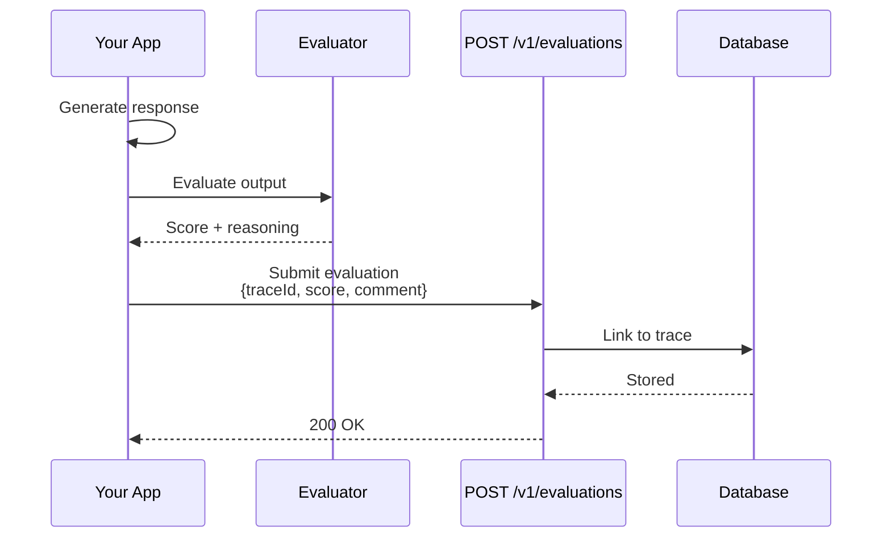

import { Callout } from "fumadocs-ui/components/callout";
import { Tabs, Tab } from "fumadocs-ui/components/tabs";

# Evaluations API

The Evaluations API provides endpoints for submitting quality scores and feedback, and querying evaluation results.

## Endpoints Overview

| Method | Endpoint | Description | Auth |
|--------|----------|-------------|------|
| POST | `/v1/evaluations` | Submit evaluation scores | API Key |
| GET | `/api/v1/evaluations` | List evaluations | JWT |
| GET | `/api/v1/evaluations/{evaluationId}` | Get evaluation details | JWT |
| POST | `/api/v1/evaluations/batch` | Batch create evaluations | JWT |
| DELETE | `/api/v1/evaluations/{evaluationId}` | Delete evaluation | JWT |



## Submit Evaluation

```
POST /v1/evaluations
```

Submit evaluation scores for traces or spans.

### Authentication

- **Header**: `X-API-Key: bk_your_api_key`
- **Required Scope**: `evaluations:write`

### Request Body

```json
{
  "traceId": "0af7651916cd43dd8448eb211c80319c",
  "spanId": "b7ad6b7169203331",
  "evaluations": [
    {
      "name": "relevance",
      "score": 0.95,
      "type": "numeric",
      "comment": "Response directly addresses the question"
    },
    {
      "name": "hallucination",
      "score": 0.0,
      "type": "boolean",
      "comment": "No factual errors detected"
    },
    {
      "name": "quality",
      "value": "excellent",
      "type": "categorical",
      "options": ["poor", "fair", "good", "excellent"]
    }
  ],
  "evaluator": {
    "type": "llm",
    "model": "gpt-4",
    "version": "1.0"
  },
  "metadata": {
    "dataset": "test_set_v1",
    "runId": "run_abc123"
  }
}
```

### Evaluation Types

| Type | Score Range | Description |
|------|-------------|-------------|
| `numeric` | 0.0 - 1.0 | Continuous score |
| `boolean` | 0 or 1 | Binary pass/fail |
| `categorical` | string | One of predefined options |
| `integer` | 1-5, 1-10, etc. | Discrete rating scale |

### Response

```json
{
  "data": {
    "id": "eval_abc123",
    "traceId": "0af7651916cd43dd8448eb211c80319c",
    "spanId": "b7ad6b7169203331",
    "evaluations": [
      {
        "name": "relevance",
        "score": 0.95,
        "type": "numeric"
      }
    ],
    "createdAt": "2024-01-15T10:31:00Z"
  }
}
```

### Examples

<Tabs>
  <Tab value="curl" label="cURL">
    ```bash
    curl -X POST https://api.brokle.com/v1/evaluations \
      -H "Content-Type: application/json" \
      -H "X-API-Key: bk_your_api_key" \
      -d '{
        "traceId": "0af7651916cd43dd8448eb211c80319c",
        "evaluations": [
          {
            "name": "relevance",
            "score": 0.95,
            "type": "numeric"
          },
          {
            "name": "hallucination",
            "score": 0.0,
            "type": "boolean"
          }
        ]
      }'
    ```
  </Tab>
  <Tab value="python" label="Python">
    ```python
    import requests

    response = requests.post(
        "https://api.brokle.com/v1/evaluations",
        headers={
            "Content-Type": "application/json",
            "X-API-Key": "bk_your_api_key"
        },
        json={
            "traceId": "0af7651916cd43dd8448eb211c80319c",
            "evaluations": [
                {
                    "name": "relevance",
                    "score": 0.95,
                    "type": "numeric",
                    "comment": "Highly relevant response"
                },
                {
                    "name": "factual_accuracy",
                    "score": 1.0,
                    "type": "boolean"
                }
            ],
            "evaluator": {
                "type": "llm",
                "model": "gpt-4"
            }
        }
    )

    print(response.json())
    ```
  </Tab>
  <Tab value="javascript" label="JavaScript">
    ```javascript
    const response = await fetch('https://api.brokle.com/v1/evaluations', {
      method: 'POST',
      headers: {
        'Content-Type': 'application/json',
        'X-API-Key': 'bk_your_api_key'
      },
      body: JSON.stringify({
        traceId: '0af7651916cd43dd8448eb211c80319c',
        evaluations: [
          {
            name: 'relevance',
            score: 0.95,
            type: 'numeric'
          }
        ],
        evaluator: {
          type: 'llm',
          model: 'gpt-4'
        }
      })
    });

    const data = await response.json();
    console.log(data);
    ```
  </Tab>
</Tabs>

## List Evaluations

```
GET /api/v1/evaluations
```

Retrieve evaluations with filtering and pagination.

### Authentication

- **Header**: `Authorization: Bearer {jwt_token}`

### Query Parameters

| Parameter | Type | Required | Description |
|-----------|------|----------|-------------|
| `projectId` | string | Yes | Filter by project |
| `traceId` | string | No | Filter by trace |
| `spanId` | string | No | Filter by span |
| `name` | string | No | Filter by evaluation name |
| `evaluatorType` | string | No | `llm`, `human`, `automated` |
| `minScore` | float | No | Minimum score filter |
| `maxScore` | float | No | Maximum score filter |
| `startTime` | ISO 8601 | No | Start of time range |
| `endTime` | ISO 8601 | No | End of time range |
| `page` | integer | No | Page number |
| `pageSize` | integer | No | Items per page |

### Response

```json
{
  "data": [
    {
      "id": "eval_abc123",
      "traceId": "0af7651916cd43dd8448eb211c80319c",
      "spanId": "b7ad6b7169203331",
      "name": "relevance",
      "score": 0.95,
      "type": "numeric",
      "comment": "Highly relevant response",
      "evaluator": {
        "type": "llm",
        "model": "gpt-4"
      },
      "createdAt": "2024-01-15T10:31:00Z"
    }
  ],
  "pagination": {
    "page": 1,
    "pageSize": 20,
    "totalItems": 150,
    "totalPages": 8
  }
}
```

## Get Evaluation

```
GET /api/v1/evaluations/{evaluationId}
```

Retrieve details of a specific evaluation.

### Response

```json
{
  "data": {
    "id": "eval_abc123",
    "traceId": "0af7651916cd43dd8448eb211c80319c",
    "spanId": "b7ad6b7169203331",
    "name": "relevance",
    "score": 0.95,
    "type": "numeric",
    "comment": "Highly relevant response addressing the user's question directly",
    "evaluator": {
      "type": "llm",
      "model": "gpt-4",
      "version": "1.0",
      "prompt": "Evaluate the relevance of the response..."
    },
    "metadata": {
      "dataset": "test_set_v1",
      "runId": "run_abc123"
    },
    "trace": {
      "id": "trace_xyz",
      "name": "chat_completion",
      "input": {
        "messages": [{"role": "user", "content": "..."}]
      },
      "output": {
        "content": "..."
      }
    },
    "createdAt": "2024-01-15T10:31:00Z",
    "updatedAt": "2024-01-15T10:31:00Z"
  }
}
```

## Batch Create Evaluations

```
POST /api/v1/evaluations/batch
```

Create multiple evaluations in a single request.

### Request Body

```json
{
  "evaluations": [
    {
      "traceId": "trace_1",
      "name": "relevance",
      "score": 0.9,
      "type": "numeric"
    },
    {
      "traceId": "trace_2",
      "name": "relevance",
      "score": 0.85,
      "type": "numeric"
    },
    {
      "traceId": "trace_3",
      "name": "relevance",
      "score": 0.95,
      "type": "numeric"
    }
  ],
  "evaluator": {
    "type": "llm",
    "model": "gpt-4"
  }
}
```

### Response

```json
{
  "data": {
    "created": 3,
    "failed": 0,
    "evaluations": [
      {"id": "eval_1", "traceId": "trace_1", "score": 0.9},
      {"id": "eval_2", "traceId": "trace_2", "score": 0.85},
      {"id": "eval_3", "traceId": "trace_3", "score": 0.95}
    ]
  }
}
```

## Evaluation Aggregations

### Aggregate Scores

```
GET /api/v1/evaluations/aggregate
```

Aggregate evaluation scores for analytics.

### Query Parameters

| Parameter | Type | Description |
|-----------|------|-------------|
| `projectId` | string | Project ID (required) |
| `name` | string | Evaluation name (required) |
| `groupBy` | string | `model`, `day`, `week`, `evaluator` |
| `startTime` | ISO 8601 | Start of time range |
| `endTime` | ISO 8601 | End of time range |

### Response

```json
{
  "data": {
    "name": "relevance",
    "overall": {
      "mean": 0.87,
      "median": 0.90,
      "stdDev": 0.12,
      "min": 0.45,
      "max": 1.0,
      "count": 1500,
      "p50": 0.90,
      "p90": 0.98,
      "p99": 1.0
    },
    "byGroup": [
      {
        "group": "gpt-4",
        "mean": 0.92,
        "count": 500
      },
      {
        "group": "gpt-3.5-turbo",
        "mean": 0.82,
        "count": 1000
      }
    ],
    "trend": [
      {
        "date": "2024-01-15",
        "mean": 0.85,
        "count": 150
      },
      {
        "date": "2024-01-16",
        "mean": 0.88,
        "count": 175
      }
    ]
  }
}
```

## Human Feedback

Submit human feedback through the dashboard API:

```
POST /api/v1/feedback
```

### Request Body

```json
{
  "traceId": "0af7651916cd43dd8448eb211c80319c",
  "type": "thumbs",
  "value": "up",
  "comment": "Great response!",
  "userId": "user_123",
  "metadata": {
    "source": "chatbot",
    "sessionId": "session_456"
  }
}
```

### Feedback Types

| Type | Values | Description |
|------|--------|-------------|
| `thumbs` | `up`, `down` | Simple thumbs up/down |
| `rating` | 1-5 | Star rating |
| `categorical` | custom | Predefined categories |
| `text` | string | Free-form feedback |

### Response

```json
{
  "data": {
    "id": "feedback_abc123",
    "traceId": "0af7651916cd43dd8448eb211c80319c",
    "type": "thumbs",
    "value": "up",
    "createdAt": "2024-01-15T10:32:00Z"
  }
}
```

## Built-in Evaluators

Brokle provides built-in evaluators accessible via API:

```
POST /api/v1/evaluators/run
```

### Request Body

```json
{
  "evaluator": "relevance",
  "traceIds": ["trace_1", "trace_2", "trace_3"],
  "options": {
    "model": "gpt-4",
    "threshold": 0.8
  }
}
```

### Available Evaluators

| Evaluator | Description | Output |
|-----------|-------------|--------|
| `relevance` | Response relevance to query | 0.0 - 1.0 |
| `hallucination` | Factual accuracy check | boolean |
| `toxicity` | Harmful content detection | 0.0 - 1.0 |
| `coherence` | Response coherence | 0.0 - 1.0 |
| `completeness` | Answer completeness | 0.0 - 1.0 |
| `groundedness` | Grounded in context | 0.0 - 1.0 |

### Response

```json
{
  "data": {
    "runId": "run_abc123",
    "evaluator": "relevance",
    "results": [
      {
        "traceId": "trace_1",
        "score": 0.95,
        "reasoning": "Response directly addresses..."
      },
      {
        "traceId": "trace_2",
        "score": 0.72,
        "reasoning": "Partially relevant but..."
      }
    ],
    "summary": {
      "mean": 0.84,
      "passRate": 0.67
    }
  }
}
```

## Custom Evaluators

Register custom evaluation logic:

```
POST /api/v1/evaluators/custom
```

### Request Body

```json
{
  "name": "custom_relevance",
  "type": "llm",
  "prompt": "Evaluate the relevance of the assistant's response to the user's question.\n\nQuestion: {{input}}\nResponse: {{output}}\n\nScore from 0 to 1:",
  "model": "gpt-4",
  "outputParser": {
    "type": "numeric",
    "min": 0,
    "max": 1
  },
  "metadata": {
    "version": "1.0",
    "author": "team@company.com"
  }
}
```

<Callout type="info">
  Custom evaluators are project-scoped and can be shared across your organization.
</Callout>

## Evaluation Datasets

Create datasets for systematic evaluation:

```
POST /api/v1/datasets
```

### Request Body

```json
{
  "name": "qa_test_set",
  "description": "Question-answering test dataset",
  "items": [
    {
      "input": {"question": "What is AI?"},
      "expectedOutput": {"answer": "AI is..."},
      "metadata": {"difficulty": "easy"}
    }
  ]
}
```

### Run Evaluation on Dataset

```
POST /api/v1/datasets/{datasetId}/evaluate
```

```json
{
  "evaluators": ["relevance", "hallucination"],
  "model": "gpt-4",
  "options": {
    "temperature": 0.7
  }
}
```

## Webhooks

Configure webhooks for evaluation events:

```json
{
  "url": "https://your-server.com/webhook",
  "events": ["evaluation.created", "evaluation.threshold_breached"],
  "filters": {
    "evaluationNames": ["relevance", "hallucination"],
    "thresholds": {
      "relevance": {"min": 0.8},
      "hallucination": {"max": 0.1}
    }
  }
}
```

## Best Practices

### Consistent Naming

Use consistent evaluation names across your project:

```python
# Good: Consistent naming convention
evaluations = [
    {"name": "qa_relevance", "score": 0.9},
    {"name": "qa_accuracy", "score": 0.95},
    {"name": "qa_completeness", "score": 0.85}
]

# Bad: Inconsistent naming
evaluations = [
    {"name": "relevance", "score": 0.9},
    {"name": "Accuracy Score", "score": 0.95},
    {"name": "complete", "score": 0.85}
]
```

### Include Context

Always include helpful context:

```python
{
    "name": "relevance",
    "score": 0.72,
    "comment": "Response addresses the question but includes unnecessary information",
    "evaluator": {
        "type": "llm",
        "model": "gpt-4",
        "version": "1.0"
    },
    "metadata": {
        "dataset": "production_sample",
        "evaluationRun": "weekly_check_2024_01_15"
    }
}
```

## Related

- [Traces API →](/docs/api/endpoints/traces)
- [Evaluation Concepts →](/docs/concepts/evaluations)
- [Python SDK →](/docs/sdk/python)
