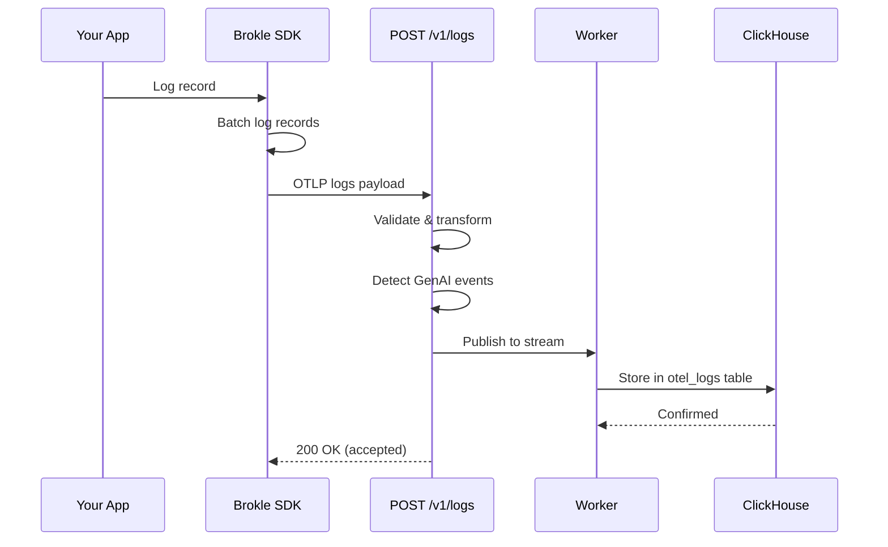

import { Callout } from "fumadocs-ui/components/callout";
import { Tabs, Tab } from "fumadocs-ui/components/tabs";

# Logs API

The Logs API provides an OTLP-native endpoint for ingesting log data with automatic trace correlation and GenAI event detection. Logs linked to traces via `traceId` and `spanId` are automatically associated with the corresponding trace in the Brokle UI.

## Endpoints Overview

| Method | Endpoint | Description | Auth |
|--------|----------|-------------|------|
| POST | `/v1/logs` | Ingest OTLP log data | API Key |



## Ingest Logs

```
POST /v1/logs
```

Ingest log data in OpenTelemetry Protocol (OTLP) format. Supports both Protobuf and JSON encoding.

### Authentication

- **Header**: `X-API-Key: bk_your_api_key`

### Content Types

| Content-Type | Description |
|-------------|-------------|
| `application/x-protobuf` | OTLP Protobuf encoding (recommended) |
| `application/json` | OTLP JSON encoding |

<Callout type="info">
  Gzip compression is supported via the `Content-Encoding: gzip` header. Recommended for high-volume log ingestion.
</Callout>

### Request Size Limit

Maximum request body size is **10 MB**.

### Request Body

OTLP JSON format for log data:

```json
{
  "resourceLogs": [
    {
      "resource": {
        "attributes": [
          {
            "key": "service.name",
            "value": { "stringValue": "my-ai-app" }
          },
          {
            "key": "service.version",
            "value": { "stringValue": "1.0.0" }
          }
        ]
      },
      "scopeLogs": [
        {
          "scope": {
            "name": "my-logger",
            "version": "1.0.0"
          },
          "logRecords": [
            {
              "timeUnixNano": "1700000001500000000",
              "observedTimeUnixNano": "1700000001500100000",
              "severityNumber": 9,
              "severityText": "INFO",
              "body": {
                "stringValue": "LLM request completed successfully"
              },
              "attributes": [
                {
                  "key": "gen_ai.request.model",
                  "value": { "stringValue": "gpt-4" }
                },
                {
                  "key": "gen_ai.provider.name",
                  "value": { "stringValue": "openai" }
                }
              ],
              "traceId": "4bf92f3577b34da6a3ce929d0e0e4736",
              "spanId": "00f067aa0ba902b7"
            }
          ]
        }
      ]
    }
  ]
}
```

### Log Record Fields

| Field | Type | Required | Description |
|-------|------|----------|-------------|
| `timeUnixNano` | string | No | Event timestamp in nanoseconds since epoch |
| `observedTimeUnixNano` | string | No | When the log was observed/collected |
| `severityNumber` | integer | No | Numeric severity level (1-24) |
| `severityText` | string | No | Human-readable severity (e.g., "INFO", "ERROR") |
| `body` | AnyValue | No | Log message body |
| `attributes` | KeyValue[] | No | Additional structured metadata |
| `traceId` | string | No | Associated trace ID for correlation |
| `spanId` | string | No | Associated span ID for correlation |
| `traceFlags` | integer | No | W3C trace flags |

### Severity Levels

| Severity Text | Number Range | Description |
|--------------|-------------|-------------|
| TRACE | 1-4 | Fine-grained debugging |
| DEBUG | 5-8 | Debugging information |
| INFO | 9-12 | Informational messages |
| WARN | 13-16 | Warning conditions |
| ERROR | 17-20 | Error conditions |
| FATAL | 21-24 | Critical failures |

### Trace Correlation

<Callout type="info">
  Log records that include `traceId` and `spanId` fields are automatically linked to the corresponding trace in Brokle. This enables viewing logs alongside traces in the dashboard for full observability.
</Callout>

When using SDK provider wrappers, trace context is automatically propagated to log records. No manual trace ID injection is needed.

### GenAI Event Detection

<Callout type="info">
  Structured log records with GenAI event names (such as prompt/completion events) are automatically detected and stored as GenAI events alongside regular logs. This enables richer analysis of LLM interactions beyond traces alone.
</Callout>

### Response

**Success (200 OK)**

```json
{
  "success": true,
  "data": {
    "batch_id": "01ARZ3NdgoQmNKx3WR_zrKQ",
    "event_count": 12,
    "status": "accepted"
  },
  "meta": {
    "request_id": "req_abc123",
    "timestamp": "2024-01-15T10:30:00Z",
    "version": "v1"
  }
}
```

**Error Responses**

| Status | Description |
|--------|-------------|
| 400 | Invalid OTLP format or malformed request body |
| 401 | Missing or invalid API key |
| 413 | Request body exceeds 10 MB limit |
| 415 | Unsupported content type |

### Examples

<Tabs>
  <Tab value="curl" label="cURL">
    ```bash
    curl -X POST https://api.brokle.com/v1/logs \
      -H "Content-Type: application/json" \
      -H "X-API-Key: bk_your_api_key" \
      -d '{
        "resourceLogs": [{
          "resource": {
            "attributes": [
              {"key": "service.name", "value": {"stringValue": "my-app"}}
            ]
          },
          "scopeLogs": [{
            "scope": {"name": "my-logger"},
            "logRecords": [{
              "timeUnixNano": "1700000001500000000",
              "severityNumber": 9,
              "severityText": "INFO",
              "body": {"stringValue": "Chat completion finished"},
              "attributes": [
                {"key": "gen_ai.request.model", "value": {"stringValue": "gpt-4"}},
                {"key": "gen_ai.provider.name", "value": {"stringValue": "openai"}}
              ],
              "traceId": "4bf92f3577b34da6a3ce929d0e0e4736",
              "spanId": "00f067aa0ba902b7"
            }]
          }]
        }]
      }'
    ```
  </Tab>
  <Tab value="python" label="Python SDK">
    ```python
    from brokle import Brokle
    from brokle.wrappers import wrap_openai
    import openai

    # Logs are opt-in (disabled by default)
    brokle = Brokle(
        api_key="bk_your_api_key",
        logs_enabled=True,   # Must explicitly enable
    )

    # Wrap your provider
    client = wrap_openai(openai.OpenAI())

    # Logs are collected and correlated with traces automatically
    response = client.chat.completions.create(
        model="gpt-4",
        messages=[{"role": "user", "content": "Hello!"}]
    )
    ```
  </Tab>
  <Tab value="javascript" label="JavaScript SDK">
    ```javascript
    import { Brokle } from 'brokle';
    import { wrapOpenAI } from 'brokle/openai';
    import OpenAI from 'openai';

    // Logs are opt-in (disabled by default)
    const brokle = new Brokle({
      apiKey: 'bk_your_api_key',
      logsEnabled: true,   // Must explicitly enable
    });

    // Wrap your provider
    const client = wrapOpenAI(new OpenAI());

    // Logs are collected and correlated with traces automatically
    const response = await client.chat.completions.create({
      model: 'gpt-4',
      messages: [{ role: 'user', content: 'Hello!' }],
    });
    ```
  </Tab>
</Tabs>

## SDK Configuration

| Option | JavaScript | Python | Default | Description |
|--------|-----------|--------|---------|-------------|
| Enable logs | `logsEnabled` | `logs_enabled` | `false` | Enable/disable log collection (opt-in) |

<Callout type="warning">
  Logs are **disabled by default**. Set `logsEnabled: true` (JS) or `logs_enabled=True` (Python) to enable log collection. This opt-in design avoids unnecessary overhead for applications that don't need log ingestion.
</Callout>

**Environment Variables:**

| Variable | Default | Description |
|----------|---------|-------------|
| `BROKLE_LOGS_ENABLED` | `false` | Enable log collection |

## Best Practices

### Enable Logs Selectively

Logs are opt-in for good reason — enable them only when you need log-level observability alongside traces:

```python
# Production: traces + metrics (default), add logs when debugging
brokle = Brokle(
    api_key="bk_your_api_key",
    logs_enabled=True,   # Enable when needed
)
```

### Use Trace Correlation

Always include `traceId` and `spanId` in your log records to link them to traces. The SDK handles this automatically when using provider wrappers:

```python
# Automatic: SDK propagates trace context to logs
client = wrap_openai(openai.OpenAI())
response = client.chat.completions.create(...)
# Logs from this call are automatically linked to the trace
```

### Structured Logging

Use log attributes for structured metadata instead of embedding data in the log body. This enables filtering and querying in the Brokle dashboard:

```json
{
  "body": {"stringValue": "Request completed"},
  "attributes": [
    {"key": "gen_ai.request.model", "value": {"stringValue": "gpt-4"}},
    {"key": "response.status", "value": {"intValue": "200"}},
    {"key": "custom.user_id", "value": {"stringValue": "user_123"}}
  ]
}
```

## Related

- [Traces API →](/docs/api/endpoints/traces)
- [Metrics API →](/docs/api/endpoints/metrics)
- [Python SDK →](/docs/sdk/python)
- [JavaScript SDK →](/docs/sdk/javascript)
