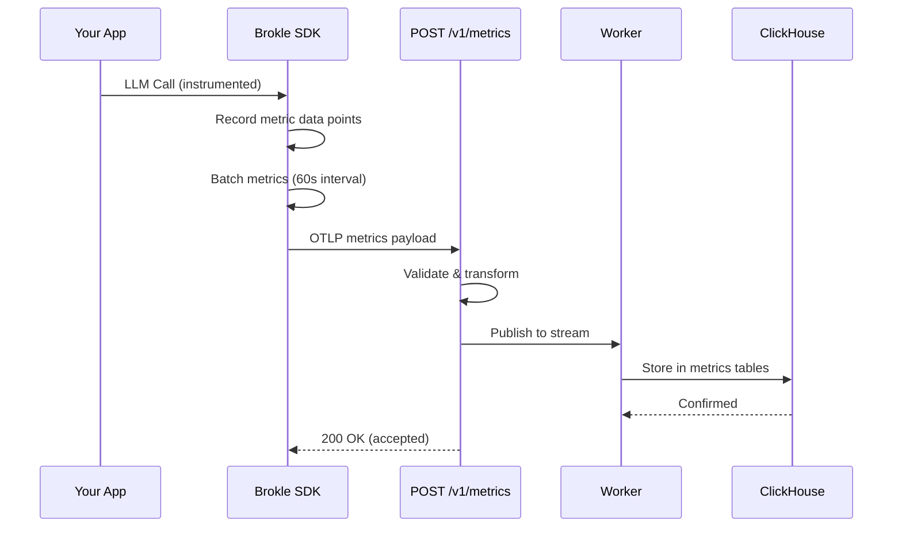

import { Callout } from "fumadocs-ui/components/callout";
import { Tabs, Tab } from "fumadocs-ui/components/tabs";

# Metrics API

The Metrics API provides an OTLP-native endpoint for ingesting metrics data from your GenAI applications. Brokle automatically collects performance metrics like token usage, request latency, time-to-first-token, and error rates when using SDK provider wrappers.

## Endpoints Overview

| Method | Endpoint | Description | Auth |
|--------|----------|-------------|------|
| POST | `/v1/metrics` | Ingest OTLP metrics data | API Key |



## Ingest Metrics

```
POST /v1/metrics
```

Ingest metrics data in OpenTelemetry Protocol (OTLP) format. Supports both Protobuf and JSON encoding.

### Authentication

- **Header**: `X-API-Key: bk_your_api_key`

### Content Types

| Content-Type | Description |
|-------------|-------------|
| `application/x-protobuf` | OTLP Protobuf encoding (recommended) |
| `application/json` | OTLP JSON encoding |

<Callout type="info">
  Gzip compression is supported via the `Content-Encoding: gzip` header. Recommended for high-volume metric ingestion.
</Callout>

### Request Size Limit

Maximum request body size is **10 MB**.

### Request Body

OTLP JSON format for metrics data:

```json
{
  "resourceMetrics": [
    {
      "resource": {
        "attributes": [
          {
            "key": "service.name",
            "value": { "stringValue": "my-ai-app" }
          },
          {
            "key": "service.version",
            "value": { "stringValue": "1.0.0" }
          }
        ]
      },
      "scopeMetrics": [
        {
          "scope": {
            "name": "brokle.metrics",
            "version": "1.0.0"
          },
          "metrics": [
            {
              "name": "gen_ai.token_usage",
              "histogram": {
                "dataPoints": [
                  {
                    "startTimeUnixNano": "1700000000000000000",
                    "timeUnixNano": "1700000060000000000",
                    "count": "10",
                    "sum": 1500,
                    "bucketCounts": ["0", "2", "5", "3", "0"],
                    "explicitBounds": [50, 100, 200, 500],
                    "attributes": [
                      {
                        "key": "gen_ai.request.model",
                        "value": { "stringValue": "gpt-4" }
                      },
                      {
                        "key": "gen_ai.provider.name",
                        "value": { "stringValue": "openai" }
                      }
                    ]
                  }
                ],
                "aggregationTemporality": 2
              }
            }
          ]
        }
      ]
    }
  ]
}
```

### Supported Metric Types

| Type | Description | Use Case |
|------|-------------|----------|
| Sum | Monotonic counters and non-monotonic sums | Request counts, token counts, error counts |
| Gauge | Point-in-time measurements | Current queue depth, active connections |
| Histogram | Distribution of values with bucket boundaries | Token usage, latency, TTFT |
| ExponentialHistogram | Histogram with exponential bucket boundaries | High-precision latency distributions |

### GenAI Metric Names

The Brokle SDKs automatically collect the following metrics when using provider wrappers:

| Metric Name | Type | Description |
|------------|------|-------------|
| `gen_ai.token_usage` | Histogram | Total tokens per request (input + output) |
| `gen_ai.input_tokens` | Counter | Cumulative input token count |
| `gen_ai.output_tokens` | Counter | Cumulative output token count |
| `gen_ai.operation.duration` | Histogram | Request duration in milliseconds |
| `gen_ai.request.time_to_first_token` | Histogram | Time to first token for streaming responses (ms) |
| `gen_ai.request.inter_token_latency` | Histogram | Inter-token latency for streaming responses (ms) |
| `gen_ai.request.count` | Counter | Total number of GenAI requests |
| `gen_ai.request.error.count` | Counter | Total number of failed requests |

All metrics include these standard attributes:

| Attribute | Type | Description |
|-----------|------|-------------|
| `gen_ai.request.model` | string | Model name (e.g., "gpt-4") |
| `gen_ai.provider.name` | string | Provider name (e.g., "openai") |
| `gen_ai.operation.name` | string | Operation type (e.g., "chat", "embeddings") |

### Response

**Success (200 OK)**

```json
{
  "success": true,
  "data": {
    "batch_id": "01ARZ3NdgoQmNKx3WR_zrKQ",
    "event_count": 5,
    "status": "accepted"
  },
  "meta": {
    "request_id": "req_abc123",
    "timestamp": "2024-01-15T10:30:00Z",
    "version": "v1"
  }
}
```

**Error Responses**

| Status | Description |
|--------|-------------|
| 400 | Invalid OTLP format or malformed request body |
| 401 | Missing or invalid API key |
| 413 | Request body exceeds 10 MB limit |
| 415 | Unsupported content type |

### Examples

<Tabs>
  <Tab value="curl" label="cURL">
    ```bash
    curl -X POST https://api.brokle.com/v1/metrics \
      -H "Content-Type: application/json" \
      -H "X-API-Key: bk_your_api_key" \
      -d '{
        "resourceMetrics": [{
          "resource": {
            "attributes": [
              {"key": "service.name", "value": {"stringValue": "my-app"}}
            ]
          },
          "scopeMetrics": [{
            "scope": {"name": "brokle.metrics"},
            "metrics": [{
              "name": "gen_ai.request.count",
              "sum": {
                "dataPoints": [{
                  "startTimeUnixNano": "1700000000000000000",
                  "timeUnixNano": "1700000060000000000",
                  "asInt": "42",
                  "attributes": [
                    {"key": "gen_ai.request.model", "value": {"stringValue": "gpt-4"}},
                    {"key": "gen_ai.provider.name", "value": {"stringValue": "openai"}}
                  ]
                }],
                "aggregationTemporality": 2,
                "isMonotonic": true
              }
            }]
          }]
        }]
      }'
    ```
  </Tab>
  <Tab value="python" label="Python SDK">
    ```python
    from brokle import Brokle
    from brokle.wrappers import wrap_openai
    import openai

    # Metrics are enabled by default
    brokle = Brokle(
        api_key="bk_your_api_key",
        metrics_enabled=True,              # Default: True
        metrics_export_interval=60.0,      # Default: 60 seconds
    )

    # Wrap your provider — metrics are collected automatically
    client = wrap_openai(openai.OpenAI())

    # Every call automatically records:
    # - gen_ai.request.count
    # - gen_ai.request.tokens.input / output
    # - gen_ai.request.duration
    response = client.chat.completions.create(
        model="gpt-4",
        messages=[{"role": "user", "content": "Hello!"}]
    )
    ```
  </Tab>
  <Tab value="javascript" label="JavaScript SDK">
    ```javascript
    import { Brokle } from 'brokle';
    import { wrapOpenAI } from 'brokle/openai';
    import OpenAI from 'openai';

    // Metrics are enabled by default
    const brokle = new Brokle({
      apiKey: 'bk_your_api_key',
      metricsEnabled: true,         // Default: true
      metricsInterval: 60000,       // Default: 60000ms (60 seconds)
    });

    // Wrap your provider — metrics are collected automatically
    const client = wrapOpenAI(new OpenAI());

    // Every call automatically records:
    // - gen_ai.request.count
    // - gen_ai.token_usage
    // - gen_ai.operation.duration
    const response = await client.chat.completions.create({
      model: 'gpt-4',
      messages: [{ role: 'user', content: 'Hello!' }],
    });
    ```
  </Tab>
</Tabs>

## SDK Configuration

| Option | JavaScript | Python | Default | Description |
|--------|-----------|--------|---------|-------------|
| Enable metrics | `metricsEnabled` | `metrics_enabled` | `true` | Enable/disable metrics collection |
| Export interval | `metricsInterval` | `metrics_export_interval` | 60000ms / 60s | How often metrics are exported |

<Callout type="info">
  Metrics are **enabled by default**. The SDK automatically collects GenAI metrics when using provider wrappers (`wrapOpenAI`, `wrap_openai`, etc.). No additional instrumentation code is needed.
</Callout>

**Environment Variables:**

| Variable | Default | Description |
|----------|---------|-------------|
| `BROKLE_METRICS_ENABLED` | `true` | Enable metrics collection |
| `BROKLE_METRICS_EXPORT_INTERVAL` | `60.0` | Export interval in seconds (Python) |

## Best Practices

### Use SDK Provider Wrappers

The easiest way to collect metrics is through SDK wrappers. They automatically instrument all GenAI calls with the standard metrics above:

```python
from brokle.wrappers import wrap_openai
client = wrap_openai(openai.OpenAI())
# All metrics collected automatically — no manual instrumentation needed
```

### Compression for High Volume

For applications generating high metric volumes, enable gzip compression:

```bash
curl -X POST https://api.brokle.com/v1/metrics \
  -H "Content-Encoding: gzip" \
  -H "Content-Type: application/json" \
  -H "X-API-Key: bk_your_api_key" \
  --data-binary @metrics.json.gz
```

### Histogram Bucket Boundaries

The SDK pre-configures histogram bucket boundaries optimized for GenAI workloads (token counts, latencies). When sending metrics directly, use appropriate boundaries for your use case.

## Related

- [Traces API →](/docs/api/endpoints/traces)
- [Logs API →](/docs/api/endpoints/logs)
- [Python SDK →](/docs/sdk/python)
- [JavaScript SDK →](/docs/sdk/javascript)
