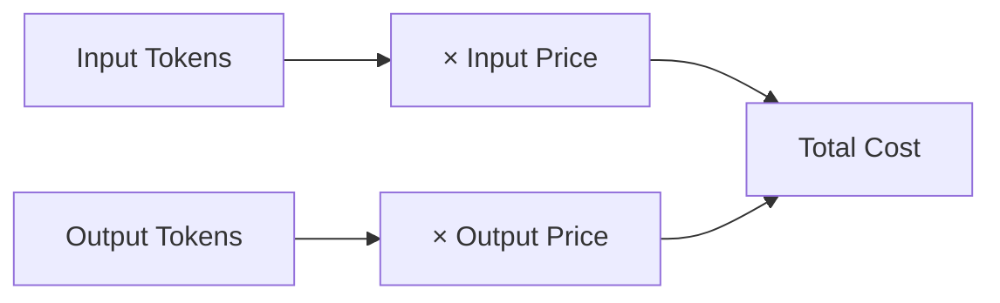

import { Callout } from "fumadocs-ui/components/callout";
import { Tabs, Tab } from "fumadocs-ui/components/tabs";

# Cost Analytics

**Cost analytics** gives you complete visibility into your AI spending. Track costs per request, user, feature, and model to optimize your AI investment.

## Why Cost Analytics?

AI costs can grow unpredictably. Without visibility, you might discover:

- A single feature consuming 80% of your budget
- Inefficient prompts generating unnecessary tokens
- High-cost models used where cheaper alternatives suffice
- Unexpected spikes from runaway loops or errors

Brokle's cost analytics helps you understand and control spending.

## How Costs are Calculated

Brokle automatically calculates costs based on:



### Model Pricing

Brokle maintains current pricing for major providers:

| Model | Input (per 1M tokens) | Output (per 1M tokens) |
|-------|----------------------|------------------------|
| GPT-4 Turbo | $10.00 | $30.00 |
| GPT-4 | $30.00 | $60.00 |
| GPT-3.5 Turbo | $0.50 | $1.50 |
| Claude 3 Opus | $15.00 | $75.00 |
| Claude 3 Sonnet | $3.00 | $15.00 |
| Claude 3 Haiku | $0.25 | $1.25 |

<Callout type="info">
  Pricing is updated regularly. For enterprise agreements with custom pricing, you can configure custom rates in your project settings.
</Callout>

## Viewing Costs

### Trace-Level Costs

Every trace shows its total cost:

```
Trace: "rag_pipeline"
├── Span: embed_query
│   └── Cost: $0.00002
├── Span: gpt-4-call
│   ├── Input tokens: 1,500
│   ├── Output tokens: 500
│   └── Cost: $0.045
└── Total Cost: $0.04502
```

### Dashboard Analytics

The cost dashboard provides:

```
┌─────────────────────────────────────────────────────────┐
│ Cost Analytics - Last 30 Days                           │
├─────────────────────────────────────────────────────────┤
│                                                         │
│  Total Spend:        $1,234.56                         │
│  Avg Cost/Request:   $0.032                            │
│  Total Requests:     38,580                            │
│  Total Tokens:       45.2M                             │
│                                                         │
│  By Model:                                              │
│  ├── GPT-4:          $890.00 (72%)                     │
│  ├── GPT-3.5:        $234.00 (19%)                     │
│  └── Embeddings:     $110.56 (9%)                      │
│                                                         │
│  By Feature:                                            │
│  ├── Chat:           $650.00 (53%)                     │
│  ├── Search:         $384.00 (31%)                     │
│  └── Analytics:      $200.56 (16%)                     │
│                                                         │
└─────────────────────────────────────────────────────────┘
```

## Cost Attribution

### By User

Track spending per user for billing or rate limiting:

<Tabs>
  <Tab value="python" label="Python">
    ```python
    with client.start_as_current_span(name="chat_response") as span:
        span.update_trace(user_id=user.id)

        # Cost automatically attributed to user
        response = generate_response(message)
    ```
  </Tab>
  <Tab value="javascript" label="JavaScript">
    ```javascript
    await client.startActiveSpan('chat_response', async (span) => {
      span.setAttribute('userId', user.id);

      // Cost automatically attributed to user
      const response = await generateResponse(message);
      client.updateCurrentSpan({ output: response });
    });
    ```
  </Tab>
</Tabs>

### By Feature

Tag traces with features for spend analysis:

```python
with client.start_as_current_span(name="generate_summary") as span:
    span.set_attribute("feature", "document_summarization")
    span.set_attribute("product_area", "productivity")

    summary = summarize_document(document)
```

### By Customer Tier

Understand cost distribution across customer segments:

```python
with client.start_as_current_span(name="premium_feature") as span:
    span.set_attribute("customer_tier", customer.tier)  # "free", "pro", "enterprise"
    span.set_attribute("customer_id", customer.id)

    result = expensive_ai_operation()
```

## Cost Optimization

### 1. Model Selection

Choose the right model for each task:

```python
def select_model(task_complexity: str) -> str:
    """Select cost-appropriate model"""
    model_map = {
        "simple": "gpt-3.5-turbo",      # $0.002/1K tokens
        "moderate": "gpt-4-turbo",       # $0.01/1K tokens
        "complex": "gpt-4",              # $0.03/1K tokens
    }
    return model_map.get(task_complexity, "gpt-3.5-turbo")

with client.start_as_current_span(name="adaptive_generation") as span:
    model = select_model(analyze_complexity(prompt))
    span.set_attribute("model_selection_reason", "complexity-based")

    response = openai.chat.completions.create(
        model=model,
        messages=[{"role": "user", "content": prompt}]
    )
```

### 2. Prompt Optimization

Reduce token usage without sacrificing quality:

```python
# Before optimization: 2,500 tokens
system_prompt = """
You are a helpful assistant. Your job is to help users with their questions.
You should always be polite and professional. You should provide accurate information.
When you don't know something, you should say so. You should not make things up.
... (continues for 500 more words)
"""

# After optimization: 150 tokens
system_prompt = """
Helpful assistant. Answer accurately and concisely.
Acknowledge uncertainty. Be professional.
"""
```

### 3. Caching Strategies

Avoid redundant API calls:

```python
import hashlib
from functools import lru_cache

@lru_cache(maxsize=1000)
def cached_embedding(text: str) -> list[float]:
    """Cache embeddings to avoid repeated API calls"""
    return openai.embeddings.create(
        model="text-embedding-3-small",
        input=text
    ).data[0].embedding

# Usage with cost tracking
with client.start_as_current_span(name="get_embedding") as span:
    cache_key = hashlib.md5(text.encode()).hexdigest()

    if cache_key in embedding_cache:
        span.set_attribute("cache_hit", True)
        span.set_attribute("cost_saved", True)
        embedding = embedding_cache[cache_key]
    else:
        span.set_attribute("cache_hit", False)
        embedding = get_embedding(text)
        embedding_cache[cache_key] = embedding
```

### 4. Request Batching

Combine multiple requests to reduce overhead:

```python
# Instead of N separate calls
def embed_documents_inefficient(docs: list[str]) -> list:
    embeddings = []
    for doc in docs:
        embedding = get_embedding(doc)  # N API calls
        embeddings.append(embedding)
    return embeddings

# Batch into single call
def embed_documents_efficient(docs: list[str]) -> list:
    with client.start_as_current_span(name="batch_embed") as span:
        span.set_attribute("batch_size", len(docs))

        response = openai.embeddings.create(
            model="text-embedding-3-small",
            input=docs  # Single API call
        )

        span.set_attribute("tokens_used", response.usage.total_tokens)
        return [e.embedding for e in response.data]
```

## Cost Alerts

Set up alerts for spending thresholds:

### Budget Alerts

```python
# Configure in dashboard or via API
budget_config = {
    "daily_limit": 100.00,    # Alert at $100/day
    "weekly_limit": 500.00,   # Alert at $500/week
    "monthly_limit": 2000.00, # Alert at $2000/month
    "alert_threshold": 0.80,  # Alert at 80% of limit
}
```

### Anomaly Detection

```
Alert: Unusual spending detected
├── Current: $45.23 (last hour)
├── Average: $12.50 (hourly baseline)
├── Increase: +262%
├── Top contributor: feature/chat (89%)
└── Action: Investigate /chat endpoint
```

## Cost Reports

### Export Options

Generate cost reports for:

- **Billing**: Invoice customers based on usage
- **Planning**: Forecast future costs
- **Optimization**: Identify high-cost patterns

```python
# API: Get cost breakdown
report = client.get_cost_report(
    start_date="2024-01-01",
    end_date="2024-01-31",
    group_by=["model", "feature", "user_id"],
    format="csv"
)
```

### Report Dimensions

| Dimension | Use Case |
|-----------|----------|
| **Time** | Trend analysis, seasonality |
| **Model** | Identify expensive models |
| **Feature** | Product cost allocation |
| **User** | Usage-based billing |
| **Customer Tier** | Segment profitability |
| **Environment** | Prod vs staging costs |

## Cost vs Quality Trade-offs

Balance cost and quality based on your needs:

```
┌─────────────────────────────────────────────────────────┐
│ Cost vs Quality Matrix                                  │
├─────────────────────────────────────────────────────────┤
│                                                         │
│  GPT-4     ★★★★★ Quality    $$$$$  Cost                │
│  GPT-4T    ★★★★☆ Quality    $$$    Cost                │
│  GPT-3.5   ★★★☆☆ Quality    $      Cost                │
│  Claude-H  ★★★☆☆ Quality    $      Cost                │
│                                                         │
│  Recommendation by Use Case:                            │
│  ├── Simple Q&A: GPT-3.5 or Claude Haiku               │
│  ├── Complex reasoning: GPT-4 Turbo                    │
│  ├── Long documents: Claude Sonnet                     │
│  └── Maximum quality: GPT-4 or Claude Opus             │
│                                                         │
└─────────────────────────────────────────────────────────┘
```

## Best Practices

### 1. Tag Everything

Enable granular cost analysis:

```python
span.set_attribute("feature", "summarization")
span.set_attribute("customer_tier", "enterprise")
span.set_attribute("prompt_version", "v2.1")
span.update_trace(user_id=user.id)
```

### 2. Monitor Regularly

Check cost dashboards daily/weekly:

- Identify unexpected spikes
- Track optimization impact
- Catch runaway loops early

### 3. Set Budgets

Prevent bill shock with limits:

```python
# Rate limit expensive operations
if get_daily_user_cost(user_id) > 10.00:
    raise RateLimitError("Daily limit exceeded")
```

### 4. Test with Cheaper Models

Use inexpensive models during development:

```python
model = "gpt-3.5-turbo" if os.getenv("ENV") == "development" else "gpt-4"
```

<Callout type="warning">
  Always test in production-like conditions before deployment. Cheaper models may not catch edge cases that expensive models handle correctly.
</Callout>

## Related Concepts

- [Traces](/docs/concepts/traces) - Cost is tracked per trace
- [Evaluations](/docs/concepts/evaluations) - Balance cost vs quality
- [Sessions](/docs/concepts/sessions) - Track session-level costs

## Next Steps

- [Create your first trace →](/docs/first-trace)
- [Set up cost alerts →](/docs/analytics/alerts)
- [Optimize your prompts →](/docs/prompt-management)
