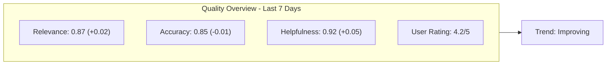

import { Callout } from "fumadocs-ui/components/callout";
import { Tabs, Tab } from "fumadocs-ui/components/tabs";

# Evaluations

**Evaluations** measure the quality of your AI outputs. They transform subjective assessments ("this response seems good") into quantifiable metrics you can track, compare, and improve over time.

## What are Evaluations?

Evaluations attach scores and feedback to traces and spans:

```
Trace: "customer_support_response"
├── Input: "How do I cancel my subscription?"
├── Output: "To cancel your subscription, go to Settings > Billing..."
│
├── Evaluations:
│   ├── relevance: 0.95 (highly relevant to question)
│   ├── helpfulness: 0.88 (actionable instructions)
│   ├── accuracy: 0.92 (correct information)
│   ├── tone: 0.90 (professional and friendly)
│   └── human_feedback: "thumbs_up"
```

## Types of Evaluations

### 1. Automated Evaluations

Run automatically on traces without human intervention:

| Evaluator | What It Measures | Score Range |
|-----------|------------------|-------------|
| **Relevance** | Does output address the input? | 0.0 - 1.0 |
| **Coherence** | Is the response logically consistent? | 0.0 - 1.0 |
| **Fluency** | Is the language natural and readable? | 0.0 - 1.0 |
| **Toxicity** | Does output contain harmful content? | 0.0 - 1.0 |
| **Hallucination** | Are claims supported by context? | 0.0 - 1.0 |

### 2. LLM-as-Judge Evaluations

Use an LLM to evaluate another LLM's output:

```python
# Example: Using GPT-4 to evaluate response quality
evaluation_prompt = """
Rate the following response on helpfulness (1-5):

Question: {input}
Response: {output}

Consider:
- Does it directly answer the question?
- Are the instructions clear and actionable?
- Is the tone appropriate?

Score (1-5):
"""
```

### 3. Human Feedback

Collect explicit user feedback:

```
User Actions:
├── 👍 Thumbs up / 👎 Thumbs down
├── ⭐ Star ratings (1-5)
├── 📝 Written feedback
└── 🔄 Corrections / edits
```

## Adding Evaluations

### Attach Scores to Spans

<Tabs>
  <Tab value="python" label="Python">
    ```python
    from brokle import Brokle

    client = Brokle(api_key="bk_...")

    with client.start_as_current_span(name="generate_response") as span:
        response = generate(prompt)
        span.update(output=response)

        # Add evaluation scores
        span.set_attribute("eval_relevance", 0.95)
        span.set_attribute("eval_helpfulness", 0.88)
        span.set_attribute("eval_accuracy", 0.92)
    ```
  </Tab>
  <Tab value="javascript" label="JavaScript">
    ```javascript
    import { Brokle } from 'brokle';

    const client = new Brokle({ apiKey: 'bk_...' });

    const span = client.startSpan({ name: 'generate_response' });

    const response = await generate(prompt);

    span.end({
      output: response,
      attributes: {
        evalRelevance: 0.95,
        evalHelpfulness: 0.88,
        evalAccuracy: 0.92
      }
    });
    ```
  </Tab>
</Tabs>

### Record Human Feedback

<Tabs>
  <Tab value="python" label="Python">
    ```python
    # After user provides feedback
    def record_feedback(trace_id: str, feedback: str, rating: int):
        client.create_score(
            trace_id=trace_id,
            name="user_feedback",
            value=rating,
            comment=feedback,
            source="user"
        )

    # Usage
    record_feedback(
        trace_id="trace_abc123",
        feedback="Very helpful response!",
        rating=5
    )
    ```
  </Tab>
  <Tab value="javascript" label="JavaScript">
    ```javascript
    // After user provides feedback
    async function recordFeedback(traceId, feedback, rating) {
      await client.createScore({
        traceId,
        name: 'user_feedback',
        value: rating,
        comment: feedback,
        source: 'user'
      });
    }

    // Usage
    await recordFeedback(
      'trace_abc123',
      'Very helpful response!',
      5
    );
    ```
  </Tab>
</Tabs>

### LLM-as-Judge Pattern

<Tabs>
  <Tab value="python" label="Python">
    ```python
    import openai

    def evaluate_response(input_text: str, output_text: str) -> float:
        """Use GPT-4 to evaluate response quality"""

        evaluation = openai.chat.completions.create(
            model="gpt-4",
            messages=[
                {
                    "role": "system",
                    "content": """You are an expert evaluator. Rate responses on a scale of 0-1.
                    Return only a number between 0 and 1."""
                },
                {
                    "role": "user",
                    "content": f"""
                    Question: {input_text}
                    Response: {output_text}

                    Rate the helpfulness of this response (0-1):
                    """
                }
            ],
            max_tokens=10
        )

        score = float(evaluation.choices[0].message.content.strip())
        return score

    # Usage in a trace
    with client.start_as_current_span(name="qa_pipeline") as span:
        response = generate_answer(question)
        span.update(output=response)

        # Run LLM evaluation
        quality_score = evaluate_response(question, response)
        span.set_attribute("eval_quality", quality_score)
    ```
  </Tab>
  <Tab value="javascript" label="JavaScript">
    ```javascript
    import OpenAI from 'openai';

    const openai = new OpenAI();

    async function evaluateResponse(inputText, outputText) {
      const evaluation = await openai.chat.completions.create({
        model: 'gpt-4',
        messages: [
          {
            role: 'system',
            content: `You are an expert evaluator. Rate responses on a scale of 0-1.
            Return only a number between 0 and 1.`
          },
          {
            role: 'user',
            content: `
            Question: ${inputText}
            Response: ${outputText}

            Rate the helpfulness of this response (0-1):
            `
          }
        ],
        max_tokens: 10
      });

      return parseFloat(evaluation.choices[0].message.content.trim());
    }

    // Usage in a trace
    const span = client.startSpan({ name: 'qa_pipeline' });

    const response = await generateAnswer(question);
    const qualityScore = await evaluateResponse(question, response);

    span.end({
      output: response,
      attributes: { evalQuality: qualityScore }
    });
    ```
  </Tab>
</Tabs>

## Built-in Evaluators

Brokle provides ready-to-use evaluators:

### Relevance Evaluator

Measures how well the output addresses the input:

```python
from brokle.evaluators import relevance_evaluator

score = relevance_evaluator(
    input="What are the side effects of aspirin?",
    output="Aspirin can cause stomach upset, bleeding, and allergic reactions..."
)
# Returns: 0.95
```

### Hallucination Evaluator

Detects when the LLM makes claims not supported by context:

```python
from brokle.evaluators import hallucination_evaluator

score = hallucination_evaluator(
    context="The company was founded in 2020 and has 50 employees.",
    output="The company, founded in 2018, employs over 500 people..."
)
# Returns: 0.2 (high hallucination detected)
```

### Toxicity Evaluator

Identifies harmful or inappropriate content:

```python
from brokle.evaluators import toxicity_evaluator

score = toxicity_evaluator(
    output="Here's the information you requested about our products..."
)
# Returns: 0.02 (very low toxicity)
```

## Evaluation Categories

### Quality Metrics

| Metric | Question | Use When |
|--------|----------|----------|
| **Accuracy** | Is the information correct? | Factual responses |
| **Completeness** | Does it cover all aspects? | Complex queries |
| **Conciseness** | Is it appropriately brief? | User preferences |
| **Clarity** | Is it easy to understand? | General responses |

### Task-Specific Metrics

| Task | Key Metrics |
|------|-------------|
| **Q&A** | Accuracy, Relevance, Completeness |
| **Summarization** | Faithfulness, Coverage, Conciseness |
| **Classification** | Precision, Recall, F1 |
| **Generation** | Creativity, Coherence, Safety |
| **Translation** | BLEU, Accuracy, Fluency |

### Safety Metrics

| Metric | Detects |
|--------|---------|
| **Toxicity** | Harmful, offensive content |
| **Bias** | Unfair treatment of groups |
| **PII Leakage** | Personal information exposure |
| **Jailbreak** | Prompt injection attempts |

## Viewing Evaluations

### Dashboard Views

In the Brokle dashboard:

1. **Trace View**: See all evaluations attached to a trace
2. **Evaluation Tab**: Filter and analyze evaluations across traces
3. **Quality Trends**: Track metrics over time
4. **Comparison Views**: Compare quality across models/prompts

### Quality Dashboard



## Evaluation Pipelines

### Asynchronous Evaluation

Run evaluations without blocking responses:

```python
import asyncio
from concurrent.futures import ThreadPoolExecutor

executor = ThreadPoolExecutor(max_workers=4)

async def generate_and_evaluate(question: str):
    with client.start_as_current_span(name="qa_with_eval") as span:
        # Generate response (fast path)
        response = await generate_answer(question)
        span.update(output=response)

        # Schedule evaluation (doesn't block response)
        asyncio.get_event_loop().run_in_executor(
            executor,
            lambda: run_evaluations(span.span_id, question, response)
        )

        return response

def run_evaluations(span_id: str, question: str, response: str):
    """Run evaluations in background"""
    relevance = evaluate_relevance(question, response)
    accuracy = evaluate_accuracy(question, response)

    client.update_span(
        span_id=span_id,
        attributes={
            "eval_relevance": relevance,
            "eval_accuracy": accuracy
        }
    )
```

### Batch Evaluation

Evaluate historical traces:

```python
def batch_evaluate(trace_ids: list[str], evaluator):
    """Run evaluator on multiple traces"""
    results = []

    for trace_id in trace_ids:
        trace = client.get_trace(trace_id)
        score = evaluator(
            input=trace.input,
            output=trace.output
        )

        client.create_score(
            trace_id=trace_id,
            name=evaluator.name,
            value=score
        )

        results.append({"trace_id": trace_id, "score": score})

    return results
```

## Best Practices

### 1. Choose Relevant Metrics

Match evaluators to your use case:

```python
# Customer support bot
evaluators = ["relevance", "helpfulness", "tone", "resolution"]

# Code generation
evaluators = ["correctness", "efficiency", "readability", "security"]

# Content generation
evaluators = ["creativity", "coherence", "engagement", "safety"]
```

### 2. Combine Automated and Human Evaluation

```python
# Automated for scale
span.set_attribute("eval_automated_quality", automated_score)

# Human for calibration
if should_sample_for_human_review(trace):
    queue_for_review(trace.trace_id)
```

### 3. Track Evaluation Trends

Monitor quality over time to detect regressions:

```python
# Alert if quality drops
if average_quality_score < baseline - 0.1:
    send_alert("Quality regression detected")
```

### 4. Version Your Evaluators

Track which evaluator version produced each score:

```python
span.set_attribute("eval_relevance", score)
span.set_attribute("eval_relevance_version", "v2.1")
span.set_attribute("eval_relevance_model", "gpt-4-0125")
```

<Callout type="warning">
  When comparing evaluation scores over time, ensure you're using consistent evaluator versions. A score change might reflect evaluator changes rather than actual quality changes.
</Callout>

## Related Concepts

- [Traces](/docs/concepts/traces) - What gets evaluated
- [Sessions](/docs/concepts/sessions) - Evaluate conversation quality
- [Cost Analytics](/docs/concepts/cost-analytics) - Balance quality vs cost

## Next Steps

- [Create your first trace →](/docs/first-trace)
- [Explore built-in evaluators →](/docs/evaluation/built-in)
- [Build custom evaluators →](/docs/evaluation/custom)
