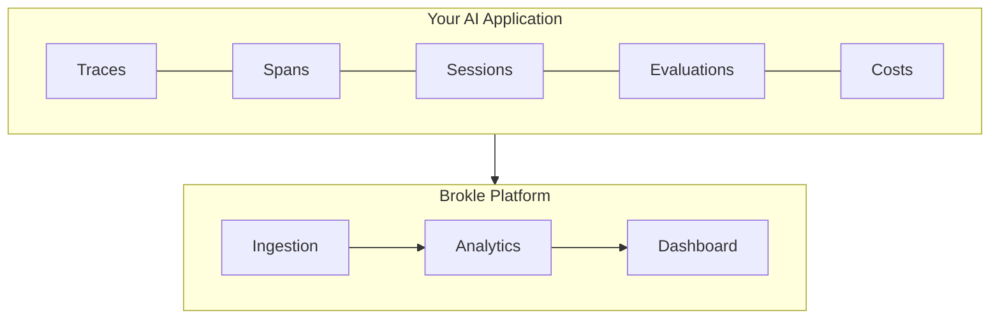
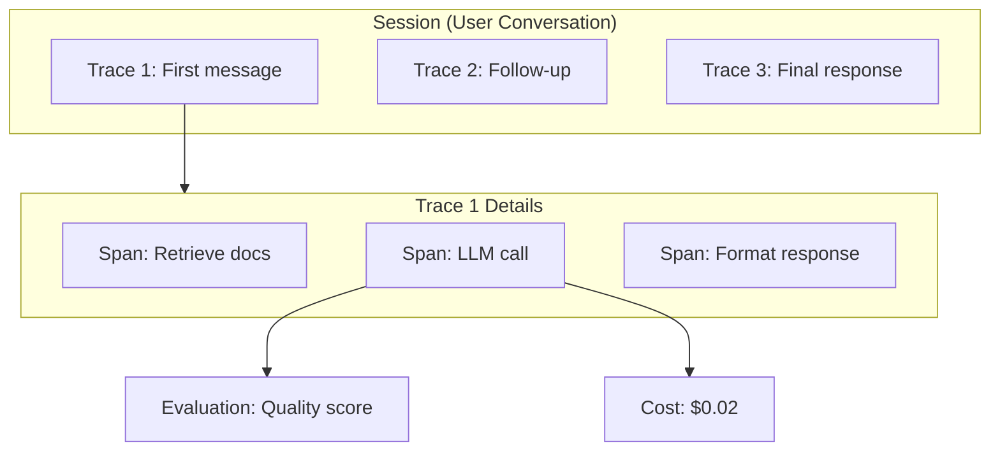

import { Cards, Card } from "fumadocs-ui/components/card";
import { Callout } from "fumadocs-ui/components/callout";

# Core Concepts

Before diving into implementation, it helps to understand the foundational concepts that power Brokle. These concepts form the building blocks for monitoring, evaluating, and improving your AI applications.

## The Observability Stack

Brokle provides a complete observability stack for AI applications:



## Key Concepts

<Cards>
  <Card
    title="Traces"
    description="End-to-end request journeys through your AI application"
    href="/docs/concepts/traces"
  />
  <Card
    title="Spans"
    description="Individual operations within a trace - LLM calls, retrievals, tools"
    href="/docs/concepts/spans"
  />
  <Card
    title="Sessions"
    description="Group related traces for conversation and user journey tracking"
    href="/docs/concepts/sessions"
  />
  <Card
    title="Evaluations"
    description="Quality scoring and feedback for AI outputs"
    href="/docs/concepts/evaluations"
  />
  <Card
    title="Cost Analytics"
    description="Track spending across models, providers, and features"
    href="/docs/concepts/cost-analytics"
  />
</Cards>

## How They Connect

Understanding how these concepts relate helps you design effective observability:



### Hierarchy

1. **Sessions** group multiple traces from the same user or conversation
2. **Traces** capture complete request-response cycles
3. **Spans** represent individual operations within a trace
4. **Evaluations** attach quality metrics to spans or traces
5. **Cost Analytics** aggregate spending across all levels

## Core Principles

### 1. Minimal Code Changes

Brokle integrates with your existing code without major refactoring:

```python
from brokle import Brokle, wrap_openai
import openai

client = Brokle(api_key="bk_...")
openai_client = wrap_openai(openai.OpenAI(), brokle=client)

# Your existing code works unchanged
response = openai_client.chat.completions.create(...)
```

### 2. OpenTelemetry Compatible

Brokle is built on OpenTelemetry standards, ensuring:

- Interoperability with existing observability tools
- Standardized trace and span formats
- Easy integration with your infrastructure

### 3. Privacy First

- Sensitive data masking options
- On-premise deployment available
- No data leaves your infrastructure (self-hosted)

### 4. Real-Time Insights

- Live trace streaming
- Instant cost calculations
- Real-time quality scoring

<Callout type="info">
  All concepts support both automatic instrumentation (via integrations) and manual instrumentation (via SDK) for maximum flexibility.
</Callout>

## Quick Start Path

Based on your needs, here's where to start:

| Goal | Start With |
|------|------------|
| Monitor LLM calls | [Traces](/docs/concepts/traces) |
| Debug complex workflows | [Spans](/docs/concepts/spans) |
| Track conversations | [Sessions](/docs/concepts/sessions) |
| Measure AI quality | [Evaluations](/docs/concepts/evaluations) |
| Control spending | [Cost Analytics](/docs/concepts/cost-analytics) |

## Next Steps

- [Create your first trace →](/docs/first-trace)
- [View the quickstart guide →](/docs/quickstart)
- [Explore integrations →](/docs/integrations)
