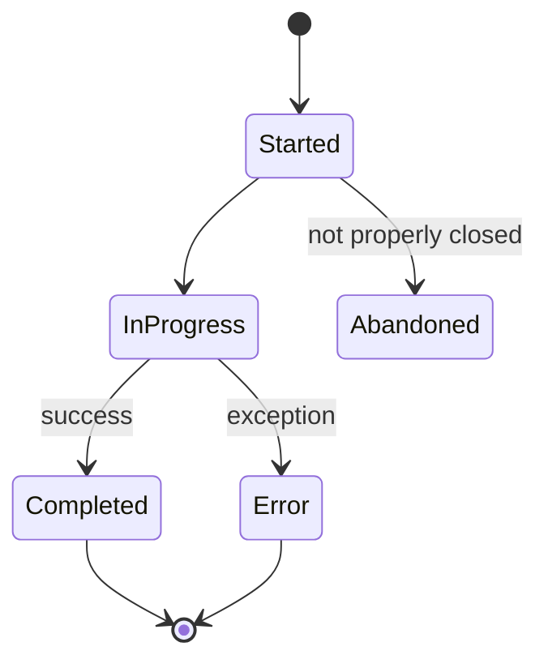

import { Callout } from "fumadocs-ui/components/callout";
import { Tabs, Tab } from "fumadocs-ui/components/tabs";

# Traces

A **trace** represents a single end-to-end request through your AI application. It captures the complete journey from user input to final response, including all intermediate operations.

## What is a Trace?

Think of a trace as a detailed story of what happened during one interaction with your AI system. When a user asks a question, your application might:

1. Validate and preprocess the input
2. Retrieve relevant documents from a vector database
3. Call an LLM to generate a response
4. Post-process and format the output

A trace captures all of these steps, their relationships, timing, inputs, outputs, and any errors.

```
Trace: "answer_customer_question"
├── Input: "How do I reset my password?"
├── Duration: 2,345ms
├── Status: Success
├── Spans:
│   ├── preprocess_query (45ms)
│   ├── retrieve_docs (120ms)
│   ├── generate_response (2,100ms) ← LLM call
│   └── format_output (80ms)
├── Tokens: 1,523 total
├── Cost: $0.0456
└── Output: "To reset your password, go to Settings..."
```

## Trace Properties

Every trace has these key properties:

| Property | Type | Description |
|----------|------|-------------|
| `trace_id` | string | Unique identifier (e.g., `trace_abc123xyz`) |
| `name` | string | Human-readable name |
| `project_id` | string | Project this trace belongs to |
| `start_time` | datetime | When the trace began |
| `end_time` | datetime | When the trace completed |
| `duration_ms` | number | Total trace duration in milliseconds |
| `status` | enum | `success`, `error`, or `in_progress` |
| `input` | any | The initial input to the trace |
| `output` | any | The final output from the trace |
| `metadata` | object | Custom key-value pairs |
| `user_id` | string | Optional user identifier |
| `session_id` | string | Optional session grouping |

## Creating Traces

### Context Manager (Recommended)

The context manager automatically handles trace lifecycle:

<Tabs>
  <Tab value="python" label="Python">
    ```python
    from brokle import Brokle

    client = Brokle(api_key="bk_...")

    with client.start_as_current_span(name="answer_question", as_type="span") as span:
        # Set trace-level metadata
        span.update_trace(
            session_id="session_123",
            user_id="user_456"
        )

        # Your operations here
        result = process_question(user_input)

        # Update with output
        span.update(output=result)
    ```
  </Tab>
  <Tab value="javascript" label="JavaScript">
    ```javascript
    import { Brokle } from 'brokle';

    const client = new Brokle({ apiKey: 'bk_...' });

    await client.startActiveSpan('answer_question', async (span) => {
      span.setAttribute('sessionId', 'session_123');
      span.setAttribute('userId', 'user_456');

      const result = await processQuestion(userInput);
      client.updateCurrentSpan({ output: result });
      return result;
    });
    ```
  </Tab>
</Tabs>

### Using Decorators (Python)

For function-level tracing:

```python
from brokle import observe

@observe(name="process_query")
def process_query(query: str) -> str:
    # This function is automatically traced
    response = generate_response(query)
    return response

# Each call creates a new trace
result = process_query("What is the weather?")
```

### Manual Span Management

For more control over trace boundaries:

<Tabs>
  <Tab value="python" label="Python">
    ```python
    from brokle import Brokle

    client = Brokle(api_key="bk_...")

    # Start a trace manually
    span = client.start_as_current_span(name="complex_workflow", as_type="span")

    try:
        # Perform operations
        result = do_work()
        span.update(output=result, metadata={"status": "complete"})
    except Exception as e:
        span.update(error=str(e))
        raise
    finally:
        span.end()
    ```
  </Tab>
  <Tab value="javascript" label="JavaScript">
    ```javascript
    import { Brokle } from 'brokle';

    const client = new Brokle({ apiKey: 'bk_...' });

    await client.startActiveSpan('complex_workflow', async (span) => {
      const result = await doWork();
      span.setAttribute('status', 'complete');
      client.updateCurrentSpan({ output: result });
      return result;
    });
    ```
  </Tab>
</Tabs>

## Trace Metadata

Add context to traces for filtering and analysis:

<Tabs>
  <Tab value="python" label="Python">
    ```python
    with client.start_as_current_span(name="customer_support") as span:
        span.set_attribute("customer_tier", "enterprise")
        span.set_attribute("feature", "billing_inquiry")
        span.set_attribute("priority", "high")

        span.update_trace(
            user_id="cust_789",
            session_id="support_session_456"
        )

        # Process request...
    ```
  </Tab>
  <Tab value="javascript" label="JavaScript">
    ```javascript
    await client.startActiveSpan('customer_support', async (span) => {
      span.setAttribute('customerTier', 'enterprise');
      span.setAttribute('feature', 'billing_inquiry');
      span.setAttribute('priority', 'high');
      span.setAttribute('userId', 'cust_789');
      span.setAttribute('sessionId', 'support_session_456');

      // Process request...
    });
    ```
  </Tab>
</Tabs>

### Recommended Metadata

| Key | Purpose | Example |
|-----|---------|---------|
| `user_id` | Track per-user behavior | `user_123` |
| `session_id` | Group conversation turns | `session_456` |
| `environment` | Separate prod/staging | `production` |
| `feature` | Identify application area | `chatbot` |
| `version` | Track deployment version | `v2.1.0` |

## Viewing Traces

Once captured, view traces in the Brokle dashboard:

1. Navigate to **Traces** in the sidebar
2. Filter by project, time range, status, or metadata
3. Click any trace to see the full span tree
4. Drill into individual spans for inputs, outputs, and timing

### Trace List View

The trace list provides key metrics at a glance:

- Duration (with latency breakdown)
- Token usage (prompt + completion)
- Cost (based on model pricing)
- Status (success, error)
- Timestamp

### Trace Detail View

Click on a trace to see:

- Complete span tree with timing waterfall
- Input/output for each operation
- Token counts and costs per span
- Error details and stack traces
- Custom metadata

## Trace Lifecycle



<Callout type="warning">
  Always close traces properly using context managers or explicit `end()` calls to ensure accurate duration tracking and data completeness.
</Callout>

## Best Practices

### 1. Use Meaningful Names

```python
# Good - descriptive names
with client.start_as_current_span(name="answer_customer_question") as span:
    ...

# Bad - generic names
with client.start_as_current_span(name="operation") as span:
    ...
```

### 2. Add Relevant Metadata

```python
with client.start_as_current_span(name="chat") as span:
    span.set_attribute("model", "gpt-4")
    span.set_attribute("customer_tier", "premium")
    span.update_trace(user_id=user.id, session_id=session.id)
```

### 3. Handle Errors Properly

```python
with client.start_as_current_span(name="risky_operation") as span:
    try:
        result = process()
        span.update(output=result)
    except Exception as e:
        span.update(error=str(e))
        raise
```

### 4. Set Appropriate Trace Boundaries

- Start traces at request boundaries (API endpoints, message handlers)
- Don't create traces for internal helper functions
- Use spans for sub-operations within a trace

## Related Concepts

- [Spans](/docs/concepts/spans) - Individual operations within a trace
- [Sessions](/docs/concepts/sessions) - Group related traces together
- [Evaluations](/docs/concepts/evaluations) - Score trace outputs

## Next Steps

- [Create your first trace →](/docs/first-trace)
- [Learn about spans →](/docs/concepts/spans)
- [Add evaluations →](/docs/concepts/evaluations)
