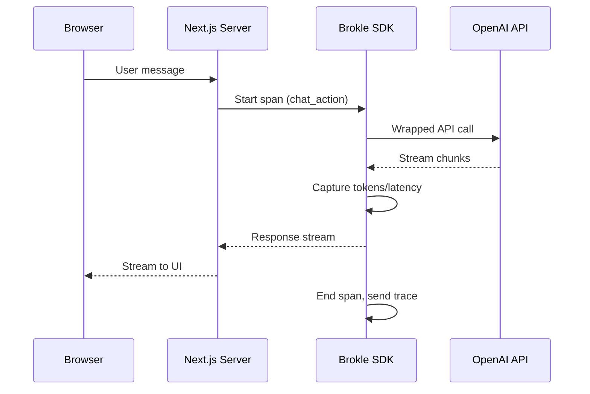

import { Callout } from "fumadocs-ui/components/callout";
import { Tabs, Tab } from "fumadocs-ui/components/tabs";

# Next.js Application

Add comprehensive tracing to a Next.js AI application with Server Actions and API Routes.



## Problem

Next.js applications with AI features need:
- Tracing across Server Actions and API Routes
- User session tracking
- Streaming response tracing
- Error handling without breaking the UI

## Solution

### 1. Install Dependencies

```bash
npm install brokle brokle-openai openai
```

### 2. Create Brokle Client

```typescript
// lib/brokle.ts
import { Brokle } from 'brokle';
import { wrapOpenAI } from 'brokle-openai';
import OpenAI from 'openai';

// Singleton Brokle client
const brokle = new Brokle({
  apiKey: process.env.BROKLE_API_KEY,
  environment: process.env.NODE_ENV,
});

// Wrapped OpenAI client
const openai = wrapOpenAI(new OpenAI(), { brokle });

export { brokle, openai };
```

### 3. Server Actions with Tracing

```typescript
// app/actions/chat.ts
'use server';

import { brokle, openai } from '@/lib/brokle';
import { cookies } from 'next/headers';

export async function sendMessage(message: string) {
  // Get user ID from session
  const cookieStore = cookies();
  const sessionId = cookieStore.get('session_id')?.value;
  const userId = cookieStore.get('user_id')?.value;

  return brokle.withSpan(
    {
      name: 'chat_action',
      metadata: {
        action: 'sendMessage',
        messageLength: message.length,
      },
    },
    async (span) => {
      // Set user context
      if (userId) {
        span.updateTrace({ userId, sessionId });
      }

      try {
        const response = await openai.chat.completions.create({
          model: 'gpt-4o',
          messages: [
            { role: 'system', content: 'You are a helpful assistant.' },
            { role: 'user', content: message },
          ],
        });

        const reply = response.choices[0].message.content;

        span.update({
          output: reply,
          metadata: {
            success: true,
            model: 'gpt-4o',
          },
        });

        return { success: true, reply };
      } catch (error) {
        span.update({
          metadata: {
            success: false,
            error: error instanceof Error ? error.message : 'Unknown error',
          },
        });
        span.score({ name: 'error', value: 1 });

        return { success: false, error: 'Failed to generate response' };
      }
    }
  );
}
```

### 4. API Route with Streaming

```typescript
// app/api/chat/route.ts
import { brokle, openai } from '@/lib/brokle';
import { NextRequest } from 'next/server';

export async function POST(request: NextRequest) {
  const { message, userId } = await request.json();

  // Create trace for the request
  const span = brokle.startSpan({
    name: 'chat_api',
    metadata: { endpoint: '/api/chat' },
  });

  if (userId) {
    span.updateTrace({ userId });
  }

  try {
    const stream = await openai.chat.completions.create({
      model: 'gpt-4o',
      messages: [{ role: 'user', content: message }],
      stream: true,
      stream_options: { include_usage: true },
    });

    // Create readable stream for response
    const encoder = new TextEncoder();
    let fullResponse = '';

    const readable = new ReadableStream({
      async start(controller) {
        try {
          for await (const chunk of stream) {
            const content = chunk.choices[0]?.delta?.content || '';
            fullResponse += content;
            controller.enqueue(encoder.encode(content));

            // Capture usage from final chunk
            if (chunk.usage) {
              span.update({
                usage: {
                  inputTokens: chunk.usage.prompt_tokens,
                  outputTokens: chunk.usage.completion_tokens,
                },
              });
            }
          }

          span.update({
            output: fullResponse,
            metadata: { success: true, streaming: true },
          });
          span.end();
          controller.close();
        } catch (error) {
          span.update({
            metadata: { success: false, error: String(error) },
          });
          span.score({ name: 'error', value: 1 });
          span.end();
          controller.error(error);
        }
      },
    });

    return new Response(readable, {
      headers: {
        'Content-Type': 'text/plain; charset=utf-8',
        'Transfer-Encoding': 'chunked',
      },
    });
  } catch (error) {
    span.update({
      metadata: { success: false, error: String(error) },
    });
    span.score({ name: 'error', value: 1 });
    span.end();

    return Response.json({ error: 'Failed to process request' }, { status: 500 });
  }
}
```

### 5. Client Component with User Tracking

```typescript
// components/ChatInterface.tsx
'use client';

import { useState, useEffect } from 'react';
import { sendMessage } from '@/app/actions/chat';

export function ChatInterface() {
  const [messages, setMessages] = useState<Array<{ role: string; content: string }>>([]);
  const [input, setInput] = useState('');
  const [isLoading, setIsLoading] = useState(false);

  // Set session ID on mount
  useEffect(() => {
    if (!document.cookie.includes('session_id')) {
      const sessionId = crypto.randomUUID();
      document.cookie = `session_id=${sessionId}; path=/; max-age=86400`;
    }
  }, []);

  const handleSubmit = async (e: React.FormEvent) => {
    e.preventDefault();
    if (!input.trim() || isLoading) return;

    const userMessage = input.trim();
    setInput('');
    setMessages((prev) => [...prev, { role: 'user', content: userMessage }]);
    setIsLoading(true);

    try {
      const result = await sendMessage(userMessage);

      if (result.success) {
        setMessages((prev) => [...prev, { role: 'assistant', content: result.reply! }]);
      } else {
        setMessages((prev) => [
          ...prev,
          { role: 'assistant', content: 'Sorry, something went wrong.' },
        ]);
      }
    } finally {
      setIsLoading(false);
    }
  };

  return (
    <div className="flex flex-col h-full">
      <div className="flex-1 overflow-y-auto p-4 space-y-4">
        {messages.map((msg, i) => (
          <div
            key={i}
            className={`p-3 rounded-lg ${
              msg.role === 'user' ? 'bg-blue-100 ml-auto' : 'bg-gray-100'
            }`}
          >
            {msg.content}
          </div>
        ))}
        {isLoading && <div className="text-gray-500">Thinking...</div>}
      </div>

      <form onSubmit={handleSubmit} className="p-4 border-t">
        <input
          type="text"
          value={input}
          onChange={(e) => setInput(e.target.value)}
          placeholder="Type a message..."
          className="w-full p-2 border rounded"
          disabled={isLoading}
        />
      </form>
    </div>
  );
}
```

### 6. Middleware for Request Tracking

```typescript
// middleware.ts
import { NextResponse } from 'next/server';
import type { NextRequest } from 'next/server';

export function middleware(request: NextRequest) {
  const response = NextResponse.next();

  // Add request ID for tracing
  const requestId = crypto.randomUUID();
  response.headers.set('x-request-id', requestId);

  // Pass to server components via headers
  const requestHeaders = new Headers(request.headers);
  requestHeaders.set('x-request-id', requestId);

  return NextResponse.next({
    request: {
      headers: requestHeaders,
    },
  });
}

export const config = {
  matcher: ['/api/:path*', '/((?!_next/static|_next/image|favicon.ico).*)'],
};
```

### 7. Error Boundary with Logging

```typescript
// components/ErrorBoundary.tsx
'use client';

import { Component, ReactNode } from 'react';

interface Props {
  children: ReactNode;
  fallback?: ReactNode;
}

interface State {
  hasError: boolean;
}

export class ErrorBoundary extends Component<Props, State> {
  constructor(props: Props) {
    super(props);
    this.state = { hasError: false };
  }

  static getDerivedStateFromError() {
    return { hasError: true };
  }

  componentDidCatch(error: Error, errorInfo: React.ErrorInfo) {
    // Log to your error tracking service
    console.error('AI Component Error:', error, errorInfo);

    // Optionally report to Brokle via API
    fetch('/api/log-error', {
      method: 'POST',
      body: JSON.stringify({
        error: error.message,
        stack: error.stack,
        componentStack: errorInfo.componentStack,
      }),
    }).catch(console.error);
  }

  render() {
    if (this.state.hasError) {
      return (
        this.props.fallback || (
          <div className="p-4 bg-red-50 text-red-600 rounded">
            Something went wrong. Please try again.
          </div>
        )
      );
    }

    return this.props.children;
  }
}
```

## Folder Structure

```
app/
├── api/
│   ├── chat/
│   │   └── route.ts        # Streaming API
│   └── log-error/
│       └── route.ts        # Error logging
├── actions/
│   └── chat.ts             # Server Actions
├── page.tsx
└── layout.tsx

components/
├── ChatInterface.tsx       # Client component
└── ErrorBoundary.tsx       # Error handling

lib/
└── brokle.ts               # Brokle setup

middleware.ts               # Request tracking
```

## Environment Variables

```bash
# .env.local
BROKLE_API_KEY=bk_...
OPENAI_API_KEY=sk_...
```

<Callout type="warning">
  Never expose your `BROKLE_API_KEY` to the client. All tracing should happen in Server Actions or API Routes.
</Callout>

## Best Practices

1. **Use Server Actions**: Keep all AI calls in Server Actions for security
2. **Track Sessions**: Use cookies or auth to track user sessions
3. **Handle Errors Gracefully**: Never expose internal errors to users
4. **Stream When Possible**: Use streaming for better UX and accurate TTFT tracking

## Related

- [JavaScript SDK](/docs/sdk/javascript) - Full SDK reference
- [Streaming Responses](/docs/cookbook/tracing-recipes/streaming) - Streaming patterns
- [Production Monitoring](/docs/tutorials/production-monitoring) - Monitoring setup
