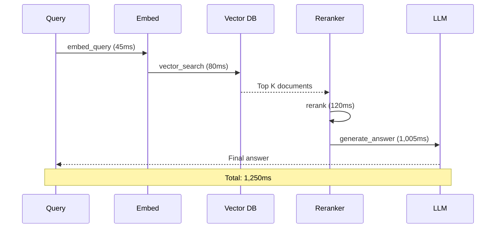

import { Callout } from "fumadocs-ui/components/callout";
import { Steps, Step } from "fumadocs-ui/components/steps";

# RAG Application Tracing

Learn how to add full observability to a RAG (Retrieval-Augmented Generation) pipeline, tracking document retrieval, context assembly, and LLM generation.

## What You'll Build

A fully traced RAG pipeline that captures:
- Document retrieval with relevance scores
- Context assembly and token counts
- LLM generation with quality metrics
- End-to-end latency breakdown



## Prerequisites

- Brokle account and API key
- Python 3.9+ with pip
- OpenAI API key
- Vector database (we'll use Chroma for this tutorial)

## Setup

<Steps>
  <Step>
    ### Install Dependencies

    ```bash
    pip install brokle openai chromadb sentence-transformers
    ```
  </Step>

  <Step>
    ### Configure Environment

    ```bash
    export BROKLE_API_KEY=bk_...
    export OPENAI_API_KEY=sk_...
    ```
  </Step>

  <Step>
    ### Initialize Clients

    ```python
    from brokle import Brokle, wrap_openai
    import openai
    import chromadb

    # Initialize Brokle
    brokle = Brokle()

    # Wrap OpenAI for automatic tracing
    openai_client = wrap_openai(openai.OpenAI())

    # Initialize Chroma
    chroma_client = chromadb.Client()
    collection = chroma_client.create_collection("documents")
    ```
  </Step>
</Steps>

## Implementation

### Step 1: Create the RAG Pipeline Structure

Start with the main query function that creates the parent span:

```python
def rag_query(query: str, user_id: str = None) -> str:
    """Execute a RAG query with full tracing."""

    with brokle.start_as_current_span(
        name="rag_query",
        metadata={
            "query": query,
            "pipeline_version": "1.0"
        }
    ) as span:
        # Add user context for filtering
        if user_id:
            span.update_trace(user_id=user_id)

        # Step 1: Embed the query
        query_embedding = embed_query(query)

        # Step 2: Retrieve relevant documents
        documents = retrieve_documents(query_embedding, top_k=5)

        # Step 3: Rerank for relevance
        reranked_docs = rerank_documents(query, documents)

        # Step 4: Generate answer
        answer = generate_answer(query, reranked_docs)

        # Update span with final output
        span.update(
            output=answer,
            metadata={
                "documents_retrieved": len(documents),
                "documents_used": len(reranked_docs)
            }
        )

        return answer
```

### Step 2: Trace Query Embedding

Create a generation span for the embedding:

```python
def embed_query(query: str) -> list[float]:
    """Embed the query with tracing."""

    with brokle.start_as_current_generation(
        name="embed_query",
        model="text-embedding-3-small"
    ) as gen:
        response = openai_client.embeddings.create(
            model="text-embedding-3-small",
            input=query
        )

        embedding = response.data[0].embedding

        gen.update(
            output=f"[{len(embedding)} dimensions]",
            usage={
                "input_tokens": response.usage.prompt_tokens,
                "output_tokens": 0
            }
        )

        return embedding
```

### Step 3: Trace Document Retrieval

Use a retrieval span type for vector search:

```python
def retrieve_documents(
    query_embedding: list[float],
    top_k: int = 5
) -> list[dict]:
    """Retrieve documents with tracing."""

    with brokle.start_as_current_span(
        name="vector_search",
        as_type="retrieval"
    ) as span:
        # Query the vector database
        results = collection.query(
            query_embeddings=[query_embedding],
            n_results=top_k
        )

        documents = []
        for i, (doc, score) in enumerate(zip(
            results["documents"][0],
            results["distances"][0]
        )):
            documents.append({
                "content": doc,
                "score": 1 - score,  # Convert distance to similarity
                "rank": i + 1
            })

        # Record retrieval details
        span.update(
            output=documents,
            metadata={
                "top_k": top_k,
                "results_count": len(documents),
                "avg_score": sum(d["score"] for d in documents) / len(documents)
            }
        )

        return documents
```

### Step 4: Trace Reranking

Add reranking with quality scoring:

```python
from sentence_transformers import CrossEncoder

reranker = CrossEncoder("cross-encoder/ms-marco-MiniLM-L-6-v2")

def rerank_documents(
    query: str,
    documents: list[dict],
    top_k: int = 3
) -> list[dict]:
    """Rerank documents with tracing."""

    with brokle.start_as_current_span(
        name="rerank",
        metadata={"model": "ms-marco-MiniLM-L-6-v2"}
    ) as span:
        # Score each document
        pairs = [(query, doc["content"]) for doc in documents]
        scores = reranker.predict(pairs)

        # Sort by score and take top_k
        for doc, score in zip(documents, scores):
            doc["rerank_score"] = float(score)

        reranked = sorted(
            documents,
            key=lambda x: x["rerank_score"],
            reverse=True
        )[:top_k]

        # Record reranking details
        span.update(
            output=reranked,
            metadata={
                "input_count": len(documents),
                "output_count": len(reranked),
                "score_range": {
                    "min": min(scores),
                    "max": max(scores)
                }
            }
        )

        # Add quality score
        span.score(
            name="rerank_confidence",
            value=max(scores),
            comment="Top reranked document score"
        )

        return reranked
```

### Step 5: Trace Answer Generation

Create a generation span for the final LLM call:

```python
def generate_answer(query: str, documents: list[dict]) -> str:
    """Generate answer with tracing."""

    # Build context from documents
    context = "\n\n".join([
        f"Document {i+1} (score: {doc['rerank_score']:.2f}):\n{doc['content']}"
        for i, doc in enumerate(documents)
    ])

    with brokle.start_as_current_generation(
        name="generate_answer",
        model="gpt-4o",
        input={
            "query": query,
            "context_length": len(context),
            "document_count": len(documents)
        }
    ) as gen:
        response = openai_client.chat.completions.create(
            model="gpt-4o",
            messages=[
                {
                    "role": "system",
                    "content": """You are a helpful assistant. Answer the user's question
                    based on the provided context. If the context doesn't contain
                    relevant information, say so."""
                },
                {
                    "role": "user",
                    "content": f"Context:\n{context}\n\nQuestion: {query}"
                }
            ],
            temperature=0.7
        )

        answer = response.choices[0].message.content

        gen.update(
            output=answer,
            usage={
                "input_tokens": response.usage.prompt_tokens,
                "output_tokens": response.usage.completion_tokens
            }
        )

        return answer
```

### Step 6: Add Quality Evaluation

Evaluate the response quality:

```python
from brokle.evaluation import evaluate

def rag_query_with_evaluation(query: str) -> dict:
    """RAG query with automatic evaluation."""

    with brokle.start_as_current_span(name="rag_query") as span:
        # Execute the RAG pipeline
        answer = rag_query(query)

        # Evaluate quality
        relevance = evaluate(
            evaluator="relevance",
            input=query,
            output=answer
        )

        groundedness = evaluate(
            evaluator="groundedness",
            input=query,
            output=answer,
            context=context  # From retrieval
        )

        # Record scores
        span.score(name="relevance", value=relevance.score)
        span.score(name="groundedness", value=groundedness.score)

        return {
            "answer": answer,
            "scores": {
                "relevance": relevance.score,
                "groundedness": groundedness.score
            }
        }
```

## Complete Example

```python
from brokle import Brokle, wrap_openai
import openai
import chromadb
from sentence_transformers import CrossEncoder

# Initialize
brokle = Brokle()
openai_client = wrap_openai(openai.OpenAI())
chroma = chromadb.Client()
collection = chroma.create_collection("docs")
reranker = CrossEncoder("cross-encoder/ms-marco-MiniLM-L-6-v2")

# Add sample documents
collection.add(
    documents=[
        "Brokle is an open-source AI observability platform.",
        "Brokle supports tracing, evaluation, and prompt management.",
        "You can self-host Brokle using Docker or Kubernetes."
    ],
    ids=["doc1", "doc2", "doc3"]
)

# Execute query
result = rag_query(
    query="What is Brokle?",
    user_id="user_123"
)

print(result)

# Flush traces
brokle.flush()
```

## Viewing Traces

After running your RAG pipeline:

1. Navigate to **Traces** in the Brokle dashboard
2. Find your `rag_query` trace
3. Expand to see the nested spans:
   - `embed_query` - Query embedding time and tokens
   - `vector_search` - Retrieved documents and scores
   - `rerank` - Reranking scores and selection
   - `generate_answer` - LLM response and quality

## Best Practices

### 1. Use Appropriate Span Types

```python
# Retrieval operations
brokle.start_as_current_span(name="...", as_type="retrieval")

# LLM generations
brokle.start_as_current_generation(name="...", model="...")

# General operations
brokle.start_as_current_span(name="...")
```

### 2. Track Key Metrics

Always record:
- Document counts and scores
- Token usage
- Latency breakdown
- Quality scores

### 3. Add Context for Debugging

```python
span.update(metadata={
    "query_length": len(query),
    "context_tokens": count_tokens(context),
    "documents_used": len(documents)
})
```

<Callout type="info">
  The trace view shows a timeline breakdown, making it easy to identify bottlenecks in your RAG pipeline.
</Callout>

## Next Steps

- [Evaluation](/docs/evaluation) - Add automated quality checks
- [Cost Tracking](/docs/analytics/cost-tracking) - Monitor RAG costs
- [Agent Evaluation](/docs/tutorials/agent-evaluation) - Trace complex agents
