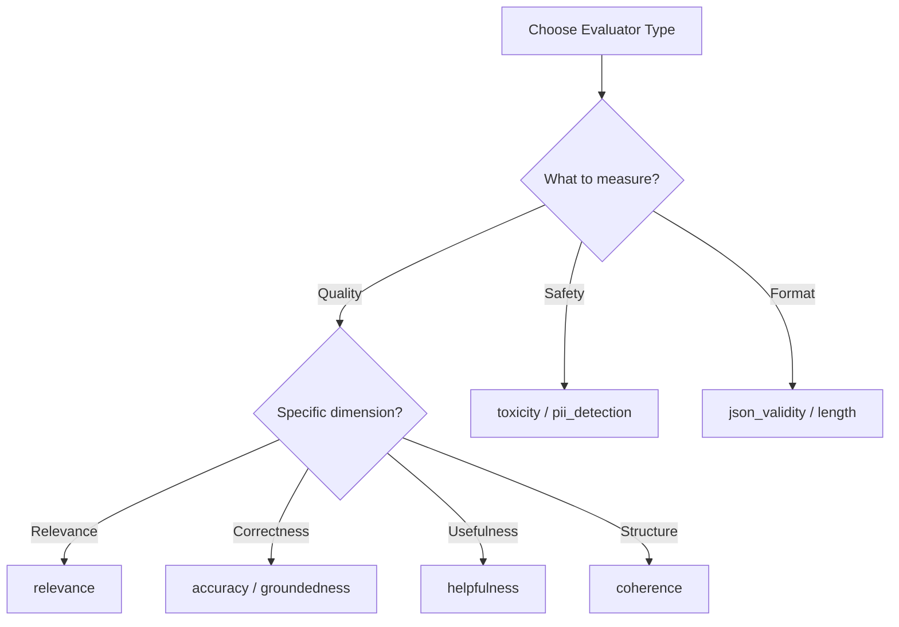

import { Callout } from "fumadocs-ui/components/callout";
import { Tabs, Tab } from "fumadocs-ui/components/tabs";
import { Cards, Card } from "fumadocs-ui/components/card";

# Built-in Evaluators

Brokle provides pre-built evaluators for common AI quality assessments. These evaluators are ready to use and cover standard quality dimensions like relevance, accuracy, and safety.

## Available Evaluators



| Evaluator | Type | Description |
|-----------|------|-------------|
| **relevance** | LLM | How well the output addresses the input |
| **accuracy** | LLM | Factual correctness of claims |
| **helpfulness** | LLM | How useful the response is |
| **coherence** | LLM | Logical flow and structure |
| **groundedness** | LLM | Alignment with provided context |
| **toxicity** | Model | Harmful or offensive content detection |
| **pii_detection** | Regex/ML | Personal information detection |
| **json_validity** | Programmatic | Valid JSON structure check |
| **length** | Programmatic | Response length metrics |

## Quick Start

<Tabs>
  <Tab value="python" label="Python">
    ```python
    from brokle import Brokle
    from brokle.evaluation import evaluate

    client = Brokle()

    # Evaluate a single output
    result = evaluate(
        evaluator="relevance",
        input="What is machine learning?",
        output="Machine learning is a subset of AI that enables systems to learn from data."
    )

    print(f"Score: {result.score}")
    print(f"Reasoning: {result.reasoning}")
    ```
  </Tab>
  <Tab value="javascript" label="JavaScript">
    ```javascript
    import { Brokle } from 'brokle';
    import { evaluate } from 'brokle/evaluation';

    const client = new Brokle();

    // Evaluate a single output
    const result = await evaluate({
      evaluator: 'relevance',
      input: 'What is machine learning?',
      output: 'Machine learning is a subset of AI that enables systems to learn from data.'
    });

    console.log(`Score: ${result.score}`);
    console.log(`Reasoning: ${result.reasoning}`);
    ```
  </Tab>
</Tabs>

## Quality Evaluators

### Relevance

Measures how directly the output addresses the input query.

<Tabs>
  <Tab value="python" label="Python">
    ```python
    result = evaluate(
        evaluator="relevance",
        input="How do I reset my password?",
        output="To reset your password, click 'Forgot Password' on the login page, enter your email, and follow the instructions sent to your inbox."
    )
    # Result: score=0.95, reasoning="Response directly addresses the password reset question with clear steps"
    ```
  </Tab>
  <Tab value="javascript" label="JavaScript">
    ```javascript
    const result = await evaluate({
      evaluator: 'relevance',
      input: 'How do I reset my password?',
      output: "To reset your password, click 'Forgot Password' on the login page, enter your email, and follow the instructions sent to your inbox."
    });
    // Result: score=0.95, reasoning="Response directly addresses the password reset question with clear steps"
    ```
  </Tab>
</Tabs>

**Score interpretation:**
- 0.9-1.0: Perfectly relevant, directly addresses the query
- 0.7-0.9: Mostly relevant with minor tangents
- 0.5-0.7: Partially relevant, some off-topic content
- 0.0-0.5: Largely irrelevant to the query

### Accuracy

Evaluates factual correctness of claims in the output.

<Tabs>
  <Tab value="python" label="Python">
    ```python
    result = evaluate(
        evaluator="accuracy",
        input="When was Python released?",
        output="Python was first released in 1991 by Guido van Rossum.",
        context="Python is a programming language created by Guido van Rossum. Version 0.9.0 was released in February 1991."
    )
    # Result: score=0.98, reasoning="Date and creator are factually correct per the context"
    ```
  </Tab>
  <Tab value="javascript" label="JavaScript">
    ```javascript
    const result = await evaluate({
      evaluator: 'accuracy',
      input: 'When was Python released?',
      output: 'Python was first released in 1991 by Guido van Rossum.',
      context: 'Python is a programming language created by Guido van Rossum. Version 0.9.0 was released in February 1991.'
    });
    // Result: score=0.98, reasoning="Date and creator are factually correct per the context"
    ```
  </Tab>
</Tabs>

<Callout type="info">
  For best accuracy evaluation, provide `context` with source material to verify claims against.
</Callout>

### Helpfulness

Assesses how useful and actionable the response is.

```python
result = evaluate(
    evaluator="helpfulness",
    input="I'm getting a TypeError in my Python code",
    output="A TypeError occurs when you try to perform an operation on incompatible types. To fix this:\n1. Check the error message for the line number\n2. Verify the types of variables involved\n3. Use type() or isinstance() to debug\n4. Add type conversions where needed"
)
# Result: score=0.92, reasoning="Provides clear explanation and actionable debugging steps"
```

### Coherence

Measures logical flow, structure, and readability.

```python
result = evaluate(
    evaluator="coherence",
    input="Explain how APIs work",
    output="APIs (Application Programming Interfaces) are... Then the server processes... First, the client sends... Finally, the response..."
)
# Result: score=0.65, reasoning="Content is relevant but structure is disorganized with out-of-order explanations"
```

### Groundedness

For RAG applications: checks if the output is supported by provided context.

```python
result = evaluate(
    evaluator="groundedness",
    input="What are our refund policies?",
    output="Refunds are processed within 5-7 business days. You can request a refund through the app or by contacting support.",
    context="Our refund policy: Customers can request refunds within 30 days of purchase. Refunds are processed within 5-7 business days. Contact support@example.com or use the in-app refund request feature."
)
# Result: score=0.95, reasoning="All claims are directly supported by the provided context"
```

## Safety Evaluators

### Toxicity

Detects harmful, offensive, or inappropriate content.

<Tabs>
  <Tab value="python" label="Python">
    ```python
    result = evaluate(
        evaluator="toxicity",
        output="Here's how to create a simple Python function that adds two numbers..."
    )
    # Result: score=0.01, reasoning="No toxic content detected"

    result = evaluate(
        evaluator="toxicity",
        output="That's a stupid question..."
    )
    # Result: score=0.72, reasoning="Contains dismissive and potentially offensive language"
    ```
  </Tab>
  <Tab value="javascript" label="JavaScript">
    ```javascript
    const result = await evaluate({
      evaluator: 'toxicity',
      output: "Here's how to create a simple Python function that adds two numbers..."
    });
    // Result: score=0.01, reasoning="No toxic content detected"
    ```
  </Tab>
</Tabs>

<Callout type="warning">
  For toxicity, **lower scores are better**. A score of 0.0 means no toxicity detected.
</Callout>

### PII Detection

Identifies personal identifiable information in outputs.

```python
result = evaluate(
    evaluator="pii_detection",
    output="Please contact John Smith at john.smith@example.com or call 555-123-4567"
)
# Result: score=0.85, reasoning="Detected email address and phone number"
# metadata: {"pii_types": ["email", "phone"], "locations": [...]}
```

**Detected PII types:**
- Email addresses
- Phone numbers
- Social Security Numbers
- Credit card numbers
- Names (when context suggests PII)
- Addresses

## Programmatic Evaluators

### JSON Validity

Checks if the output is valid JSON.

```python
result = evaluate(
    evaluator="json_validity",
    output='{"name": "Alice", "age": 30}'
)
# Result: score=1.0, reasoning="Valid JSON object"

result = evaluate(
    evaluator="json_validity",
    output='{"name": "Alice", age: 30}'  # Missing quotes
)
# Result: score=0.0, reasoning="Invalid JSON: Expecting property name enclosed in double quotes"
```

### Length Evaluator

Measures response length against targets.

```python
result = evaluate(
    evaluator="length",
    output="This is a short response.",
    config={
        "min_length": 50,
        "max_length": 500,
        "target_length": 200
    }
)
# Result: score=0.3, reasoning="Response length (26 chars) is below minimum (50)"
```

## Batch Evaluation

Evaluate multiple outputs efficiently:

<Tabs>
  <Tab value="python" label="Python">
    ```python
    from brokle.evaluation import evaluate_batch

    outputs = [
        {"input": "Question 1", "output": "Answer 1"},
        {"input": "Question 2", "output": "Answer 2"},
        {"input": "Question 3", "output": "Answer 3"},
    ]

    results = evaluate_batch(
        evaluator="relevance",
        items=outputs
    )

    for result in results:
        print(f"Score: {result.score}")
    ```
  </Tab>
  <Tab value="javascript" label="JavaScript">
    ```javascript
    import { evaluateBatch } from 'brokle/evaluation';

    const outputs = [
      { input: 'Question 1', output: 'Answer 1' },
      { input: 'Question 2', output: 'Answer 2' },
      { input: 'Question 3', output: 'Answer 3' },
    ];

    const results = await evaluateBatch({
      evaluator: 'relevance',
      items: outputs
    });

    results.forEach(result => {
      console.log(`Score: ${result.score}`);
    });
    ```
  </Tab>
</Tabs>

## Multiple Evaluators

Run multiple evaluators on the same output:

```python
from brokle.evaluation import evaluate_multi

result = evaluate_multi(
    evaluators=["relevance", "helpfulness", "toxicity"],
    input="How do I fix this bug?",
    output="Here's how to debug your issue: First, check the error logs..."
)

for name, score in result.scores.items():
    print(f"{name}: {score.value}")
# relevance: 0.88
# helpfulness: 0.92
# toxicity: 0.02
```

## Attaching to Traces

Automatically score traces during or after creation:

```python
# During trace creation
with client.start_as_current_span(name="chat") as span:
    response = llm.generate(prompt)

    # Evaluate and attach scores
    scores = evaluate_multi(
        evaluators=["relevance", "helpfulness"],
        input=prompt,
        output=response
    )

    for name, result in scores.items():
        span.score(name=name, value=result.score, comment=result.reasoning)

# After trace creation
client.evaluate_trace(
    trace_id="trace_123",
    evaluators=["relevance", "accuracy", "toxicity"]
)
```

## Configuration Options

### Model Selection

Choose which model powers LLM-based evaluators:

```python
result = evaluate(
    evaluator="relevance",
    input="...",
    output="...",
    config={
        "model": "gpt-4o",  # Default
        "temperature": 0.0
    }
)
```

### Custom Criteria

Add specific evaluation criteria:

```python
result = evaluate(
    evaluator="relevance",
    input="...",
    output="...",
    config={
        "criteria": [
            "Must mention pricing",
            "Should include call-to-action",
            "Must be under 100 words"
        ]
    }
)
```

### Scoring Mode

Control score output format:

```python
# Continuous score (default)
result = evaluate(evaluator="relevance", ..., config={"scoring": "continuous"})
# score: 0.87

# Binary score
result = evaluate(evaluator="relevance", ..., config={"scoring": "binary"})
# score: 1 (pass) or 0 (fail)

# Categorical score
result = evaluate(evaluator="relevance", ..., config={"scoring": "categorical"})
# score: "high", "medium", or "low"
```

## Evaluator Response

All evaluators return a consistent response structure:

```python
@dataclass
class EvaluationResult:
    score: float              # Numeric score (0.0-1.0)
    reasoning: str            # Explanation of the score
    metadata: dict            # Additional details
    evaluator: str            # Evaluator name
    model: str | None         # Model used (for LLM evaluators)
    latency_ms: int           # Evaluation time
```

## Performance Tips

### 1. Batch Similar Evaluations

```python
# Good: Batch processing
results = evaluate_batch(evaluator="relevance", items=all_outputs)

# Bad: Individual calls in a loop
for output in all_outputs:
    result = evaluate(evaluator="relevance", ...)  # Slower
```

### 2. Use Appropriate Evaluators

| Need | Evaluator | Speed |
|------|-----------|-------|
| Format check | json_validity, length | Fast (1ms) |
| Pattern match | pii_detection | Fast (5ms) |
| Quality assessment | relevance, helpfulness | Moderate (500ms) |
| Complex reasoning | accuracy with context | Slower (1-2s) |

### 3. Cache Results

```python
# Evaluator results are cached by default
result1 = evaluate(evaluator="relevance", input="Q", output="A")  # API call
result2 = evaluate(evaluator="relevance", input="Q", output="A")  # Cached
```

## Best Practices

### 1. Start with Core Evaluators

Begin with these for most applications:
- **relevance**: Primary quality signal
- **helpfulness**: User value
- **toxicity**: Safety check

### 2. Add Context When Available

```python
# Better accuracy with context
result = evaluate(
    evaluator="accuracy",
    input="...",
    output="...",
    context=source_documents  # Improves evaluation quality
)
```

### 3. Combine Multiple Signals

```python
# Composite quality score
scores = evaluate_multi(
    evaluators=["relevance", "helpfulness", "coherence"],
    input="...",
    output="..."
)

composite_score = (
    scores["relevance"].score * 0.4 +
    scores["helpfulness"].score * 0.4 +
    scores["coherence"].score * 0.2
)
```

## Next Steps

<Cards>
  <Card
    title="Custom Evaluators"
    description="Build domain-specific evaluators"
    href="/docs/evaluation/custom-evaluators"
  />
  <Card
    title="LLM-as-Judge"
    description="Advanced AI-based evaluation"
    href="/docs/evaluation/llm-as-judge"
  />
  <Card
    title="Datasets"
    description="Batch evaluation with test sets"
    href="/docs/evaluation/datasets"
  />
</Cards>
