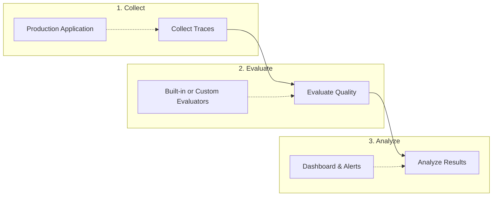

import { Cards, Card } from "fumadocs-ui/components/card";
import { Callout } from "fumadocs-ui/components/callout";

# Evaluation

Brokle's evaluation system helps you measure and improve AI output quality through multiple approaches: automated scoring, user feedback collection, and LLM-based assessment.

## Why Evaluate?

AI applications face unique quality challenges:

- **Non-deterministic outputs**: Same input can produce different results
- **Subjective quality**: "Good" depends on context and user expectations
- **Regression detection**: Model updates can degrade specific capabilities
- **Cost optimization**: Balance quality against token usage and latency

## Evaluation Approaches

Brokle supports three complementary evaluation strategies:

### 1. Automated Scores

Programmatic evaluation using built-in or custom scoring functions:

```python
from brokle import Brokle

client = Brokle()

# Score a generation
client.score(
    trace_id="trace_abc123",
    name="relevance",
    value=0.85,
    comment="Response addresses the user's question directly"
)
```

Best for: Consistency metrics, factual accuracy, format compliance

### 2. User Feedback

Capture real user reactions to AI outputs:

```python
# Capture thumbs up/down
client.feedback(
    trace_id="trace_abc123",
    score=1,  # 1 = positive, -1 = negative
    comment="User found the answer helpful"
)
```

Best for: Satisfaction tracking, identifying problematic responses, A/B testing

### 3. LLM-as-Judge

Use AI models to evaluate other AI outputs:

```python
from brokle.evaluation import evaluate

result = evaluate(
    evaluator="relevance",
    input="What is machine learning?",
    output="Machine learning is a subset of AI that enables...",
    context="User is a software developer"
)
print(f"Score: {result.score}, Reasoning: {result.reasoning}")
```

Best for: Subjective quality, complex criteria, scale without manual review

## Evaluation Types

| Type | Method | Speed | Scale | Best For |
|------|--------|-------|-------|----------|
| **Scores** | Programmatic | Fast | High | Metrics, thresholds |
| **Feedback** | User input | Variable | Medium | Real satisfaction |
| **LLM-as-Judge** | AI evaluation | Moderate | High | Complex quality |

## Quick Start

<Cards>
  <Card
    title="Record Scores"
    description="Add quality scores to your traces"
    href="/docs/evaluation/scores"
  />
  <Card
    title="Collect Feedback"
    description="Capture user reactions"
    href="/docs/evaluation/feedback"
  />
  <Card
    title="Built-in Evaluators"
    description="Use pre-built quality assessments"
    href="/docs/evaluation/built-in-evaluators"
  />
  <Card
    title="Custom Evaluators"
    description="Create domain-specific evaluations"
    href="/docs/evaluation/custom-evaluators"
  />
</Cards>

## Core Concepts

### Scores

Numeric quality measurements attached to traces or generations:

```python
# Numeric score (0-1)
client.score(trace_id="...", name="accuracy", value=0.92)

# Categorical score
client.score(trace_id="...", name="tone", value="professional")

# Boolean score
client.score(trace_id="...", name="contains_pii", value=False)
```

Scores can be:
- **Numeric**: 0.0 to 1.0 for continuous metrics
- **Categorical**: Enum values like "positive", "neutral", "negative"
- **Boolean**: True/False for binary classifications

### Evaluators

Functions that compute scores based on trace data:

```python
from brokle.evaluation import Evaluator

class ToxicityEvaluator(Evaluator):
    name = "toxicity"

    def evaluate(self, output: str, **kwargs) -> float:
        # Your toxicity detection logic
        return toxicity_score
```

Evaluators can be:
- **Built-in**: Pre-packaged evaluators for common use cases
- **Custom**: Your own domain-specific logic
- **LLM-based**: Use language models for evaluation

### Datasets

Collections of inputs, expected outputs, and context for batch evaluation:

```python
from brokle.evaluation import Dataset

dataset = Dataset.from_csv("test_cases.csv")

# Run evaluations against dataset
results = client.evaluate_dataset(
    dataset=dataset,
    evaluators=["relevance", "accuracy", "helpfulness"]
)
```

## Evaluation Workflow



### 1. Collect Traces

Your application generates traces through normal operation:

```python
from brokle import wrap_openai

client = wrap_openai(openai.OpenAI())
response = client.chat.completions.create(...)
# Trace automatically created
```

### 2. Evaluate Quality

Apply evaluators to score trace quality:

```python
# Immediate evaluation
with brokle.start_as_current_span(name="chat") as span:
    response = llm.generate(prompt)
    span.score(name="quality", value=evaluate(response))

# Batch evaluation
brokle.evaluate_batch(
    trace_ids=["trace_1", "trace_2", "trace_3"],
    evaluators=["relevance", "accuracy"]
)
```

### 3. Analyze Results

View evaluation results in the dashboard:

- **Score distributions**: See quality trends over time
- **Failure analysis**: Identify low-scoring responses
- **Correlation**: Connect quality to latency, cost, model
- **Alerts**: Get notified when quality drops

## Integration with Tracing

Evaluations connect directly to your traces:

```python
with brokle.start_as_current_span(name="rag_query") as span:
    # Your RAG pipeline
    docs = retriever.retrieve(query)
    response = llm.generate(query, context=docs)

    # Attach evaluations to this trace
    span.score(name="retrieval_relevance", value=0.85)
    span.score(name="answer_quality", value=0.92)
    span.score(name="groundedness", value=0.88)
```

View all scores alongside trace details in the dashboard.

## Best Practices

### Start Simple

Begin with user feedback and one or two automated scores:

```python
# Start with these
client.score(trace_id, "response_length", len(response))
client.feedback(trace_id, user_rating)
```

### Iterate on Evaluators

Build evaluators incrementally based on observed failure modes:

1. **Week 1**: Track basic metrics (length, latency, cost)
2. **Week 2**: Add user feedback collection
3. **Week 3**: Add LLM-based relevance scoring
4. **Week 4**: Create custom evaluators for your domain

### Balance Speed and Accuracy

| Evaluator Type | Latency | Accuracy | Cost |
|----------------|---------|----------|------|
| Regex patterns | 1ms | Low | Free |
| Embedding similarity | 10ms | Medium | Low |
| Small LLM judge | 500ms | High | Medium |
| Large LLM judge | 2s | Very High | High |

### Set Quality Thresholds

Define acceptable quality levels and alert on violations:

```python
# In your evaluation pipeline
if score.value < 0.7:
    alert_on_low_quality(trace_id, score)
```

## Dashboard Features

### Score Overview

View aggregate quality metrics:
- Average scores by evaluator
- Score distributions
- Trends over time
- Comparisons across models

### Drill-Down Analysis

Investigate specific traces:
- All scores for a trace
- Evaluator reasoning
- Input/output context
- User feedback

### Quality Alerts

Get notified when quality degrades:
- Score drops below threshold
- Negative feedback spikes
- Evaluator failures

<Callout type="info">
  Evaluation data is stored alongside trace data and subject to the same retention policies.
</Callout>

## Next Steps

<Cards>
  <Card
    title="Scores"
    description="Learn about quality scoring"
    href="/docs/evaluation/scores"
  />
  <Card
    title="Feedback"
    description="Collect user feedback"
    href="/docs/evaluation/feedback"
  />
  <Card
    title="Built-in Evaluators"
    description="Use pre-built evaluators"
    href="/docs/evaluation/built-in-evaluators"
  />
  <Card
    title="Datasets"
    description="Batch evaluation with datasets"
    href="/docs/evaluation/datasets"
  />
</Cards>
