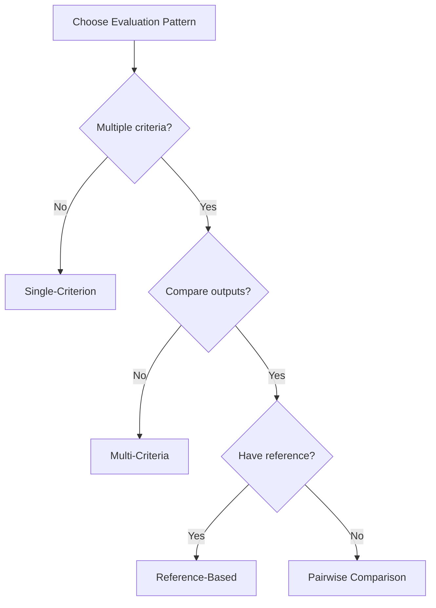

import { Callout } from "fumadocs-ui/components/callout";
import { Tabs, Tab } from "fumadocs-ui/components/tabs";
import { Steps, Step } from "fumadocs-ui/components/steps";

# LLM-as-Judge

LLM-as-Judge uses language models to evaluate AI outputs based on complex, subjective criteria that are difficult to capture with programmatic rules. This approach enables scalable quality assessment without manual review.

## When to Use LLM-as-Judge

| Criteria | LLM-as-Judge | Programmatic |
|----------|--------------|--------------|
| Subjective quality | ✅ Best choice | ❌ Limited |
| Complex reasoning | ✅ Best choice | ❌ Can't capture |
| Format/structure | ⚠️ Overkill | ✅ Best choice |
| Speed critical | ⚠️ Slower | ✅ Fast |
| Cost sensitive | ⚠️ API costs | ✅ Free |

## Basic Usage

<Tabs>
  <Tab value="python" label="Python">
    ```python
    from brokle import Brokle
    from brokle.evaluation import LLMJudge

    client = Brokle()

    # Create a judge
    judge = LLMJudge(
        model="gpt-4o",
        criteria="Rate how helpful this response is for solving the user's problem"
    )

    # Evaluate
    result = judge.evaluate(
        input="How do I center a div in CSS?",
        output="Use flexbox: display: flex; justify-content: center; align-items: center;"
    )

    print(f"Score: {result.score}")      # 0.92
    print(f"Reasoning: {result.reasoning}")  # "Clear, correct, and concise solution..."
    ```
  </Tab>
  <Tab value="javascript" label="JavaScript">
    ```javascript
    import { Brokle, LLMJudge } from 'brokle';

    const client = new Brokle();

    // Create a judge
    const judge = new LLMJudge({
      model: 'gpt-4o',
      criteria: 'Rate how helpful this response is for solving the user\'s problem'
    });

    // Evaluate
    const result = await judge.evaluate({
      input: 'How do I center a div in CSS?',
      output: 'Use flexbox: display: flex; justify-content: center; align-items: center;'
    });

    console.log(`Score: ${result.score}`);      // 0.92
    console.log(`Reasoning: ${result.reasoning}`);  // "Clear, correct, and concise solution..."
    ```
  </Tab>
</Tabs>

## Evaluation Patterns



### Single-Criterion Evaluation

Evaluate one quality dimension:

```python
judge = LLMJudge(
    model="gpt-4o",
    criteria="Rate the factual accuracy of this response based on the provided context",
    context_key="reference_docs"
)

result = judge.evaluate(
    input="When was the Eiffel Tower built?",
    output="The Eiffel Tower was completed in 1889.",
    reference_docs="The Eiffel Tower construction began in 1887 and was completed in 1889."
)
```

### Multi-Criteria Evaluation

Evaluate multiple dimensions at once:

```python
judge = LLMJudge(
    model="gpt-4o",
    criteria={
        "accuracy": "Are the facts correct?",
        "helpfulness": "Does it solve the user's problem?",
        "clarity": "Is it easy to understand?",
        "conciseness": "Is it appropriately brief without losing information?"
    }
)

result = judge.evaluate(
    input="Explain recursion",
    output="Recursion is when a function calls itself..."
)

print(result.scores)
# {
#     "accuracy": 0.95,
#     "helpfulness": 0.88,
#     "clarity": 0.82,
#     "conciseness": 0.90
# }
```

### Pairwise Comparison

Compare two outputs to determine which is better:

```python
from brokle.evaluation import PairwiseJudge

judge = PairwiseJudge(
    model="gpt-4o",
    criteria="Which response better answers the user's question?"
)

result = judge.evaluate(
    input="What is the capital of France?",
    output_a="Paris is the capital of France.",
    output_b="The capital of France is Paris, a city known for the Eiffel Tower, the Louvre, and its rich history. It has been the capital since..."
)

print(result.winner)     # "A"
print(result.reasoning)  # "Response A is more concise while still correct..."
```

### Reference-Based Evaluation

Compare output against a gold standard:

```python
from brokle.evaluation import ReferenceJudge

judge = ReferenceJudge(
    model="gpt-4o",
    criteria="How well does the output match the expected answer semantically?"
)

result = judge.evaluate(
    input="What is 2 + 2?",
    output="The answer is four.",
    reference="4"
)

print(result.score)  # 1.0 - semantically equivalent
```

## Prompt Engineering for Judges

### System Prompt Structure

```python
judge = LLMJudge(
    model="gpt-4o",
    system_prompt="""You are an expert evaluator for customer support responses.

Evaluation Criteria:
1. Empathy (0-1): Does the response acknowledge the customer's feelings?
2. Solution Quality (0-1): Does it solve or address the issue?
3. Professionalism (0-1): Is the tone appropriate?
4. Completeness (0-1): Are all aspects of the query addressed?

Instructions:
- Be strict but fair
- Consider edge cases
- Provide specific reasoning for each score

Output Format:
Return a JSON object with scores and reasoning for each criterion."""
)
```

### Rubric-Based Evaluation

Define explicit scoring rubrics:

```python
judge = LLMJudge(
    model="gpt-4o",
    rubric="""
    Score the response quality from 1-5:

    5 - Excellent: Complete, accurate, well-structured, and helpful
        - Directly addresses all aspects of the question
        - Provides accurate information with relevant examples
        - Clear and easy to follow

    4 - Good: Mostly complete and accurate with minor gaps
        - Addresses most aspects of the question
        - Generally accurate with one or two minor issues
        - Reasonably clear

    3 - Acceptable: Partially addresses the question
        - Some relevant information but missing key points
        - Some inaccuracies or unclear sections
        - Could be better organized

    2 - Poor: Significant issues
        - Missing important information
        - Contains notable inaccuracies
        - Difficult to follow

    1 - Unacceptable: Does not address the question
        - Irrelevant or wrong information
        - Major factual errors
        - Incomprehensible
    """,
    normalize_to_01=True  # Convert 1-5 to 0-1 range
)
```

### Few-Shot Examples

Improve consistency with examples:

```python
judge = LLMJudge(
    model="gpt-4o",
    criteria="Rate response helpfulness",
    examples=[
        {
            "input": "How do I reset my password?",
            "output": "Click 'Forgot Password' on the login page.",
            "score": 0.7,
            "reasoning": "Correct but could include more detail about next steps."
        },
        {
            "input": "How do I reset my password?",
            "output": "Go to the login page, click 'Forgot Password', enter your email, then check your inbox for a reset link. The link expires in 24 hours.",
            "score": 0.95,
            "reasoning": "Complete, clear instructions with helpful additional context."
        },
        {
            "input": "How do I reset my password?",
            "output": "Your password is stored in our database.",
            "score": 0.1,
            "reasoning": "Does not answer the question at all."
        }
    ]
)
```

## Model Selection

### Choosing a Judge Model

| Model | Cost | Quality | Speed | Best For |
|-------|------|---------|-------|----------|
| GPT-4o | High | Highest | Medium | Critical evaluations |
| GPT-4o-mini | Low | High | Fast | High-volume evaluation |
| Claude 3.5 Sonnet | Medium | High | Fast | Nuanced criteria |
| Claude 3 Haiku | Low | Good | Fast | Simple criteria |

```python
# For critical evaluations
production_judge = LLMJudge(model="gpt-4o", ...)

# For development/testing
dev_judge = LLMJudge(model="gpt-4o-mini", ...)
```

### Using Your Own Models

```python
from brokle.evaluation import LLMJudge

# Custom model endpoint
judge = LLMJudge(
    model="custom-judge-v2",
    base_url="https://your-api.com/v1",
    api_key="your-key"
)
```

## Reducing Bias

### Position Bias

Mitigate by randomizing order in pairwise comparisons:

```python
judge = PairwiseJudge(
    model="gpt-4o",
    randomize_order=True,  # Randomly swap A and B
    require_consistency=True  # Evaluate twice and check consistency
)
```

### Verbosity Bias

LLMs often prefer longer responses. Mitigate with explicit instructions:

```python
judge = LLMJudge(
    model="gpt-4o",
    system_prompt="""...
    Important: Do NOT favor longer responses. A concise, correct answer
    should score higher than a verbose answer with the same information.
    Focus on information quality, not quantity.
    """
)
```

### Self-Preference Bias

Models may prefer outputs from the same model:

```python
# Use a different model for judging
generator = "gpt-4o"
judge = LLMJudge(model="claude-3-sonnet")  # Different model family
```

## Batch Evaluation

Efficiently evaluate many outputs:

```python
from brokle.evaluation import LLMJudge

judge = LLMJudge(model="gpt-4o", criteria="Rate helpfulness")

# Batch of outputs to evaluate
items = [
    {"input": "Q1", "output": "A1"},
    {"input": "Q2", "output": "A2"},
    {"input": "Q3", "output": "A3"},
]

# Evaluate in batch
results = await judge.evaluate_batch(
    items=items,
    batch_size=10,  # Concurrent evaluations
    show_progress=True
)

for item, result in zip(items, results):
    print(f"Score: {result.score}")
```

## Calibration

### Calibration Dataset

Create a calibration set to ensure consistent scoring:

```python
calibration_set = [
    {"input": "...", "output": "...", "expected_score": 0.9},
    {"input": "...", "output": "...", "expected_score": 0.5},
    {"input": "...", "output": "...", "expected_score": 0.1},
]

def calibrate_judge(judge, calibration_set):
    errors = []
    for item in calibration_set:
        result = judge.evaluate(input=item["input"], output=item["output"])
        error = abs(result.score - item["expected_score"])
        errors.append(error)

    avg_error = sum(errors) / len(errors)
    print(f"Average calibration error: {avg_error:.2f}")

    if avg_error > 0.15:
        print("Warning: Consider refining judge criteria or examples")

    return avg_error
```

### Score Normalization

Normalize scores if your judge produces different ranges:

```python
class NormalizedJudge:
    def __init__(self, judge, min_score=0.2, max_score=0.95):
        self.judge = judge
        self.min_score = min_score
        self.max_score = max_score

    def evaluate(self, **kwargs):
        result = self.judge.evaluate(**kwargs)
        # Normalize to 0-1 range
        normalized = (result.score - self.min_score) / (self.max_score - self.min_score)
        normalized = max(0.0, min(1.0, normalized))

        return EvaluationResult(
            score=normalized,
            reasoning=result.reasoning,
            metadata={**result.metadata, "raw_score": result.score}
        )
```

## Integration with Traces

### Real-time Evaluation

Evaluate during generation:

```python
with client.start_as_current_span(name="chat") as span:
    response = llm.generate(prompt)

    # Evaluate immediately
    result = judge.evaluate(input=prompt, output=response)

    # Attach score to trace
    span.score(
        name="quality",
        value=result.score,
        comment=result.reasoning,
        source="llm:gpt-4o-judge"
    )
```

### Async Evaluation

Evaluate asynchronously to avoid latency:

```python
import asyncio

async def generate_and_evaluate(prompt):
    # Generate response
    response = await llm.agenerate(prompt)

    # Start evaluation (don't await yet)
    eval_task = asyncio.create_task(
        judge.aevaluate(input=prompt, output=response)
    )

    # Return response immediately
    yield response

    # Wait for evaluation in background
    result = await eval_task
    client.scores.submit(trace_id=current_trace_id, name="quality", value=result.score)
```

## Cost Optimization

### Tiered Evaluation

Use cheaper models for initial screening:

```python
class TieredJudge:
    def __init__(self):
        self.fast_judge = LLMJudge(model="gpt-4o-mini")
        self.deep_judge = LLMJudge(model="gpt-4o")

    def evaluate(self, **kwargs):
        # Fast initial check
        fast_result = self.fast_judge.evaluate(**kwargs)

        # Deep evaluation only for borderline cases
        if 0.4 < fast_result.score < 0.7:
            return self.deep_judge.evaluate(**kwargs)

        return fast_result
```

### Sampling Strategy

Don't evaluate everything:

```python
import random

SAMPLE_RATE = 0.1  # Evaluate 10% of responses

def maybe_evaluate(trace_id, input, output):
    if random.random() < SAMPLE_RATE:
        result = judge.evaluate(input=input, output=output)
        client.scores.submit(trace_id=trace_id, name="quality", value=result.score)
```

## Best Practices

### 1. Clear, Specific Criteria

```python
# Good: Specific and measurable
judge = LLMJudge(criteria="Does the response include specific steps the user can follow?")

# Bad: Vague
judge = LLMJudge(criteria="Is the response good?")
```

### 2. Validate with Human Labels

```python
def measure_agreement(judge, human_labeled_data):
    agreements = 0
    for item in human_labeled_data:
        result = judge.evaluate(input=item["input"], output=item["output"])

        # Allow some tolerance
        if abs(result.score - item["human_score"]) < 0.2:
            agreements += 1

    agreement_rate = agreements / len(human_labeled_data)
    print(f"Human agreement rate: {agreement_rate:.1%}")
    return agreement_rate
```

### 3. Log Everything

```python
def evaluate_with_logging(judge, input, output):
    result = judge.evaluate(input=input, output=output)

    # Log for analysis
    logger.info(
        "LLM evaluation",
        input_preview=input[:100],
        output_preview=output[:100],
        score=result.score,
        reasoning=result.reasoning,
        model=judge.model,
        latency_ms=result.latency_ms
    )

    return result
```

<Callout type="warning">
  LLM judges are not perfect. Always validate with human review and use multiple evaluation methods for high-stakes decisions.
</Callout>

## Next Steps

- [Custom Evaluators](/docs/evaluation/custom-evaluators) - Build specialized evaluators
- [Datasets](/docs/evaluation/datasets) - Batch evaluation with test sets
- [Scores](/docs/evaluation/scores) - Recording evaluation results
