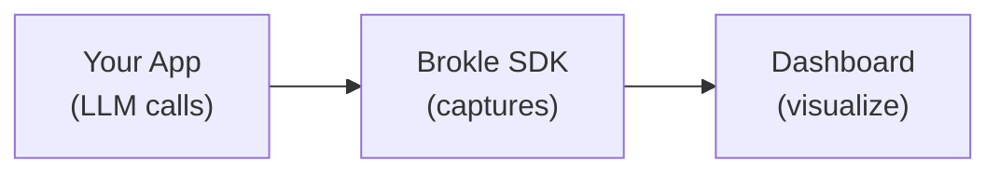

import { Callout } from "fumadocs-ui/components/callout";
import { Tabs, Tab } from "fumadocs-ui/components/tabs";
import { Steps, Step } from "fumadocs-ui/components/steps";

# Your First Trace

This guide walks you through creating your first trace with Brokle. By the end, you'll have traces flowing to your dashboard with full visibility into your LLM calls.

## Prerequisites

Before starting, ensure you have:

- A Brokle account ([sign up for free](https://app.brokle.ai))
- An API key from your Brokle dashboard
- Python 3.8+ or Node.js 18+
- An OpenAI API key (for the example)

## Quick Overview

Here's what we'll accomplish:



<Steps>

<Step>

## Install the SDK

Install the Brokle SDK for your language:

<Tabs>
  <Tab value="python-pip" label="Python (pip)">
    ```bash
    pip install brokle openai
    ```
  </Tab>
  <Tab value="python-poetry" label="Python (Poetry)">
    ```bash
    poetry add brokle openai
    ```
  </Tab>
  <Tab value="javascript-npm" label="JavaScript (npm)">
    ```bash
    npm install brokle openai
    ```
  </Tab>
  <Tab value="javascript-pnpm" label="JavaScript (pnpm)">
    ```bash
    pnpm add brokle openai
    ```
  </Tab>
</Tabs>

</Step>

<Step>

## Get Your API Key

1. Log in to [app.brokle.ai](https://app.brokle.ai)
2. Navigate to **Settings** → **API Keys**
3. Click **Create API Key**
4. Copy the key (it starts with `bk_`)

<Callout type="warning">
  Store your API key securely. It won't be shown again after creation.
</Callout>

</Step>

<Step>

## Set Up Environment Variables

Store your API keys as environment variables:

<Tabs>
  <Tab value="bash" label="Bash / Zsh">
    ```bash
    export BROKLE_API_KEY="bk_your_api_key_here"
    export OPENAI_API_KEY="sk_your_openai_key_here"
    ```
  </Tab>
  <Tab value="env" label=".env File">
    ```bash
    # .env
    BROKLE_API_KEY=bk_your_api_key_here
    OPENAI_API_KEY=sk_your_openai_key_here
    ```
  </Tab>
  <Tab value="powershell" label="PowerShell">
    ```powershell
    $env:BROKLE_API_KEY = "bk_your_api_key_here"
    $env:OPENAI_API_KEY = "sk_your_openai_key_here"
    ```
  </Tab>
</Tabs>

</Step>

<Step>

## Create Your First Trace

Now let's create a simple script that traces an OpenAI call:

<Tabs>
  <Tab value="python" label="Python">
    ```python
    import os
    from brokle import Brokle, wrap_openai
    import openai

    # Initialize Brokle client
    brokle = Brokle(
        api_key=os.getenv("BROKLE_API_KEY")
    )

    # Wrap your OpenAI client for automatic tracing
    client = wrap_openai(
        openai.OpenAI(),
        brokle=brokle
    )

    # Make a traced LLM call
    response = client.chat.completions.create(
        model="gpt-3.5-turbo",
        messages=[
            {"role": "system", "content": "You are a helpful assistant."},
            {"role": "user", "content": "What is the capital of France?"}
        ]
    )

    print(response.choices[0].message.content)

    # Ensure traces are sent before script exits
    brokle.flush()
    ```
  </Tab>
  <Tab value="javascript" label="JavaScript">
    ```javascript
    import { Brokle } from 'brokle';
    import { wrapOpenAI } from 'brokle-openai';
    import OpenAI from 'openai';

    // Initialize Brokle client
    const brokle = new Brokle({
      apiKey: process.env.BROKLE_API_KEY
    });

    // Wrap your OpenAI client for automatic tracing
    const client = wrapOpenAI(new OpenAI(), { brokle });

    // Make a traced LLM call
    const response = await client.chat.completions.create({
      model: 'gpt-3.5-turbo',
      messages: [
        { role: 'system', content: 'You are a helpful assistant.' },
        { role: 'user', content: 'What is the capital of France?' }
      ]
    });

    console.log(response.choices[0].message.content);

    // Ensure traces are sent before script exits
    await brokle.shutdown();
    ```
  </Tab>
</Tabs>

Save this as `first_trace.py` (Python) or `first_trace.mjs` (JavaScript) and run it:

<Tabs>
  <Tab value="python" label="Python">
    ```bash
    python first_trace.py
    ```
  </Tab>
  <Tab value="javascript" label="JavaScript">
    ```bash
    node first_trace.mjs
    ```
  </Tab>
</Tabs>

You should see output like:

```
The capital of France is Paris.
```

</Step>

<Step>

## View Your Trace

1. Open [app.brokle.ai](https://app.brokle.ai)
2. Navigate to **Traces** in the sidebar
3. You should see your trace appear within seconds

Your trace shows:

- **Input**: The messages sent to OpenAI
- **Output**: The model's response
- **Model**: gpt-3.5-turbo
- **Tokens**: Prompt and completion token counts
- **Cost**: Calculated cost based on current pricing
- **Latency**: Time to first token and total duration

</Step>

</Steps>

## Adding Context to Traces

Make your traces more useful by adding metadata:

<Tabs>
  <Tab value="python" label="Python">
    ```python
    from brokle import Brokle, wrap_openai
    import openai

    brokle = Brokle(api_key=os.getenv("BROKLE_API_KEY"))
    client = wrap_openai(openai.OpenAI(), brokle=brokle)

    # Create a trace with context
    with brokle.start_as_current_span(name="customer_support_chat") as span:
        # Add metadata for filtering and analysis
        span.set_attribute("user_id", "user_123")
        span.set_attribute("feature", "support_bot")
        span.set_attribute("priority", "high")

        # Associate with a session for conversation tracking
        span.update_trace(
            session_id="session_456",
            user_id="user_123"
        )

        response = client.chat.completions.create(
            model="gpt-3.5-turbo",
            messages=[
                {"role": "user", "content": "How do I reset my password?"}
            ]
        )

        # Record the output
        span.update(output=response.choices[0].message.content)

        print(response.choices[0].message.content)

    brokle.flush()
    ```
  </Tab>
  <Tab value="javascript" label="JavaScript">
    ```javascript
    import { Brokle } from 'brokle';
    import { wrapOpenAI } from 'brokle-openai';
    import OpenAI from 'openai';

    const brokle = new Brokle({ apiKey: process.env.BROKLE_API_KEY });
    const client = wrapOpenAI(new OpenAI(), { brokle });

    // Create a trace with context
    const span = brokle.startSpan({
      name: 'customer_support_chat',
      attributes: {
        userId: 'user_123',
        feature: 'support_bot',
        priority: 'high',
        sessionId: 'session_456'
      }
    });

    const response = await client.chat.completions.create({
      model: 'gpt-3.5-turbo',
      messages: [
        { role: 'user', content: 'How do I reset my password?' }
      ]
    });

    span.end({ output: response.choices[0].message.content });

    console.log(response.choices[0].message.content);

    await brokle.shutdown();
    ```
  </Tab>
</Tabs>

## Understanding Your Trace

In the dashboard, your trace displays:

```
Trace: customer_support_chat
├── Duration: 1,245ms
├── Status: Success
├── Metadata:
│   ├── user_id: user_123
│   ├── feature: support_bot
│   └── priority: high
│
├── Spans:
│   └── gpt-3.5-turbo (Generation)
│       ├── Input: "How do I reset my password?"
│       ├── Output: "To reset your password..."
│       ├── Tokens: 89 (prompt: 42, completion: 47)
│       └── Cost: $0.00018
│
└── Session: session_456
```

## Tracing Without Wrapping

If you prefer not to wrap your client, use manual spans:

<Tabs>
  <Tab value="python" label="Python">
    ```python
    from brokle import Brokle
    import openai

    brokle = Brokle(api_key=os.getenv("BROKLE_API_KEY"))
    client = openai.OpenAI()

    with brokle.start_as_current_generation(
        name="chat_completion",
        model="gpt-3.5-turbo"
    ) as gen:
        response = client.chat.completions.create(
            model="gpt-3.5-turbo",
            messages=[{"role": "user", "content": "Hello!"}]
        )

        # Manually record usage
        gen.update(
            output=response.choices[0].message.content,
            usage={
                "prompt_tokens": response.usage.prompt_tokens,
                "completion_tokens": response.usage.completion_tokens
            }
        )

    brokle.flush()
    ```
  </Tab>
  <Tab value="javascript" label="JavaScript">
    ```javascript
    import { Brokle } from 'brokle';
    import OpenAI from 'openai';

    const brokle = new Brokle({ apiKey: process.env.BROKLE_API_KEY });
    const client = new OpenAI();

    const gen = brokle.startGeneration({
      name: 'chat_completion',
      model: 'gpt-3.5-turbo'
    });

    const response = await client.chat.completions.create({
      model: 'gpt-3.5-turbo',
      messages: [{ role: 'user', content: 'Hello!' }]
    });

    gen.end({
      output: response.choices[0].message.content,
      usage: {
        promptTokens: response.usage.prompt_tokens,
        completionTokens: response.usage.completion_tokens
      }
    });

    await brokle.shutdown();
    ```
  </Tab>
</Tabs>

## Common Issues

### Traces Not Appearing

1. **Check your API key**: Ensure `BROKLE_API_KEY` is set correctly
2. **Call flush/shutdown**: Always call `brokle.flush()` (Python) or `await brokle.shutdown()` (JS) before exiting
3. **Check the project**: Ensure you're viewing the correct project in the dashboard

### Token Counts Missing

When using manual spans (not wrapped client), you must explicitly provide token usage:

```python
gen.update(
    usage={
        "prompt_tokens": response.usage.prompt_tokens,
        "completion_tokens": response.usage.completion_tokens
    }
)
```

### Connection Errors

If you see connection errors:

1. Check your internet connection
2. Verify your API key is valid
3. For self-hosted Brokle, ensure `base_url` is correct:

```python
brokle = Brokle(
    api_key="bk_...",
    base_url="https://your-brokle-instance.com"
)
```

## Next Steps

Now that you've created your first trace:

- [Learn about traces and spans →](/docs/concepts/traces)
- [Set up OpenAI integration →](/docs/integrations/openai)
- [Add evaluation scores →](/docs/concepts/evaluations)
- [Track costs →](/docs/concepts/cost-analytics)
- [Explore the Python SDK →](/docs/sdk/python)
- [Explore the JavaScript SDK →](/docs/sdk/javascript)
