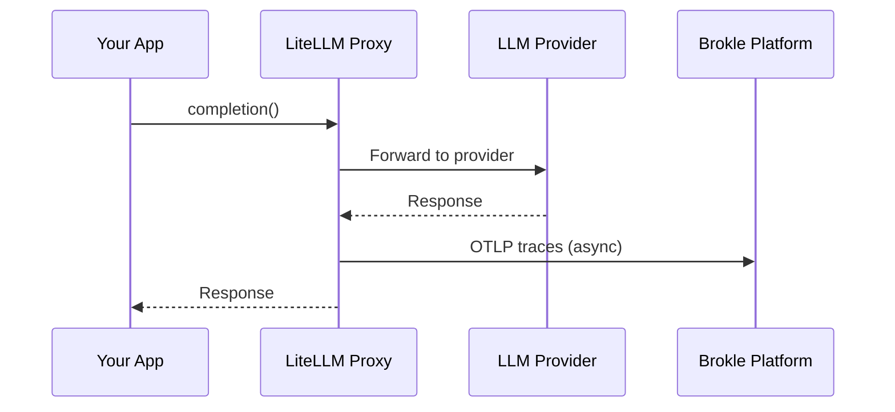

import { Callout } from "fumadocs-ui/components/callout";
import { Tabs, Tab } from "fumadocs-ui/components/tabs";

# LiteLLM Integration

LiteLLM is a unified API gateway that lets you call 100+ LLM providers with a single interface. With Brokle's LiteLLM integration, all your LLM calls are automatically traced and sent to Brokle via OpenTelemetry Protocol (OTLP).



## What Gets Traced

Brokle automatically captures:

| Feature | Data Captured |
|---------|--------------|
| **All LLM Calls** | Provider, model, parameters, response, tokens |
| **100+ Providers** | OpenAI, Anthropic, Azure, Bedrock, Vertex AI, etc. |
| **Caching** | Cache hits, misses, and saved costs |
| **Fallbacks** | Primary and fallback provider usage |
| **Load Balancing** | Request distribution across deployments |
| **Cost Tracking** | Per-request and aggregated costs |

## Installation

<Tabs>
  <Tab value="pip" label="pip">
    ```bash
    pip install litellm
    ```
  </Tab>
  <Tab value="docker" label="Docker">
    ```bash
    docker pull ghcr.io/berriai/litellm:main-latest
    ```
  </Tab>
</Tabs>

## Quick Setup

### Option 1: Environment Variables

The simplest way to configure LiteLLM to send traces to Brokle:

```bash
# Your Brokle configuration
export BROKLE_API_KEY="bk_your_api_key"
export BROKLE_BASE_URL="https://api.brokle.ai"  # Or your self-hosted URL

# LiteLLM OTLP configuration
export OTEL_EXPORTER="otlp_http"
export OTEL_ENDPOINT="${BROKLE_BASE_URL}/v1/traces"
export OTEL_HEADERS="X-API-Key=${BROKLE_API_KEY}"
```

Then use LiteLLM as normal:

```python
import litellm

response = litellm.completion(
    model="gpt-4",
    messages=[{"role": "user", "content": "Hello!"}]
)
# Traces automatically sent to Brokle!
```

### Option 2: Config File (LiteLLM Proxy)

Create a `config.yaml` for the LiteLLM proxy:

```yaml
# config.yaml
model_list:
  - model_name: gpt-4
    litellm_params:
      model: openai/gpt-4
      api_key: os.environ/OPENAI_API_KEY

  - model_name: claude-3
    litellm_params:
      model: anthropic/claude-3-opus-20240229
      api_key: os.environ/ANTHROPIC_API_KEY

litellm_settings:
  success_callback: ["otel"]
  failure_callback: ["otel"]

environment_variables:
  OTEL_EXPORTER: "otlp_http"
  OTEL_ENDPOINT: "https://api.brokle.ai/v1/traces"
  OTEL_HEADERS: "X-API-Key=bk_your_api_key"
```

Start the proxy:

```bash
litellm --config config.yaml --port 4000
```

### Option 3: Programmatic Configuration

```python
import litellm
import os

# Configure OTLP export to Brokle
litellm.success_callback = ["otel"]
litellm.failure_callback = ["otel"]

os.environ["OTEL_EXPORTER"] = "otlp_http"
os.environ["OTEL_ENDPOINT"] = "https://api.brokle.ai/v1/traces"
os.environ["OTEL_HEADERS"] = f"X-API-Key={os.environ['BROKLE_API_KEY']}"

# All calls now traced
response = litellm.completion(
    model="gpt-4",
    messages=[{"role": "user", "content": "Hello!"}]
)
```

<Callout type="success">
  That's it! All LLM calls through LiteLLM will now appear in your Brokle dashboard with full request/response details, token counts, and costs.
</Callout>

## Configuration Options

### OTLP Settings

| Environment Variable | Description | Default |
|---------------------|-------------|---------|
| `OTEL_EXPORTER` | Exporter type (`otlp_http` or `otlp_grpc`) | `otlp_http` |
| `OTEL_ENDPOINT` | Brokle OTLP endpoint | Required |
| `OTEL_HEADERS` | Authentication header | Required |
| `OTEL_SERVICE_NAME` | Service name in traces | `litellm` |

### Callback Settings

```yaml
litellm_settings:
  success_callback: ["otel"]      # Called on successful completions
  failure_callback: ["otel"]      # Called on errors
  service_callback: ["otel"]      # Called for all requests (optional)
```

## Advanced Usage

### With Load Balancing

Route requests across multiple deployments:

```yaml
model_list:
  - model_name: gpt-4
    litellm_params:
      model: azure/gpt-4-deployment-1
      api_base: https://region1.openai.azure.com
      api_key: os.environ/AZURE_API_KEY_1
    model_info:
      id: "azure-east"

  - model_name: gpt-4
    litellm_params:
      model: azure/gpt-4-deployment-2
      api_base: https://region2.openai.azure.com
      api_key: os.environ/AZURE_API_KEY_2
    model_info:
      id: "azure-west"

router_settings:
  routing_strategy: "least-busy"

litellm_settings:
  success_callback: ["otel"]

environment_variables:
  OTEL_ENDPOINT: "https://api.brokle.ai/v1/traces"
  OTEL_HEADERS: "X-API-Key=bk_your_api_key"
```

Brokle traces which deployment handled each request.

### With Fallbacks

Configure fallback providers:

```yaml
model_list:
  - model_name: gpt-4
    litellm_params:
      model: openai/gpt-4
      api_key: os.environ/OPENAI_API_KEY

  - model_name: gpt-4-fallback
    litellm_params:
      model: azure/gpt-4
      api_base: os.environ/AZURE_API_BASE
      api_key: os.environ/AZURE_API_KEY

router_settings:
  enable_fallbacks: true
  fallbacks: [{"gpt-4": ["gpt-4-fallback"]}]

litellm_settings:
  success_callback: ["otel"]
  failure_callback: ["otel"]
```

Brokle tracks fallback usage and helps identify reliability issues.

### With Caching

Enable caching with trace visibility:

```yaml
litellm_settings:
  cache: true
  cache_params:
    type: "redis"
    host: "localhost"
    port: 6379

  success_callback: ["otel"]

environment_variables:
  OTEL_ENDPOINT: "https://api.brokle.ai/v1/traces"
```

Brokle shows cache hit rates and cost savings.

### Adding Custom Metadata

Add context to your traces:

```python
import litellm

response = litellm.completion(
    model="gpt-4",
    messages=[{"role": "user", "content": "Hello!"}],
    metadata={
        "user_id": "user_123",
        "session_id": "session_456",
        "feature": "chat_bot"
    }
)
```

Metadata appears as span attributes in Brokle.

## Docker Deployment

### Docker Compose

```yaml
version: "3.9"
services:
  litellm:
    image: ghcr.io/berriai/litellm:main-latest
    ports:
      - "4000:4000"
    environment:
      - OPENAI_API_KEY=${OPENAI_API_KEY}
      - ANTHROPIC_API_KEY=${ANTHROPIC_API_KEY}
      - OTEL_EXPORTER=otlp_http
      - OTEL_ENDPOINT=https://api.brokle.ai/v1/traces
      - OTEL_HEADERS=X-API-Key=${BROKLE_API_KEY}
    volumes:
      - ./config.yaml:/app/config.yaml
    command: --config /app/config.yaml --port 4000
```

### Kubernetes

```yaml
apiVersion: apps/v1
kind: Deployment
metadata:
  name: litellm-proxy
spec:
  replicas: 2
  template:
    spec:
      containers:
        - name: litellm
          image: ghcr.io/berriai/litellm:main-latest
          ports:
            - containerPort: 4000
          env:
            - name: OTEL_EXPORTER
              value: "otlp_http"
            - name: OTEL_ENDPOINT
              value: "https://api.brokle.ai/v1/traces"
            - name: OTEL_HEADERS
              valueFrom:
                secretKeyRef:
                  name: brokle-secrets
                  key: api-key-header
```

## Self-Hosted Brokle

If you're self-hosting Brokle, update the endpoint:

```bash
export OTEL_ENDPOINT="http://your-brokle-server:8080/v1/traces"
```

## Troubleshooting

### Traces Not Appearing

1. **Verify the callback** - Ensure `success_callback: ["otel"]` is configured
2. **Check the endpoint** - Confirm `OTEL_ENDPOINT` is correct
3. **Verify the API key** - Check `OTEL_HEADERS` format: `X-API-Key=bk_...`

### Debug Mode

Enable verbose logging:

```python
import litellm
litellm.set_verbose = True
```

### Connection Issues

Test connectivity to Brokle:

```bash
curl -X POST https://api.brokle.ai/v1/traces \
  -H "X-API-Key: bk_your_api_key" \
  -H "Content-Type: application/json" \
  -d '{}'
```

## Related Integrations

- [OpenAI](/docs/integrations/openai) - Direct OpenAI integration
- [Anthropic](/docs/integrations/anthropic) - Direct Anthropic integration
- [LangChain](/docs/integrations/rag-frameworks/langchain) - LangChain framework

## Next Steps

- [View traces in the dashboard →](/docs/dashboard-tour)
- [Set up cost alerts →](/docs/analytics/cost-tracking)
- [Configure evaluations →](/docs/evaluation)
