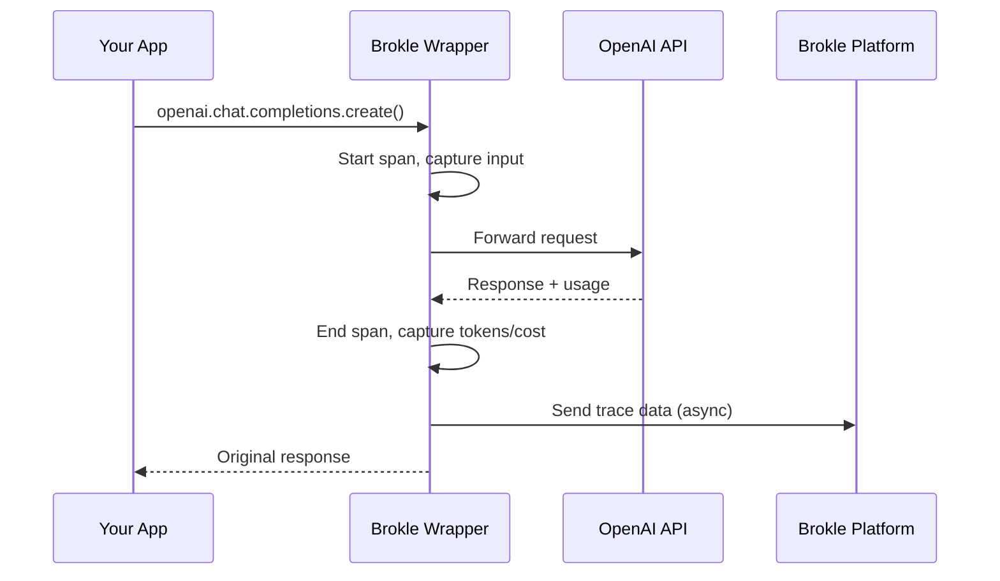

import { Callout } from "fumadocs-ui/components/callout";
import { Tabs, Tab } from "fumadocs-ui/components/tabs";

# OpenAI Integration

Automatically trace all your OpenAI API calls with Brokle. Capture chat completions, embeddings, function calls, and more with minimal code changes.



## What Gets Traced

Brokle automatically captures:

| Feature | Data Captured |
|---------|--------------|
| **Chat Completions** | Messages, model, parameters, response, tokens, cost |
| **Embeddings** | Input text, model, dimensions, token count |
| **Function Calling** | Function definitions, arguments, results |
| **Tool Use** | Tool calls, responses, execution time |
| **Streaming** | Full streamed response, chunk timing |
| **Vision** | Image inputs (URL or base64 reference) |

## Installation

<Tabs>
  <Tab value="pip" label="pip">
    ```bash
    pip install brokle openai
    ```
  </Tab>
  <Tab value="poetry" label="Poetry">
    ```bash
    poetry add brokle openai
    ```
  </Tab>
  <Tab value="npm" label="npm">
    ```bash
    npm install brokle openai
    ```
  </Tab>
</Tabs>

## Quick Setup

The fastest way to get started is using the OpenAI wrapper:

<Tabs>
  <Tab value="python" label="Python">
    ```python
    from brokle import Brokle
    from brokle.integrations.openai import wrap_openai
    import openai

    # Initialize Brokle
    client = Brokle(api_key="your-brokle-api-key")

    # Wrap your OpenAI client
    openai_client = wrap_openai(openai.OpenAI(), brokle=client)

    # Use as normal - tracing is automatic!
    response = openai_client.chat.completions.create(
        model="gpt-4",
        messages=[
            {"role": "user", "content": "What is the capital of France?"}
        ]
    )

    print(response.choices[0].message.content)
    # Output: The capital of France is Paris.
    ```
  </Tab>
  <Tab value="javascript" label="JavaScript">
    ```javascript
    import { Brokle } from 'brokle';
    import { wrapOpenAI } from 'brokle/openai';
    import OpenAI from 'openai';

    // Initialize Brokle
    const brokle = new Brokle({ apiKey: 'your-brokle-api-key' });

    // Wrap your OpenAI client
    const openai = wrapOpenAI(new OpenAI(), { brokle });

    // Use as normal - tracing is automatic!
    const response = await openai.chat.completions.create({
      model: 'gpt-4',
      messages: [
        { role: 'user', content: 'What is the capital of France?' }
      ]
    });

    console.log(response.choices[0].message.content);
    // Output: The capital of France is Paris.
    ```
  </Tab>
</Tabs>

<Callout type="success">
  That's it! All OpenAI calls will now appear in your Brokle dashboard with full request/response details, token counts, and costs.
</Callout>

## Configuration Options

Customize what gets captured:

```python
from brokle.integrations.openai import wrap_openai, OpenAIConfig

config = OpenAIConfig(
    capture_input=True,       # Log prompt content (default: True)
    capture_output=True,      # Log completion content (default: True)
    capture_tokens=True,      # Track token usage (default: True)
    capture_cost=True,        # Calculate costs (default: True)
    capture_latency=True,     # Track response time (default: True)
    mask_pii=False,           # Mask PII in logs (default: False)
)

openai_client = wrap_openai(openai.OpenAI(), brokle=client, config=config)
```

| Option | Default | Description |
|--------|---------|-------------|
| `capture_input` | `True` | Log the full prompt/messages |
| `capture_output` | `True` | Log the completion response |
| `capture_tokens` | `True` | Track prompt/completion tokens |
| `capture_cost` | `True` | Calculate estimated cost |
| `capture_latency` | `True` | Record time to first token and total duration |
| `mask_pii` | `False` | Automatically mask emails, phone numbers, etc. |

## Advanced Usage

### Streaming Responses

Streaming works seamlessly - Brokle captures the full response:

```python
openai_client = wrap_openai(openai.OpenAI(), brokle=client)

stream = openai_client.chat.completions.create(
    model="gpt-4",
    messages=[{"role": "user", "content": "Tell me a story"}],
    stream=True
)

for chunk in stream:
    if chunk.choices[0].delta.content:
        print(chunk.choices[0].delta.content, end="")

# Brokle captures:
# - Time to first token
# - Complete streamed response
# - Token counts
# - Total duration
```

### Function Calling

Function calls are automatically traced with arguments and results:

```python
tools = [
    {
        "type": "function",
        "function": {
            "name": "get_weather",
            "description": "Get the current weather",
            "parameters": {
                "type": "object",
                "properties": {
                    "location": {"type": "string"}
                },
                "required": ["location"]
            }
        }
    }
]

response = openai_client.chat.completions.create(
    model="gpt-4",
    messages=[{"role": "user", "content": "What's the weather in Paris?"}],
    tools=tools
)

# Brokle traces:
# - Tool definitions
# - Function call arguments
# - Tool call ID
```

### Vision (GPT-4V)

Image inputs are traced with references:

```python
response = openai_client.chat.completions.create(
    model="gpt-4-vision-preview",
    messages=[
        {
            "role": "user",
            "content": [
                {"type": "text", "text": "What's in this image?"},
                {
                    "type": "image_url",
                    "image_url": {"url": "https://example.com/image.jpg"}
                }
            ]
        }
    ]
)

# Brokle traces the image URL (not the actual image data)
```

### Embeddings

Embedding calls are also traced:

```python
embeddings = openai_client.embeddings.create(
    model="text-embedding-3-small",
    input=["Hello world", "Goodbye world"]
)

# Brokle captures:
# - Input texts
# - Model
# - Dimensions
# - Token count
```

### Adding Context with Traces

Wrap OpenAI calls in traces for additional context:

```python
from brokle import Brokle
from brokle.integrations.openai import wrap_openai

client = Brokle(api_key="your-api-key")
openai_client = wrap_openai(openai.OpenAI(), brokle=client)

# Add context to your traces
with client.trace("customer_support_chat") as trace:
    trace.set_metadata({
        "user_id": "user_123",
        "conversation_id": "conv_456",
        "feature": "support_bot"
    })

    response = openai_client.chat.completions.create(
        model="gpt-4",
        messages=conversation_history
    )
```

## Cost Tracking

Brokle automatically calculates costs based on current OpenAI pricing:

| Model | Input (per 1M tokens) | Output (per 1M tokens) |
|-------|----------------------|------------------------|
| gpt-4-turbo | $10.00 | $30.00 |
| gpt-4 | $30.00 | $60.00 |
| gpt-4-vision | $10.00 | $30.00 |
| gpt-3.5-turbo | $0.50 | $1.50 |
| text-embedding-3-small | $0.02 | - |
| text-embedding-3-large | $0.13 | - |

<Callout type="info">
  Pricing is updated regularly. Check the Brokle dashboard for the most current rates or configure custom pricing for enterprise agreements.
</Callout>

## Troubleshooting

### Traces Not Appearing

1. **Check your API key** - Ensure `BROKLE_API_KEY` is set correctly
2. **Verify the wrapper** - Make sure you're using the wrapped client, not the original
3. **Check the project** - Ensure traces are going to the correct project

```python
# Debug: Print trace URL
with client.trace("debug") as trace:
    print(f"View trace: https://app.brokle.com/trace/{trace.id}")
    response = openai_client.chat.completions.create(...)
```

### High Latency

Brokle tracing adds minimal overhead (under 5ms), but if you're experiencing issues:

1. **Use async mode** - Enable background uploading
2. **Batch uploads** - Configure batch size for high-throughput scenarios

```python
client = Brokle(
    api_key="your-api-key",
    async_mode=True,      # Upload in background
    batch_size=100        # Batch traces
)
```

### Missing Token Counts

Some OpenAI responses don't include usage data. Brokle estimates tokens when not provided.

## Related Integrations

- [Anthropic](/docs/integrations/anthropic) - Claude models
- [Azure OpenAI](/docs/integrations/azure-openai) - Azure-hosted OpenAI
- [LangChain](/docs/integrations/langchain) - LangChain framework

## Next Steps

- [View traces in the dashboard →](/docs/dashboard-tour)
- [Add evaluation scores →](/docs/evaluation)
- [Set up cost alerts →](/docs/analytics/cost-tracking)
