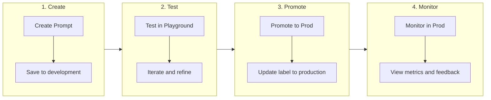

import { Cards, Card } from "fumadocs-ui/components/card";
import { Callout } from "fumadocs-ui/components/callout";
import { Tabs, Tab } from "fumadocs-ui/components/tabs";

# Prompt Management

Brokle's prompt management system provides a centralized registry for storing, versioning, and deploying prompts. Manage your prompts like code with version control, A/B testing, and production deployment workflows.

## Why Prompt Management?

As AI applications grow, prompt management becomes critical:

| Challenge | Without Management | With Brokle |
|-----------|-------------------|-------------|
| **Version Control** | Prompts in code, hard to track changes | Full version history with diffs |
| **Deployment** | Code deployments for prompt changes | Deploy prompts independently |
| **Testing** | Manual testing, no comparison | A/B testing, playground iteration |
| **Collaboration** | Prompts scattered across repos | Centralized registry, team access |
| **Rollback** | Redeploy previous code version | Instant rollback to any version |

## Core Features

### Prompt Registry

Store all prompts in a central, searchable repository:

```python
from brokle import Brokle

client = Brokle()

# Fetch a prompt by name
prompt = client.prompts.get("customer-support-v2")

# Use with OpenAI
messages = prompt.to_openai_messages({"customer_name": "Alice"})
response = openai.chat.completions.create(
    model="gpt-4o",
    messages=messages
)
```

### Version Control

Every prompt change creates a new version:

```python
# Get specific version
prompt_v1 = client.prompts.get("customer-support", version=1)
prompt_v2 = client.prompts.get("customer-support", version=2)

# Compare versions in dashboard
# Or get latest version (default)
latest = client.prompts.get("customer-support")
```

### Labels (Environments)

Deploy prompts to different environments:

```python
# Development - latest changes
dev_prompt = client.prompts.get("customer-support", label="development")

# Staging - tested changes
staging_prompt = client.prompts.get("customer-support", label="staging")

# Production - stable, reviewed changes
prod_prompt = client.prompts.get("customer-support", label="production")
```

## Quick Start

<Tabs>
  <Tab value="python" label="Python">
    ```python
    from brokle import Brokle

    client = Brokle()

    # 1. Create a prompt in the dashboard or via API
    prompt = client.prompts.create(
        name="greeting",
        content="Hello {{user_name}}! How can I help you today?",
        config={
            "model": "gpt-4o",
            "temperature": 0.7
        }
    )

    # 2. Fetch and use the prompt
    prompt = client.prompts.get("greeting")
    messages = prompt.to_openai_messages({"user_name": "Alice"})

    # 3. Make the API call
    response = openai.chat.completions.create(
        model=prompt.config.get("model", "gpt-4o"),
        messages=messages
    )
    ```
  </Tab>
  <Tab value="javascript" label="JavaScript">
    ```javascript
    import { Brokle } from 'brokle';

    const client = new Brokle();

    // 1. Create a prompt in the dashboard or via API
    const prompt = await client.prompts.create({
      name: 'greeting',
      content: 'Hello {{user_name}}! How can I help you today?',
      config: {
        model: 'gpt-4o',
        temperature: 0.7
      }
    });

    // 2. Fetch and use the prompt
    const fetchedPrompt = await client.prompts.get('greeting');
    const messages = fetchedPrompt.toOpenAIMessages({ user_name: 'Alice' });

    // 3. Make the API call
    const response = await openai.chat.completions.create({
      model: fetchedPrompt.config.model || 'gpt-4o',
      messages
    });
    ```
  </Tab>
</Tabs>

## Prompt Structure

### Basic Prompt

Simple single-message prompt:

```yaml
name: greeting
type: text
content: |
  Hello {{user_name}}! Welcome to our service.
  How can I assist you today?
```

### Chat Prompt

Multi-message chat format:

```yaml
name: customer-support
type: chat
messages:
  - role: system
    content: |
      You are a helpful customer support agent for {{company_name}}.
      Be friendly, professional, and solution-oriented.

  - role: user
    content: "{{user_message}}"
```

### With Config

Include model configuration:

```yaml
name: code-assistant
type: chat
config:
  model: gpt-4o
  temperature: 0.2
  max_tokens: 2000
messages:
  - role: system
    content: |
      You are an expert {{language}} programmer.
      Write clean, well-documented code.
```

## Template Variables

Use Mustache-style templates for dynamic content:

```python
prompt = client.prompts.get("support")

# Compile with variables
messages = prompt.to_openai_messages({
    "user_name": "Alice",
    "product_name": "Brokle",
    "issue_type": "billing"
})
```

### Variable Types

| Syntax | Description | Example |
|--------|-------------|---------|
| `{{var}}` | Simple substitution | `Hello {{name}}` |
| `{{#list}}...{{/list}}` | Iteration | `{{#items}}{{name}}{{/items}}` |
| `{{#condition}}...{{/condition}}` | Conditional | `{{#premium}}VIP support{{/premium}}` |
| `{{^condition}}...{{/condition}}` | Inverted conditional | `{{^premium}}Standard support{{/premium}}` |

### Nested Variables

```yaml
content: |
  Customer: {{customer.name}}
  Account: {{customer.account_id}}
  Plan: {{customer.plan.name}}
```

```python
messages = prompt.to_openai_messages({
    "customer": {
        "name": "Alice",
        "account_id": "acc_123",
        "plan": {"name": "Enterprise"}
    }
})
```

## Integrations

### OpenAI

```python
prompt = client.prompts.get("assistant", label="production")

response = openai.chat.completions.create(
    model=prompt.config.get("model", "gpt-4o"),
    messages=prompt.to_openai_messages(variables),
    temperature=prompt.config.get("temperature", 0.7),
    max_tokens=prompt.config.get("max_tokens")
)
```

### Anthropic

```python
prompt = client.prompts.get("analyst", label="production")

response = anthropic.messages.create(
    model=prompt.config.get("model", "claude-3-sonnet"),
    system=prompt.system_message,
    messages=prompt.to_anthropic_messages(variables),
    max_tokens=prompt.config.get("max_tokens", 1024)
)
```

### LangChain

```python
from langchain_core.prompts import ChatPromptTemplate

prompt = client.prompts.get("analyzer")
langchain_prompt = prompt.to_langchain()

chain = langchain_prompt | llm | parser
result = chain.invoke({"input": user_input})
```

## Tracing Integration

Prompts are automatically linked to traces:

```python
with client.start_as_current_span(name="chat") as span:
    # Fetch prompt - automatically recorded in trace
    prompt = client.prompts.get("support", label="production")

    # The trace includes:
    # - Prompt name and version
    # - Variables used
    # - Compiled messages
    response = llm.generate(prompt.to_openai_messages(vars))
```

View in dashboard:
- Which prompt version was used
- What variables were passed
- Performance metrics for this prompt version

## Dashboard Features

### Prompt Editor

Visual editor for creating and editing prompts:
- Syntax highlighting
- Variable autocomplete
- Real-time preview
- Template validation

### Version History

Track all changes:
- Side-by-side diff view
- Change author and timestamp
- Rollback to any version
- Version comments

### Playground

Test prompts interactively:
- Try different variables
- Compare model outputs
- Measure latency and cost
- Save as test cases

### Analytics

Monitor prompt performance:
- Usage by version
- Success/error rates
- Latency percentiles
- Cost per prompt

## Workflow

### Development Workflow



### Deployment Labels

| Label | Purpose | Who Can Edit |
|-------|---------|--------------|
| `development` | Active development | Developers |
| `staging` | Pre-production testing | Developers |
| `production` | Live traffic | Admins only |

<Callout type="warning">
  Production label changes require approval in enterprise plans. This prevents accidental prompt changes from affecting live users.
</Callout>

## Best Practices

### 1. Use Descriptive Names

```python
# Good
client.prompts.get("customer-support-billing-inquiry")
client.prompts.get("code-review-python")

# Bad
client.prompts.get("prompt1")
client.prompts.get("test")
```

### 2. Document Your Prompts

Add descriptions and usage notes:

```python
client.prompts.create(
    name="customer-support",
    description="Main prompt for customer support chatbot. Uses customer context.",
    content="...",
    metadata={
        "owner": "support-team",
        "use_case": "customer_chat",
        "requires_context": True
    }
)
```

### 3. Test Before Promoting

Always test in staging before production:

```python
# Development: rapid iteration
dev_prompt = client.prompts.get("support", label="development")

# Staging: pre-production validation
staging_prompt = client.prompts.get("support", label="staging")

# Production: stable, tested
prod_prompt = client.prompts.get("support", label="production")
```

### 4. Version Comments

Add comments when updating prompts:

```python
client.prompts.update(
    name="support",
    content=new_content,
    comment="Improved handling of refund requests"
)
```

## Next Steps

<Cards>
  <Card
    title="Playground"
    description="Test and iterate on prompts"
    href="/docs/prompt-management/playground"
  />
  <Card
    title="Versioning"
    description="Manage prompt versions"
    href="/docs/prompt-management/versioning"
  />
  <Card
    title="Tracing"
    description="Link prompts to traces"
    href="/docs/tracing"
  />
</Cards>
