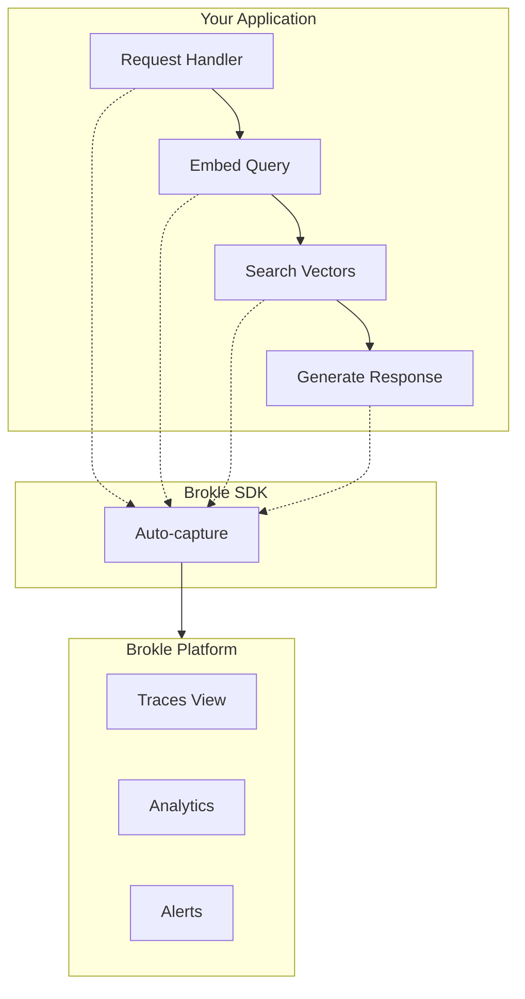

import { Cards, Card } from "fumadocs-ui/components/card";
import { Callout } from "fumadocs-ui/components/callout";

# Tracing

Tracing is the foundation of AI observability. It captures the complete journey of requests through your AI application, from user input to final response.

## Why Trace?

Without tracing, debugging AI applications is like finding a needle in a haystack:

| Without Tracing | With Tracing |
|----------------|--------------|
| "The chatbot gave a wrong answer" | See exact prompt, context, and model response |
| "It's slow sometimes" | Identify which step takes the most time |
| "Costs are too high" | Know exactly which features consume tokens |
| "Users are unhappy" | Correlate feedback with specific traces |

## How Brokle Tracing Works



## Tracing Methods

Choose the method that fits your needs:

<Cards>
  <Card
    title="Automatic Tracing"
    description="Use integration wrappers to trace LLM calls with zero code changes"
    href="/docs/tracing/automatic"
  />
  <Card
    title="Manual Tracing"
    description="Full control over what gets traced and how it's structured"
    href="/docs/tracing/manual"
  />
  <Card
    title="Working with Spans"
    description="Deep dive into span creation, nesting, and attributes"
    href="/docs/tracing/spans"
  />
  <Card
    title="Trace Metadata"
    description="Add context like user IDs, sessions, and custom attributes"
    href="/docs/tracing/metadata"
  />
</Cards>

## Quick Comparison

| Feature | Automatic Tracing | Manual Tracing |
|---------|------------------|----------------|
| Setup effort | Minimal | More code |
| Customization | Limited | Full control |
| LLM calls | Auto-captured | Manual |
| Custom operations | Not captured | Fully captured |
| Best for | Quick start, LLM-heavy apps | Complex pipelines, custom logic |

## Quick Start

### Automatic Tracing (Recommended for LLM apps)

```python
from brokle import Brokle, wrap_openai
import openai

client = Brokle(api_key="bk_...")
openai_client = wrap_openai(openai.OpenAI())

# All OpenAI calls are now automatically traced
response = openai_client.chat.completions.create(
    model="gpt-4",
    messages=[{"role": "user", "content": "Hello!"}]
)

client.flush()
```

### Manual Tracing (For custom operations)

```python
from brokle import Brokle

client = Brokle(api_key="bk_...")

with client.start_as_current_span(name="my_pipeline") as span:
    # Your custom logic here
    result = process_data(data)
    span.update(output=result)

client.flush()
```

### Combined Approach (Best of both)

```python
from brokle import Brokle, wrap_openai
import openai

client = Brokle(api_key="bk_...")
openai_client = wrap_openai(openai.OpenAI())

# Manual span for the overall flow
with client.start_as_current_span(name="customer_support") as span:
    span.set_attribute("ticket_id", ticket.id)
    span.update_trace(user_id=user.id, session_id=session.id)

    # Automatic tracing for LLM calls
    response = openai_client.chat.completions.create(
        model="gpt-4",
        messages=[{"role": "user", "content": question}]
    )

    span.update(output=response.choices[0].message.content)

client.flush()
```

## Key Concepts

### Traces

A trace represents a complete request-response cycle. It's the top-level container for all operations.

```
Trace: "answer_question"
├── Duration: 2,345ms
├── Status: success
├── User: user_123
├── Session: session_456
└── Spans: [embed_query, vector_search, generate_response]
```

[Learn more about traces →](/docs/concepts/traces)

### Spans

Spans are individual operations within a trace. They can be nested to show parent-child relationships.

```
Trace: answer_question
├── Span: embed_query (45ms)
├── Span: vector_search (120ms)
└── Span: generate_response (2,180ms)
    └── Span: gpt-4-call (2,100ms)
```

[Learn more about spans →](/docs/concepts/spans)

### Context Propagation

Brokle automatically propagates trace context, so nested operations are linked:

```python
with client.start_as_current_span(name="parent") as parent:
    # Child spans are automatically linked
    with client.start_as_current_span(name="child1"):
        do_work()

    with client.start_as_current_span(name="child2"):
        do_more_work()
```

## What Gets Captured

### Automatic Capture (via integrations)

| Data | Description |
|------|-------------|
| Model | Which LLM was called |
| Messages | Input prompts and responses |
| Tokens | Prompt and completion counts |
| Cost | Calculated based on model pricing |
| Latency | Time to first token, total duration |
| Errors | Any API errors or exceptions |

### Manual Capture

| Data | Method |
|------|--------|
| Span name | `start_as_current_span(name="...")` |
| Input/Output | `span.update(input=..., output=...)` |
| Attributes | `span.set_attribute(key, value)` |
| Metadata | `span.update(metadata={...})` |
| Errors | `span.update(error="...")` |
| User/Session | `span.update_trace(user_id=..., session_id=...)` |

## Viewing Traces

Once traces are captured, view them in the Brokle dashboard:

1. **Trace List**: Filter by project, time, status, or metadata
2. **Trace Detail**: See the complete span tree with timing
3. **Span Inspector**: View inputs, outputs, and attributes
4. **Analytics**: Aggregate metrics across traces

<Callout type="info">
  Traces typically appear in the dashboard within 1-2 seconds of being sent.
</Callout>

## Best Practices

### 1. Name Traces Meaningfully

```python
# Good - describes the operation
with client.start_as_current_span(name="answer_customer_question"):
    ...

# Bad - too generic
with client.start_as_current_span(name="process"):
    ...
```

### 2. Add User Context

```python
span.update_trace(
    user_id=user.id,
    session_id=session.id
)
```

### 3. Use Appropriate Granularity

- One trace per user request
- One span per logical operation
- Nest spans for sub-operations

### 4. Always Flush Before Exit

```python
# In scripts
client.flush()

# In web servers, use shutdown hook
import atexit
atexit.register(client.shutdown)
```

## Related Topics

- [Core Concepts: Traces](/docs/concepts/traces)
- [Core Concepts: Spans](/docs/concepts/spans)
- [OpenAI Integration](/docs/integrations/openai)
- [Python SDK Reference](/docs/sdk/python)
- [JavaScript SDK Reference](/docs/sdk/javascript)
