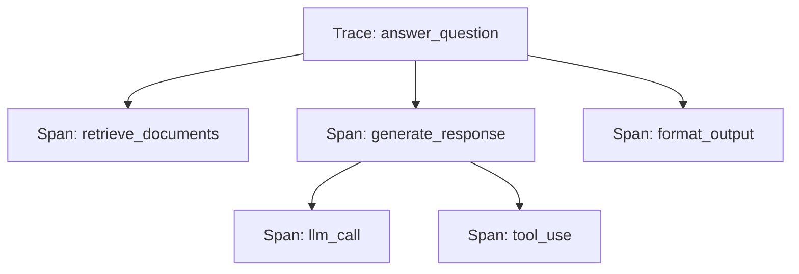

import { Callout } from "fumadocs-ui/components/callout";

# Understanding Traces

A **trace** represents a single end-to-end request through your AI application. It captures the complete journey from user input to final response, including all LLM calls, retrievals, tool uses, and custom operations along the way.

## What is a Trace?

Think of a trace as a detailed story of what happened during one interaction with your AI system. When a user asks a question, your application might:

1. Retrieve relevant documents from a vector database
2. Call an LLM to generate a response
3. Use a tool to verify information
4. Call the LLM again to refine the answer

A trace captures all of these steps, their relationships, timing, inputs, outputs, and any errors that occurred.

## Trace Anatomy

Every trace consists of **spans** - individual operations that make up the complete request:

```
Trace: "answer_question"
├── Span: retrieve_documents (Retrieval)
│   ├── duration: 120ms
│   ├── input: "What is quantum computing?"
│   └── output: [3 documents retrieved]
├── Span: generate_response (LLM)
│   ├── duration: 1,200ms
│   ├── model: gpt-4
│   ├── tokens: 1,523
│   └── cost: $0.0456
└── Span: format_output (Generation)
    ├── duration: 5ms
    └── output: "Quantum computing is..."
```

## Key Trace Properties

| Property | Description | Example |
|----------|-------------|---------|
| `trace_id` | Unique identifier for this trace | `trace_abc123xyz` |
| `name` | Human-readable name | `"chat_completion"` |
| `project_id` | Project this trace belongs to | `proj_456def` |
| `start_time` | When the trace began | `2025-01-15T12:00:00Z` |
| `end_time` | When the trace completed | `2025-01-15T12:00:02Z` |
| `duration_ms` | Total trace duration | `2,345` |
| `status` | Success, error, or in-progress | `"success"` |
| `total_tokens` | Sum of all token usage | `2,847` |
| `total_cost` | Sum of all costs | `$0.0892` |
| `metadata` | Custom key-value pairs | `{"user_id": "u_123"}` |

## Creating Traces

### Using the Python SDK

```python
from brokle import Brokle

client = Brokle(api_key="your-api-key")

# Using a context manager (recommended)
with client.start_as_current_span("my-operation") as span:
    # All operations inside are automatically captured
    response = openai.chat.completions.create(...)

    # Add custom metadata
    client.update_current_span(metadata={
        "user_id": "user_123",
        "session_id": "session_456"
    })
```

### Using the JavaScript SDK

```javascript
import { Brokle } from 'brokle';

const client = new Brokle({ apiKey: 'your-api-key' });

// Using a callback (recommended)
await client.startActiveSpan('my-operation', async (span) => {
  // All operations inside are automatically captured
  const response = await openai.chat.completions.create(...);

  // Add custom metadata
  client.updateCurrentSpan({
    metadata: {
      userId: 'user_123',
      sessionId: 'session_456'
    }
  });

  return response;
});
```

### Using Decorators (Python)

```python
from brokle import Brokle, observe

client = Brokle(api_key="your-api-key")

@observe(name="process_query")
def process_query(query: str) -> str:
    # This function is automatically traced
    response = openai.chat.completions.create(
        model="gpt-4",
        messages=[{"role": "user", "content": query}]
    )
    return response.choices[0].message.content
```

## Trace Hierarchy

Traces naturally form a tree structure. The **root span** represents the entire operation, while **child spans** represent individual steps:



<Callout type="info">
  Child spans inherit context from their parent, making it easy to track the complete flow of a request across multiple operations.
</Callout>

## Viewing Traces

Once traces are captured, you can view them in the Brokle dashboard:

1. Navigate to **Traces** in the sidebar
2. Filter by project, time range, or status
3. Click on any trace to see the full span tree
4. Drill into individual spans to see inputs, outputs, and timing

### Trace List View

The trace list shows all traces with key metrics at a glance:
- Duration
- Token usage
- Cost
- Status
- Timestamp

### Trace Detail View

Click on a trace to see:
- Complete span tree with timing
- Input/output for each span
- Token counts and costs
- Error details if any occurred
- Custom metadata

## Best Practices

### 1. Use Meaningful Names

```python
# Good - descriptive name
with client.start_as_current_span("answer_customer_question") as span:
    ...

# Bad - generic name
with client.start_as_current_span("operation") as span:
    ...
```

### 2. Add Relevant Metadata

```python
with client.start_as_current_span("chat") as span:
    client.update_current_span(metadata={
        "user_id": user.id,
        "session_id": session.id,
        "feature": "customer_support"
    })
```

### 3. Handle Errors Properly

```python
with client.start_as_current_span("risky_operation") as span:
    try:
        result = process()
        span.update(output=result)
    except Exception as e:
        span.update(error=str(e))
        raise
```

## Related Concepts

- [Spans](/docs/tracing/spans) - Individual operations within a trace
- [Sessions](/docs/concepts/sessions) - Group related traces together
- [Distributed Tracing](/docs/tracing/distributed) - Trace across services

## Next Steps

- [Create your first trace →](/docs/first-trace)
- [Add custom spans →](/docs/tracing/spans)
- [View traces in the dashboard →](/docs/dashboard-tour)
